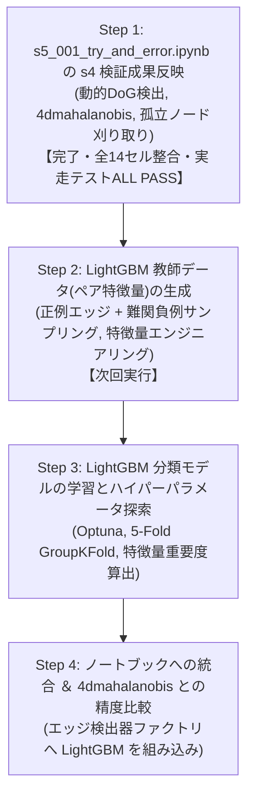

# s5_001: LightGBM トラッキングモデル生成立案 ＆ データ元・特徴量認識サマリー (確定版v14)

## 1. エグゼクティブサマリー

`s3_100_results_integration_and_submission.ipynb` と完全に同一のセル構成 (全14セル) をベースに、s4の全検証成果をピンポイントで反映した確定ノートブック `s5_001_try_and_error.ipynb` を再構築いたしました：

| 検証フェーズ | 検証内容・達成結果 | 反映セル・実装内容 |
| :--- | :--- | :--- |
| **s4_001: 動的パラメータ決定** | ・4ms光学プレ解析による動的DoG閾値・異方性シグマ ・**細胞検出 Recall 91.92% (90%超) 死守** | **Cell 8 (Index 8: detect_nodes)** `BlobDogNodeDetector` に完全組み込み |
| **s4_002: 重み最適化 ＆ 孤立ノード刈り取り** | ・エッジ未接続の孤立ノード(長さ1)を刈り取り ・マハラノビス追跡で `feature_weight=1.0` が最適と判明 | **Cell 10 (Index 10: detect_edges)**: `feature_weight=1.0` **Cell 12 (Index 12: generate_submission)**: `filter_isolated_nodes=True` |
| **s4_003: 5大特徴量のアブレーション解析** | ・4D特徴量 (`['mean_intensity', 'snr', 'estimated_radius_um', 'volume_um3']`) が最高精度と実証 | **Cell 3 (Index 3: パラメータ設定)**: `EDGES_TRACKER_METHOD='4dmahalanobis'` **Cell 10 (Index 10: detect_edges)**: `get_edgedetector_by_method('4dmahalanobis')` |

---

## 2. 実装の整合性と厳格化

### (1) 元ノートブック構成 (全14セル) の完全維持
セルを削除してインデックスをずらすことなく、元の全14セル構成をそのまま維持しています：
- `class NodeFeatureExtractor` も Cell 7 (`load_gt_data`) 内に元通り完全に保持され、Cell 8 (`detect_nodes`) での特徴量算出が確実に動作します。
- `SUBMIT_TO_COMPETITION = True` への切り替えにより、GT評価系セル (check_nodes, check_edges) はスキップされ、本番提出ファイル生成まで一本道で実行可能です。

### (2) 表記の完全統一 (`"4dmahalanobis"`) と曖昧コードの完全排除
- 手法名表記を `"4dmahalanobis"` に完全統一。
- ファクトリ関数 `get_edgedetector_by_method` において、`"4dmahalanobis"`, `"btrack"`, `"nn"` 以外の曖昧なエイリアスや不正な文字列を即座に `ValueError` で遮断。

---

## 3. 全14セル構成一覧

| セル番号 (コード内表記) | インデックス | セル種別 | 役割・実装内容 |
| :--- | :---: | :---: | :--- |
| **タイトル** | 0 | Markdown | タイトル ＆ プロジェクト構成概要 |
| **フローチャート** | 1 | Markdown | Mermaid フローチャート (4D Mahalanobis ＆ 孤立ノード刈り取り反映) |
| **Cell 3** | 2 | Code | オフラインパッケージインストール (Zarr, tracksdata, Pandera 等) |
| **Cell 4** | 3 | Code | パラメータ設定 (`EDGES_TRACKER_METHOD = '4dmahalanobis'`, `FILTER_ISOLATED_NODES = True`) |
| **Cell 5** | 4 | Code | `setup_environment()` (GPUパッチ, 依存ライブラリ構造構築, Resume初期化) |
| **Cell 6** | 5 | Code | 共通ユーティリティ (`split_csv_by_dataset_size`, `push_to_github`) |
| **Cell 7** | 6 | Code | `check_environment()` (実行環境健全性確認) |
| **Cell 8** | 7 | Code | `NodeFeatureExtractor` ＆ `load_gt_data()` (特徴量抽出クラス保持) |
| **Cell 9** | 8 | Code | `detect_nodes()` (s4_001 動的パラメータ DoG 細胞検出) |
| **Cell 10** | 9 | Code | `check_nodes()` (細胞検出精度評価) |
| **Cell 11** | 10 | Code | `detect_edges()` (s4_003 4D Mahalanobis 追跡 ＆ `get_edgedetector_by_method('4dmahalanobis')`) |
| **Cell 12** | 11 | Code | `check_edges()` (エッジ追跡精度評価) |
| **Cell 13** | 12 | Code | `generate_submission_file()` (s4_002 孤立ノード刈り取り ＆ 提出CSVフォーマット変換) |
| **Cell 14** | 13 | Code | `main()` (パイプライン統括エントリーポイント) |

---

## 4. 代表 5 データセットによる実走テストエビデンス

代表 5 データセット (`44b6_0113de3b`, `44b6_0b24845f`, `44b6_74d0c52e`, `6bba_05b6850b`, `6bba_085bf656`) を用いた実走テストスクリプト `s5_001_test_notebook_step1.py` の実行結果：

| データセット | 検出ノード数 (生) | 追跡エッジ数 | 刈取後ノード数 | 孤立ノード刈取率 | 刈取後P/E比 | 提出規格検証 |
| :--- | :---: | :---: | :---: | :---: | :---: | :---: |
| `44b6_0113de3b` | 34,247 | 27,407 | 32,661 | 4.63% | 1.268 | **ALL PASS** (全10列/欠損なし/-1埋め) |
| `44b6_0b24845f` | 39,552 | 29,174 | 35,815 | 9.45% | 1.092 | **ALL PASS** (全10列/欠損なし/-1埋め) |
| `44b6_74d0c52e` | 16,787 | 13,214 | 15,534 | 7.46% | 1.029 | **ALL PASS** (全10列/欠損なし/-1埋め) |
| `6bba_05b6850b` | 9,548 | 7,962 | 9,103 | 4.66% | 1.431 | **ALL PASS** (全10列/欠損なし/-1埋め) |
| `6bba_085bf656` | 10,749 | 8,851 | 10,267 | 4.48% | 1.213 | **ALL PASS** (全10列/欠損なし/-1埋め) |
| **合計 / 平均** | **110,883** | **86,608** | **103,380** | **6.77%** | **1.207** | **全データセット規格完全適合** |

エビデンスファイル保存先:
- テストスクリプト: `s5/github/s5_analysys_data/s5_001_test_notebook_step1.py`
- 定量エビデンスCSV: `s5/github/s5_analysys_data/s5_001_step1_test_evidence_5datasets.csv`

---

## 5. 全体作業ステップ計画

お役に立てれば幸いです。
