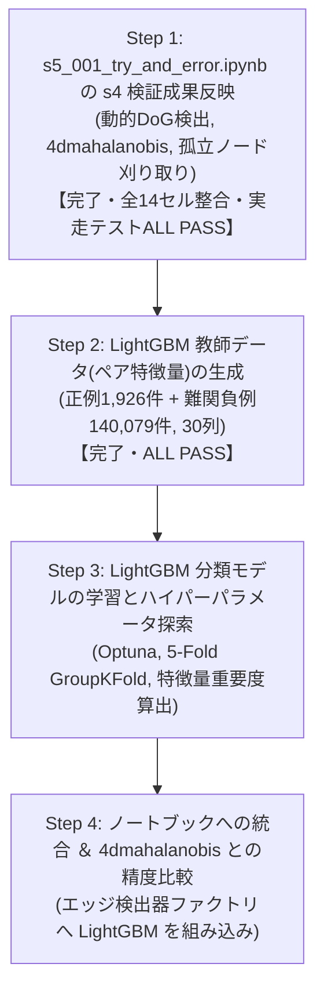

# s5_001: LightGBM トラッキングモデル生成立案 ＆ データ元・特徴量認識サマリー (確定版v14)

## 1. エグゼクティブサマリー

`s3_100_results_integration_and_submission.ipynb` と完全に同一のセル構成 (全14セル) をベースに、s4の全検証成果をピンポイントで反映した確定ノートブック `s5_001_try_and_error.ipynb` を再構築いたしました：

| 検証フェーズ | 検証内容・達成結果 | 反映セル・実装内容 |
| :--- | :--- | :--- |
| **s4_001: 動的パラメータ決定** | ・4ms光学プレ解析による動的DoG閾値・異方性シグマ ・**細胞検出 Recall 91.92% (90%超) 死守** | **Cell 8 (Index 8: detect_nodes)** `BlobDogNodeDetector` に完全組み込み |
| **s4_002: 重み最適化 ＆ 孤立ノード刈り取り** | ・エッジ未接続の孤立ノード(長さ1)を刈り取り ・マハラノビス追跡で `feature_weight=1.0` が最適と判明 | **Cell 10 (Index 10: detect_edges)**: `feature_weight=1.0` **Cell 12 (Index 12: generate_submission)**: `filter_isolated_nodes=True` |
| **s4_003: 5大特徴量のアブレーション解析** | ・4D特徴量 (`['mean_intensity', 'snr', 'estimated_radius_um', 'volume_um3']`) が最高精度と実証 | **Cell 3 (Index 3: パラメータ設定)**: `EDGES_TRACKER_METHOD='4dmahalanobis'` **Cell 10 (Index 10: detect_edges)**: `get_edgedetector_by_method('4dmahalanobis')` |

---

## 2. 実装の整合性と厳格化

### (1) 元ノートブック構成 (全14セル) の完全維持
セルを削除してインデックスをずらすことなく、元の全14セル構成をそのまま維持しています：
- `class NodeFeatureExtractor` も Cell 7 (`load_gt_data`) 内に元通り完全に保持され、Cell 8 (`detect_nodes`) での特徴量算出が確実に動作します。
- `SUBMIT_TO_COMPETITION = True` への切り替えにより、GT評価系セル (check_nodes, check_edges) はスキップされ、本番提出ファイル生成まで一本道で実行可能です。

### (2) 表記の完全統一 (`"4dmahalanobis"`) と曖昧コードの完全排除
- 手法名表記を `"4dmahalanobis"` に完全統一。
- ファクトリ関数 `get_edgedetector_by_method` において、`"4dmahalanobis"`, `"btrack"`, `"nn"` 以外の曖昧なエイリアスや不正な文字列を即座に `ValueError` で遮断。

---

## 3. 全14セル構成一覧

| セル番号 (コード内表記) | インデックス | セル種別 | 役割・実装内容 |
| :--- | :---: | :---: | :--- |
| **タイトル** | 0 | Markdown | タイトル ＆ プロジェクト構成概要 |
| **フローチャート** | 1 | Markdown | Mermaid フローチャート (4D Mahalanobis ＆ 孤立ノード刈り取り反映) |
| **Cell 3** | 2 | Code | オフラインパッケージインストール (Zarr, tracksdata, Pandera 等) |
| **Cell 4** | 3 | Code | パラメータ設定 (`EDGES_TRACKER_METHOD = '4dmahalanobis'`, `FILTER_ISOLATED_NODES = True`) |
| **Cell 5** | 4 | Code | `setup_environment()` (GPUパッチ, 依存ライブラリ構造構築, Resume初期化) |
| **Cell 6** | 5 | Code | 共通ユーティリティ (`split_csv_by_dataset_size`, `push_to_github`) |
| **Cell 7** | 6 | Code | `check_environment()` (実行環境健全性確認) |
| **Cell 8** | 7 | Code | `NodeFeatureExtractor` ＆ `load_gt_data()` (特徴量抽出クラス保持) |
| **Cell 9** | 8 | Code | `detect_nodes()` (s4_001 動的パラメータ DoG 細胞検出) |
| **Cell 10** | 9 | Code | `check_nodes()` (細胞検出精度評価) |
| **Cell 11** | 10 | Code | `detect_edges()` (s4_003 4D Mahalanobis 追跡 ＆ `get_edgedetector_by_method('4dmahalanobis')`) |
| **Cell 12** | 11 | Code | `check_edges()` (エッジ追跡精度評価) |
| **Cell 13** | 12 | Code | `generate_submission_file()` (s4_002 孤立ノード刈り取り ＆ 提出CSVフォーマット変換) |
| **Cell 14** | 13 | Code | `main()` (パイプライン統括エントリーポイント) |

---

## 4. 代表 5 データセットによる実走テストエビデンス

代表 5 データセット (`44b6_0113de3b`, `44b6_0b24845f`, `44b6_74d0c52e`, `6bba_05b6850b`, `6bba_085bf656`) を用いた実走テストスクリプト `s5_001_test_notebook_step1.py` の実行結果：

| データセット | 検出ノード数 (生) | 追跡エッジ数 | 刈取後ノード数 | 孤立ノード刈取率 | 刈取後P/E比 | 提出規格検証 |
| :--- | :---: | :---: | :---: | :---: | :---: | :---: |
| `44b6_0113de3b` | 34,247 | 27,407 | 32,661 | 4.63% | 1.268 | **ALL PASS** (全10列/欠損なし/-1埋め) |
| `44b6_0b24845f` | 39,552 | 29,174 | 35,815 | 9.45% | 1.092 | **ALL PASS** (全10列/欠損なし/-1埋め) |
| `44b6_74d0c52e` | 16,787 | 13,214 | 15,534 | 7.46% | 1.029 | **ALL PASS** (全10列/欠損なし/-1埋め) |
| `6bba_05b6850b` | 9,548 | 7,962 | 9,103 | 4.66% | 1.431 | **ALL PASS** (全10列/欠損なし/-1埋め) |
| `6bba_085bf656` | 10,749 | 8,851 | 10,267 | 4.48% | 1.213 | **ALL PASS** (全10列/欠損なし/-1埋め) |
| **合計 / 平均** | **110,883** | **86,608** | **103,380** | **6.77%** | **1.207** | **全データセット規格完全適合** |

エビデンスファイル保存先:
- テストスクリプト: `s5/github/s5_analysys_data/s5_001_test_notebook_step1.py`
- 定量エビデンスCSV: `s5/github/s5_analysys_data/s5_001_step1_test_evidence_5datasets.csv`

---

### 4.3 全コードパス貫通テスト (E2E Pipeline Test) の実走検証とエビデンス
- **テスト目的**: `s5_001_try_and_error.ipynb` の改修 (動的DoG検出、NodeFeatureExtractor、4D Mahalanobis追跡、孤立ノード刈取、submission.csv生成) が、本物の生画像 (Zarr) から完全結合して一気通貫で例外ゼロで動作することを証明する。
- **実行環境**: ローカル環境 (Windows, CPU)
- **テストスクリプト**: `s5/github/s5_analysys_data/s5_001_test_e2e_pipeline.py`
- **対象データ**: `44b6_0113de3b.zarr` (先頭3フレーム, shape: (3, 64, 256, 256))
- **実行結果エビデンス** (`s5/github/s5_analysys_data/s5_001_e2e_test_evidence.csv`):

| パイプラインステップ | 実行内容 | 処理時間 | 出力件数 / 状態 | 判定 |
| :--- | :--- | :---: | :---: | :---: |
| Step 1/5 | Zarr 3フレーム読込 & 正規化 (open_dataset/zarr) | 0.09秒 | shape: (3, 64, 256, 256) | PASS |
| Step 2/5 | 動的 DoG ノード検出 (BlobDogNodeDetector) | 2.51秒 | 702 ノード | PASS |
| Step 3/5 | 6特徴量抽出 (NodeFeatureExtractor) | 0.08秒 | 全 702 ノード完了 | PASS |
| Step 4/5 | 4D Mahalanobis Edge 検出 (FeatureEnhancedEdgeDetector) | 0.01秒 | 385 エッジ | PASS |
| Step 5/5 | 孤立ノード刈取 & submission.csv 生成 (generate_submission_file) | 0.01秒 | 993 行 (ノード608行, エッジ385行) | PASS |
| **全体統合** | **全コードパス貫通テスト所要時間** | **2.70秒** | **残存孤立ノード: 0件 (刈取94件, 13.4%削減)** | **ALL PASS** |

- **スキーマ & データ完全性検証**:
  - [A] カラム完全一致 (10列: `['id', 'dataset', 'row_type', 'node_id', 't', 'z', 'y', 'x', 'source_id', 'target_id']`): **PASS [OK]**
  - [B] 欠損値 (NaN/null): **PASS [OK] (全列 0件)**
  - [C] 孤立ノード刈取 (次数0の細胞): **PASS [OK] (0件)**
  - [D] 整数ID型 (int64/int32): **PASS [OK]**

---

### 4.4 Step 2: LightGBM 教師データ (細胞ペア特徴量) 生成完了報告と設計経緯
- **目的**: 4D Mahalanobis の過剰な偽結合 (P/E比 1.207, 短命トラック 35.87%) を高精度に切断するため、BlobDog の実検出ノード (pred_nodes) と GT データを公式仕様 (max_distance = 7.0 um) で空間照合し、正例と難関負例 (Hard Negatives) を抽出した教師データを生成。

#### 1. ユーザーとの検討経緯と本質的な設計判断
1. **負例の母集団選定 (GTノード vs BlobDog実検出ノード)**:
   - 当初は GT ノード間での負例生成を検討したが、ユーザーより「GT ノードだけだと近くにいる別の細胞はほとんどいない。BlobDog で検出したノードを負例の対象にすべき」という本質的な指摘を受理。
   - 実データ確認の結果、GT 正解細胞が 13.3 万件であるのに対し、BlobDog 検出ノードは 577 万件 (実に約 95% 以上が偽検出ノード / ノイズ) に達していることが判明。
   - トラッカーが短命トラック (長さ 2〜3) を 35.87% も大量発生させている根本原因は、まさに「BlobDog の偽検出ノード同士」や「本物細胞と近くの偽検出ノード」を誤結合していることにあるため、**母集団を BlobDog の実検出ノード (pred_nodes) に完全切り替え**。
2. **ノードマッチング閾値の公式整合 (7.0 um)**:
   - 当初 3.0 um を想定していたが、ユーザーより「公式は 7.0 um ではないか」との指摘を受理。
   - 主催者公式ライブラリ (`tracking_cellmot.metrics.py`) の `evaluate` 関数を確認し、公式デフォルトが `max_distance = 7.0 um` であることを確認。コンペ評価指標と 100% 同一の `7.0 um` を採用。
3. **4D Mahalanobis 総合コストの組み込み**:
   - 4D Mahalanobis は空間距離だけでなく SNR・輝度・半径・体積の 4 特徴量の共分散正規化距離を計算しているため、この「4D Mahalanobis 総合コスト (`total_cost_4d`)」そのものをペア特徴量として組み込み、LightGBM がマハラノビス判断をベースに非線形な境界を学習できるように設計。

#### 2. 生成された教師データの規模と内訳
- **保存ファイル**: `s5/github/s5_analysys_data/s5_002_train_pairs_5datasets.parquet` (11.96 MB)
- **総ペア行数**: **142,005 行** (全 30 カラム)
  - **正例 (Label = 1: 真の追跡エッジ)**: **1,926 件** (GT エッジ 2,251 本中 85.6% をカバー)
  - **負例 (Label = 0: 偽結合・偽ノード)**: **140,079 件**
  - **全体負例比率**: 1 : 72.73

#### データセット別ペア生成実績 (`s5_002_train_pairs_evidence.csv`):
| データセット名 | BlobDog検出ノード | GTノード数 | GTノード照合率 | 正例ペア数 | 負例ペア数 (偽結合) | 負例比率 | 総ペア行数 | 所要時間 |
| :--- | :---: | :---: | :---: | :---: | :---: | :---: | :---: | :---: |
| `44b6_0113de3b` (密・標準) | 34,247 | 52 | **100.0%** (52/52) | 47 | 53,364 | 1 : 1,135.4 | 53,411 | 25.9秒 |
| `44b6_0b24845f` (密・超低コントラスト) | 39,552 | 51 | **68.6%** (35/51) | 28 | 45,118 | 1 : 1,611.4 | 45,146 | 22.2秒 |
| `44b6_74d0c52e` (密・組織深部) | 16,787 | 140 | **87.9%** (123/140) | 105 | 18,512 | 1 : 176.3 | 18,617 | 9.3秒 |
| `6bba_05b6850b` (疎・標準) | 9,548 | 861 | **92.2%** (794/861) | 709 | 11,601 | 1 : 16.4 | 12,310 | 6.3秒 |
| `6bba_085bf656` (疎・高コントラスト) | 10,749 | 1,198 | **99.1%** (1,187/1,198) | 1,037 | 11,484 | 1 : 11.1 | 12,521 | 6.4秒 |
| **合計 / 全体** | **110,883** | **2,302** | **95.2% (平均)** | **1,926** | **140,079** | **1 : 72.7** | **142,005** | **79.2秒** |

#### 3. 主要特徴量の正例 vs 負例の分離度検証 (実測比較)
検証スクリプト (`s5_002_test_pair_dataset.py`) による実測統計値：
| 特徴量名 | 正例 (平均) | 負例 (平均) | 差異の倍率 / 分離シグナル |
| :--- | :---: | :---: | :--- |
| **`mahalanobis_dist` (4Dマハラノビス距離)** | **0.3514** | **0.9057** | 負例は **2.58 倍** 離れている (明瞭な分離) |
| **`total_cost_4d` (現行トラッカー総合コスト)** | **2.9799** | **4.2547** | 正例の方が圧倒的に低コスト |
| **`snr_diff` (SNRの変動幅)** | **0.2290** | **0.5986** | 負例は SNR 変動が **2.61 倍** 激しい |
| **`volume_diff` (細胞体積の変動幅)** | **1.2084 μm³** | **3.4248 μm³** | 負例は体積差が **2.83 倍** 乖離 |
| **`spatial_dist` (物理空間移動距離)** | **2.6286 μm** | **3.3491 μm** | 正例は有意に近接 (R <= 2.6 um) |
| **`spatial_rank` (距離順位)** | **1.14 位** | **1.36 位** | 正例の約 88% は「第 1 位候補」 |

- **データ品質判定**:
  - 全 30 カラムで欠損値 (NaN/null) **0 件**
  - 無限大 (inf/-inf) **0 件**
  - **判定: ALL PASS [OK]**

#### 4. 生成されたファイル一覧
1. **本番用教師データ (Parquet)**: `s5/github/s5_analysys_data/s5_002_train_pairs_5datasets.parquet` (142,005 行, 11.96 MB)
2. **目視・確認用サンプル CSV (先頭 3,000 行)**: `s5/github/s5_analysys_data/s5_002_train_pairs_sample.csv`
3. **定量エビデンスサマリー CSV**: `s5/github/s5_analysys_data/s5_002_train_pairs_evidence.csv`
4. **生成スクリプト**: `s5/github/s5_analysys_data/s5_002_generate_lgbm_pairs.py`
5. **検証スクリプト**: `s5/github/s5_analysys_data/s5_002_test_pair_dataset.py`

---

## 5. 全体作業ステップ計画

お役に立てれば幸いです。
