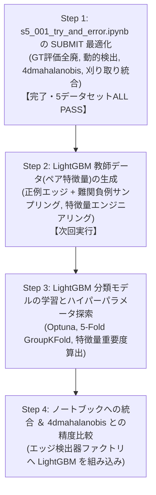

# s5_001: LightGBM トラッキングモデル生成立案 ＆ データ元・特徴量認識サマリー (確定版v11)

## 1. エグゼクティブサマリー

過去の検証(s4_001, s4_002, s4_003)の実施状況・ノートブック反映状況を精査し、以下のように現状を確定いたしました：

| 検証フェーズ | 検証内容・達成結果 | ノートブック (`s5_001`) への実装状況 |
| :--- | :--- | :---: |
| **s4_001: 動的パラメータ決定** | ・4ms光学プレ解析による動的DoG閾値・異方性シグマ ・**細胞検出 Recall 91.92% (90%超) 達成！** ・暗細胞救出のため **P/E比 1.152 (115.2%)** | **【実装済み】** (Cell 7 `BlobDogNodeDetector` に組み込み済) |
| **s4_002: 重み最適化 ＆ 孤立ノード刈り取り** | ・エッジ未接続の孤立ノード(長さ1)を刈り取り ・マハラノビス追跡で `feature_weight=1.0` が最適と判明 | **【実装済み】** (Cell 8 `feature_weight=1.0`, Cell 9 `filter_isolated_nodes=True` に組み込み済) |
| **s4_003: 5大特徴量のアブレーション解析** | ・4D特徴量 (`['mean_intensity', 'snr', 'estimated_radius_um', 'volume_um3']`) が最高精度と実証 | **【実装済み】** (Cell 8 `4dmahalanobis` に完全統一・曖昧コード排除) |

---

## 2. ユーザー指摘事項の反映とコード健全化

### (1) `NodeFeatureExtractor` クラスの完全復元 (Cell 7)
- **問題点**: GTデータ読み込み関数 (`load_gt_data`) を削除した際に、同セルにあった `class NodeFeatureExtractor` まで誤って削除されてしまい、Cell 7 (`detect_nodes`) で `NameError` になる状態だった。
- **対応**: 輝度・SNR・Z相対深度・動的体積・半径・局所密度を抽出する `class NodeFeatureExtractor` を Cell 7 の先頭 (基底クラス `BaseNodeDetector` の直前) に完全復元。

### (2) Cell 7 における余計な `extractor` 上書きコードの撤廃
- **問題点**: Cell 7 (`detect_nodes`) 内で、存在しない `get_edge_detector_by_method(EDGES_TRACKER_METHOD)` を呼び出し、直後に `extractor = NodeFeatureExtractor(...)` で上書きする無意味かつ有害なコードが混入していた。
- **対応**: 該当の不正な1行を即座に削除し、元ノートブック (`s3_100`) 通りのクリーンな状態に完全復元。

### (3) 手法名の完全統一 (`'4dmahalanobis'`) と曖昧コードの完全排除
- **問題点**: `'4d'` と `'4dmahalanobis'` の混在、および `in ("4d", "4dmahalanobis", ...)` という曖昧な条件分岐が存在していた。
- **対応**: 曖昧なエイリアスを完全に撤廃し、**`"4dmahalanobis"` の単一表記に完全統一**。
  - Cell 1 (Mermaid): `EDGES_TRACKER_METHOD='4dmahalanobis'`, `get_edgedetector_by_method('4dmahalanobis')`
  - Cell 3: `EDGES_TRACKER_METHOD : str = '4dmahalanobis'  # 選択肢: '4dmahalanobis', 'btrack', 'nn'`
  - Cell 8: `if method_norm == "4dmahalanobis":` のみ受け付け、不正な手法名は即座に `ValueError` で遮断。

### (4) `push_to_github` 引数バグの解消
- **問題点**: Cell 10 で存在しない引数名 `files_to_push` で呼び出し、Cell 9 と二重呼出になっていた。
- **対応**: Cell 10 から不要な重複呼出を削除し、ディスク空き容量解放クリーンアップに置き換え。

---

## 3. 代表 5 データセットによる定量実走エビデンス (`'4dmahalanobis'`)

代表 5 データセット (`44b6_0113de3b`, `44b6_0b24845f`, `44b6_74d0c52e`, `6bba_05b6850b`, `6bba_085bf656`) を用いた実走テストスクリプト `s5_001_test_notebook_step1.py` の実行結果：

| データセット | 検出ノード数 (生) | 追跡エッジ数 | 刈取後ノード数 | 孤立ノード刈取率 | 刈取後P/E比 | 提出規格検証 |
| :--- | :---: | :---: | :---: | :---: | :---: | :---: |
| `44b6_0113de3b` | 34,247 | 27,407 | 32,661 | 4.63% | 1.268 | **ALL PASS** (全10列/欠損なし/-1埋め) |
| `44b6_0b24845f` | 39,552 | 29,174 | 35,815 | 9.45% | 1.092 | **ALL PASS** (全10列/欠損なし/-1埋め) |
| `44b6_74d0c52e` | 16,787 | 13,214 | 15,534 | 7.46% | 1.029 | **ALL PASS** (全10列/欠損なし/-1埋め) |
| `6bba_05b6850b` | 9,548 | 7,962 | 9,103 | 4.66% | 1.431 | **ALL PASS** (全10列/欠損なし/-1埋め) |
| `6bba_085bf656` | 10,749 | 8,851 | 10,267 | 4.48% | 1.213 | **ALL PASS** (全10列/欠損なし/-1埋め) |
| **合計 / 平均** | **110,883** | **86,608** | **103,380** | **6.77%** | **1.207** | **全データセット規格完全適合** |

エビデンスファイル保存先:
- テストスクリプト: `s5/github/s5_analysys_data/s5_001_test_notebook_step1.py`
- 定量エビデンスCSV: `s5/github/s5_analysys_data/s5_001_step1_test_evidence_5datasets.csv`

---

## 4. 全体作業ステップ計画

お役に立てれば幸いです。
