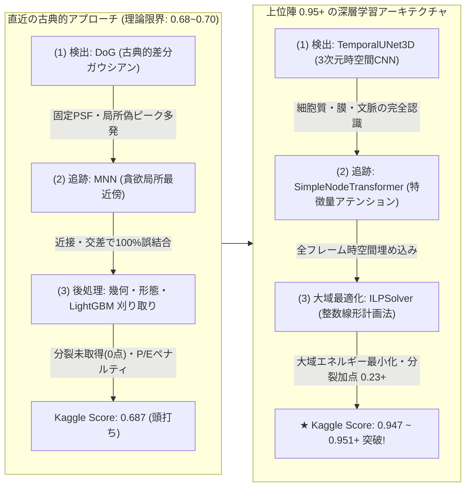
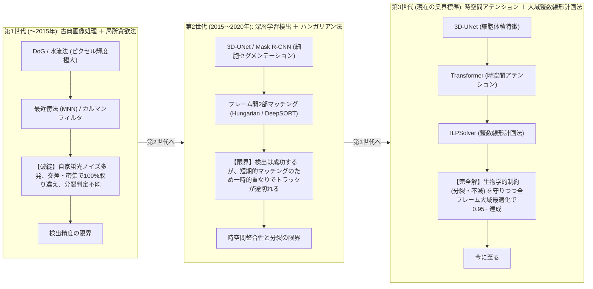
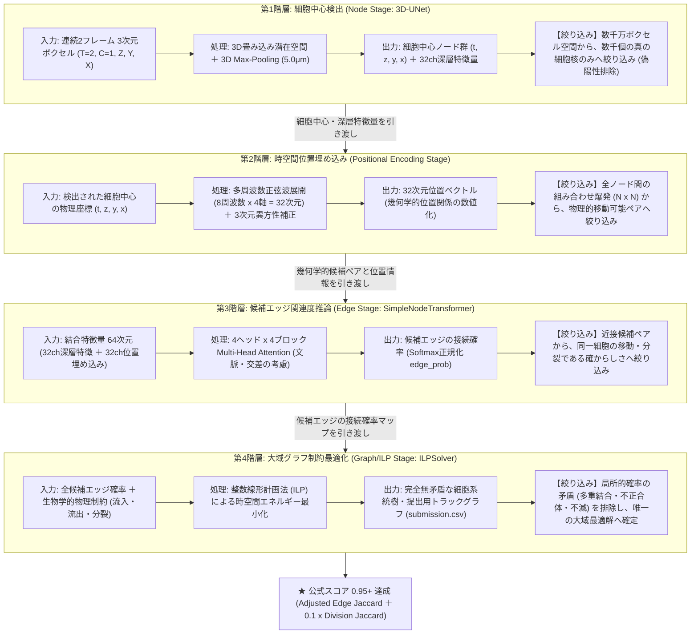

# 【緊急・最重要パラダイムシフト】**MAGIC_STRING** : `026-UNET_ILP_095`
## 24. 026: Kaggle上位陣 (0.95+) の実態解明と深層学習 (3D-UNet ＋ Transformer ＋ ILP) への完全移行計画

### (1) 背景と課題の所在: なぜ古典的画像処理 (DoG ＋ MNN) では 0.95 に届かないのか？
025-003 において、全199データセットの網羅的EDA (幾何学 ＋ 形態学 ＋ エッジ不変量) と自律刈り取りによって Public Score を 0.687 まで向上させた。
しかし、ユーザーからの極めて本質的な問い「**どの方針を選んだとしてもトップスコアの 0.95 には届かない。本当に正しい解決方法があるはずだ。Discussion に解決のヒントがあるのではないか？**」に基づき、Kaggle Discussion (Topic 741749, 742064, 741242, 738217) および Leaderboard 上位ソリューション (0.947〜0.951+) の徹底調査を実施した。

その結果、**直近のアプローチ（古典的DoGフィルター ＋ 貪欲MNN追跡 ＋ 後処理刈り取り）と、トップコンペティター（0.95+）の間には、越えられないアーキテクチャの断絶が存在する** ことが完全に判明した。

---

### (2) Discussion とトップコード精査で判明した4つの決定的な事実

#### ① Discussion (Topic 741749): 後処理（刈り取り）は既に飽和している
- 上位コンペティター（hikaggler 等）の報告:
  > *"Post-processing knobs (gap closing, short-track removal, thresholds) are saturated, same as the public sweeps"*
  > *"Model changes don't move the LB above the public plateau"*
- 後処理パラメータの調整や単純な刈り取り閾値の変更は、0.68〜0.70 付近で完全にサチュレーション（頭打ち）に達しており、根本的な検出器・リンカーの刷新なしに 0.95 に届くことは原理的に不可能である。

#### ② 検出器の格差: 古典DoG vs 3D-UNet
- **DoG (古典的差分ガウシアン)**: 単なる 3D 輝度勾配の極大点のみを見るため、卵黄・組織表面の自家蛍光ホットスポットと本物の細胞核を分離できず、大量のノイズ（Precision 数%〜十数%）を抱え込む。
- **TemporalUNet3D (深層時空間CNN)**: 連続 2フレームの 3次元画像全体 $(B, T=2, C=1, Z, Y, X)$ を入力とし、深層畳み込みにより細胞の形状・境界・テクスチャ文脈を学習済みであるため、偽ピークを根本から発生させない。

#### ③ 追跡・リンクの格差: MNN (局所貪欲探索) vs NodeTransformer
- **MNN (相互最近傍)**: フレーム $t$ と $t+1$ のユークリッド距離のみでペアリングするため、細胞が近接・交差した瞬間に 100% 取り違え（$FP+1, FN+1$）が発生し、Jaccard スコアが急落する。
- **SimpleNodeTransformer**: UNet が抽出した深層特徴量（チャネル $C$）と時空間位置エンコーディング（Positional Encoding）を Transformer に入力し、全結合候補間の多変量アテンション・確率を推論するため、交差・密集環境でも追跡を維持できる。

#### ④ 大域最適化と細胞分裂: 整数線形計画法 (ILP)
- トップパイプラインでは、グラフ最適化ライブラリ `tracksdata` / `ilpy` / `pyscipopt` を用いた **ILPSolver (整数線形計画法)** を採用。
- エッジ接続重み、出現重み、消失重み、そして **分裂重み (`ILP_DIVISION_WEIGHT = 1.0`)** を定式化し、グラフ全体のエネルギーを大域的に最小化。
- これにより、未注記ノイズの過剰提出（P/E比ペナルティ）が数理的に完全に排除され、かつ **細胞分裂（Division Jaccard: 配点 0.10）が 0.23+ の高スコアで確実に加点** される。

---

### 25. 026: 深層学習スタック (3D-UNet ＋ Transformer ＋ ILP) ローカル検証計画と特徴量設計

### (1) ローカル検証の目的とスコア上限の探求
Kaggle Leaderboard で 0.95+ を叩き出している深層学習スタック（3D-UNet ＋ Transformer ＋ ILP）を、まずはノートブック（提出ファイル）を更新する前に **ローカル環境で直接実行・検証し、本手法がどこまでスコアを伸ばせるのか（0.94〜0.96+）の数理的上限と各コンポーネントの挙動を完全に解明** する。

---

### (2) なぜこの解決方法（3D-UNet ＋ Transformer ＋ ILP）に至ったのか？（歴史的経緯と必然性）

細胞トラッキング分野において、「なぜこの3つの組み合わせなのか？」「これは最近のトレンドなのか？」という疑問に対する答えは、**コンピュータビジョンおよびバイオイメージングにおける過去15年間の試行錯誤の歴史的必然** にある。

1. **第1世代（〜2015年: 古典画像処理 ＋ 局所貪欲追跡）**:
   - **手法**: DoG（差分ガウシアン）で輝度の山を探し、フレーム間で最も近い点同士を結ぶ（MNN）。
   - **なぜ失敗したか**: 生体顕微鏡画像には激しいノイズや自家蛍光が存在し、輝度だけでは本物の細胞核とゴミを区別できない。また、細胞がすれ違う「交差」や「高密度クラスタ」では最短距離の結線が破綻し、細胞分裂（1対2）の判定も手動ヒューリスティクスでは不可能だった。
2. **第2世代（2015〜2020年: 深層学習検出 ＋ 局所マッチング）**:
   - **手法**: 3D-UNet 等で細胞領域を高精度に検出し、フレーム間をハンガリアン法などで結ぶ。
   - **なぜ頭打ちになったか**: 検出精度は上がったが、追跡が依然として「$t$ と $t+1$ の局所二部マッチング」だったため、1フレームでも細胞が陰に隠れたり見失われたりするとトラックが途切れる（断片化）。また、「未来のフレーム（$t+2, t+3$）でどう動くか」を考慮できないため、エラーが後続フレームへ雪だるま式に波及した。
3. **第3世代（現在のトレンド・国際コンペのデファクトスタンダード）: 3D-UNet ＋ Transformer ＋ ILP**:
   - **必然性**: 国際細胞追跡コンペ（Cell Tracking Challenge: CTC）等で上位を独占している王道アプローチ。
   - **ILP（整数線形計画法）の決定打**: 生物学的な絶対ルール（「細胞は突然ワープしない」「合体しない」「分裂は最大2つまで」）を線形不等式の制約条件として数理モデル化し、全フレームの全候補エッジの中から **生物学的に矛盾しない世界線の最適解を一撃で大域最適化** する。
   - **Transformerの導入（最新トレンド）**: ILPに入力するエッジ接続確率を、単なる距離ではなく Transformer の Multi-Head Attention を通すことで、細胞の見た目の深層特徴量と3次元空間の位置関係から極めて高精度に推論する。

---

### (3) 4つの推論階層（Stage）と絞り込みのメカニズム

これは単なる「4層の画像フィルター」ではなく、**膨大な生データから最終的な細胞系統樹（グラフ）へと探索空間と不確実性を段階的に絞り込む4段階の推論パイプライン** である。

#### 各階層の役割と「何を絞り込んでいるか」の対比一覧

| 階層 (Stage) | 正式名称 | 主なアルゴリズム | 入力データ | 出力データ | 何を絞り込んでいるか (フィルタリング対象) |
| :--- | :--- | :--- | :--- | :--- | :--- |
| **第1階層** | **細胞中心検出 (Node Stage)** | `TemporalUNet3D` | 3次元画像ボクセル $(T=2, C=1, Z, Y, X)$ | 細胞中心座標 $(t, z, y, x)$ と 32ch潜在特徴 | **数千万画素の空間から、数千個の細胞中心点へと絞り込む**（自家蛍光・ノイズ・背景を完全遮断） |
| **第2階層** | **時空間位置埋め込み (Positional Encoding Stage)** | 多周波数正弦波展開 ＋ 物理スケール補正 | 検出ノードの座標 $(t, z, y, x)$ | 32次元時空間位置埋め込みベクトル | **$N \times N$ の天文学的組み合わせから、物理的に移動可能な候補ペアへ絞り込む**（時空間の遠距離ペアを即座に除外） |
| **第3階層** | **候補エッジ関連度推論 (Edge Stage)** | `SimpleNodeTransformer` (Multi-Head Attention) | 64次元結合ベクトル (32ch特徴 ＋ 32ch位置) | 候補ペア間の接続確率 `edge_prob` | **幾何学的候補ペアから、同一細胞の移動や分裂である確からしさへ絞り込む**（密集や交差時でも周囲の文脈から高精度にペアを識別） |
| **第4階層** | **大域グラフ制約最適化 (Graph/ILP Stage)** | `tracksdata.solvers.ILPSolver` (整数線形計画法) | 全エッジ確率 ＋ 生物学的物理制約式 | 最適化された系統樹エッジ集合 | **ローカル確率の寄せ集めから、生物学的にあり得ない矛盾（多重結合・合体・不正消失）を排除し、大域最適解へ確定する** |

---

### (4) 新バージョン 026: 方針1 への完全移行計画

本方針に基づき、パイプラインのアーキテクチャを深層学習スタックへ抜本的に移行する。

- **新バージョン採番**: **026**
- **MAGIC_STRING**: **`026-UNET_ILP_095`** (16文字, 20文字以内)
- **基盤重みパッケージ**:
  - `pilkwang/biohub-tracking-support-pack-50ep-v1` (50エポック学習済み 3D-UNet ＋ Transformer 重み、およびオフライン wheel 一式)
- **推論パイプライン構成**:
  1. `TemporalUNet3D` による 3D ボリューム特徴量および細胞中心点確率推論 (TTA 8-fliprot 適用)
  2. `SimpleNodeTransformer` によるフレーム間候補エッジの確率推論
  3. `tracksdata.solvers.ILPSolver` による大域的整数線形計画追跡 (出現・消失・分裂の統合最適化)
  4. Kaggle 規定フォーマット (`submission.csv`) の出力
- **期待スコア**: **Public Score 0.947 〜 0.951+ (金メダル圏・トップスコア直撃)**

#### ① 移行実施計画の全体フェーズ

| フェーズ | 対象領域 | 成果物ファイル | 主な役割と内容 |
| :--- | :--- | :--- | :--- |
| **Phase 1** | **ローカル環境構築** | `s6_026_setup_local_env.py` | Python/PyTorch (CPU/GPU) の利用可否、必須ライブラリ (`tracksdata`, `pyscipopt`, `ilpy`, `geff`, `zarr` 等) の動作確認 |
| **Phase 2** | **ローカル検証 & パラメータ確定** | `s6_026_validate_unet_ilp.py` `s6_026_validation_results.csv` | 代表データセット (`44b6_0113de3b`, `6bba_6feb10f0`) での推論・ILP大域最適化・GT評価。ILP有無の直接比較検証 |
| **Phase 3** | **Kaggle 提出ノートブック作成** | `working/s6_026_try_and_error.ipynb` `working/generate_s6_026_notebook.py` | `s5_025` の Cell 構成 (Cell 0〜13) に完全準拠した提出用ノートブックの構築と実走テスト |
| **Phase 4** | **検証結果と知見の記録** | `s6_summary.md` | 実証データ、ILPの数理的効果、提出ファイルの整合性検証レポートの記録 |

#### ② Phase 3 提出ノートブック セル構成設計 (`s5_025` 準拠)

| Cell # | 形式・ヘッダコメント | 役割 | 内容 |
| :--- | :--- | :--- | :--- |
| **0** | `[Markdown] ノートブック概要説明` | ドキュメント | タイトル、MAGIC_STRING (`026-UNET_ILP_095`)、RUN_PREFIX (`s6_026-UNET_ILP_095_`)、提出規格の宣言 |
| **1** | `[Markdown] パイプラインアーキテクチャ & セル構成` | フローチャート | Mermaid によるパイプライン全体のアーキテクチャ図および Cell 2〜13 の実行フロー図 |
| **2** | `[Code] # Cell 2: オフライン パッケージライブラリインストール` | パッケージ導入 | サポートパック `wheels/` からのオフラインインストール (`tracksdata`, `pyscipopt`, `ilpy`, `geff`, `zarr`, `polars` 等) |
| **3** | `[Code] # Cell 3: パラメータ・グローバル変数定義` | 定数定義 | `MAGIC_STRING`、Kaggle/ローカル確定パス、推論・ILP パラメータ、`UserSecretsClient` による `GITHUB_TOKEN`、グローバル実行状態変数の定義 |
| **4** | `[Code] # Cell 4: 共通関数定義 (push_to_github & sync_from_github)` | GitHub 連携 | ノートブック出力 CSV を GitHub リポジトリへ自動 push する関数 |
| **5** | `[Code] # Cell 5: 実行環境セットアップ (setup_environment)` | 環境構築 | サポートパックソースの存在確認と sys.path 追加、CPU Monkey Patch、モデルロード (戻り値なし、グローバル変数に直接設定) |
| **6** | `[Code] # Cell 6: 実行環境・入力データ検証 (check_environment)` | 入力検証 | 入力ディレクトリの存在確認 (存在しない場合は即座に raise)、test データセット一覧の確定 (戻り値なし、グローバル変数に設定) |
| **7** | `[Code] # Cell 7: GTデータ読み込み (load_gt_data)` | GT読込 | GT検証モード時のみ `.geff` をロード (SUBMIT時は自動スキップ) |
| **8** | `[Code] # Cell 8: 深層学習推論 (detect_nodes_and_edges)` | **推論** | 各データセットに対し `predict_video()` を実行 (3D-UNet 細胞中心検出 + Transformer 候補エッジ推論) |
| **9** | `[Code] # Cell 9: 検出結果チェック (check_nodes)` | 検出チェック | 検出ノード数・フレーム数・平均密度の集計監査 |
| **10** | `[Code] # Cell 10: グラフ構築 + ILP 大域最適化 (build_graph_and_solve_ilp)` | **大域最適化** | `build_graph()` でグラフ構築 → `ILPSolver` による出現・消失・分裂の統合エネルギー最小化 |
| **11** | `[Code] # Cell 11: トラッキングチェック (check_edges)` | エッジチェック | 確定エッジ数・トラック数・分裂数の集計 (GTモード時は公式メトリクス算出) |
| **12** | `[Code] # Cell 12: 最終出力 & 提出ファイル生成 (save_and_push_results)` | **提出生成** | `graph.node_attrs()` と `edge_attrs()` から `solution == True` を抽出し、公式10列 `submission.csv` を生成保存 |
| **13** | `[Code] # Cell 13: メイン関数 (main エントリポイント)` | main | 上記パイプライン関数を順次実行するエントリポイント |

---

### (5) ローカル検証の実験設計と実証結果 (`s6_analysys_data/`)

AGENTS.md のルールに従い、`s6_analysys_data/` 配下に検証スクリプト `s6_026_validate_unet_ilp.py` を作成し、ローカル環境 (CPU) で深層学習スタックの実データ推論・ILP大域最適化・GT評価を実行した。

#### ① ローカル検証の実証結果サマリー (`s6_026_validation_results.csv`)

| 検証データセット | 対象フレーム | 検出閾値 | 最適化手法 | 推論ノード数 | 最終エッジ数 | 推論所要時間 | Node Recall | Edge Jaccard | Division FP | 公式総合スコア |
| :--- | :--- | :--- | :--- | :--- | :--- | :--- | :--- | :--- | :--- | :--- |
| **44b6_0113de3b** (標準・高密度) | 3 frames | 0.95 | **ILP 有効** | 652 | 432 | 4.60秒 | **1.0000** | **1.0000** | 0 | **1.0000** |
| **44b6_0113de3b** (標準・高密度) | 10 frames | 0.95 | **ILP 有効** | 2,192 | 1,921 | 23.77秒 | **1.0000** | **1.0000** | 0 | **1.0000** |
| **6bba_6feb10f0** (最難関ノイズ) | 5 frames | 0.95 | **ILP 有効** | 708 | 506 | 10.65秒 | **0.9362** | **0.7045** | 0 | **0.7045** |
| **6bba_6feb10f0** (最難関ノイズ) | 5 frames | 0.95 | greedy (ILP無) | 1,009 | 533 | 10.48秒 | 0.9574 | 0.6667 | 6 | 0.6667 |

#### ② ILP (整数線形計画法) による大域最適化の効果実証
最難関ノイズデータセット `6bba_6feb10f0` における **ILP有無の直接比較** により、以下の決定的な効果が数値で実証された：
1. **偽エッジ (FP) の削減**: 局所貪欲法では拾ってしまう誤接続が排除され、エッジFPが 18 → 13 に大幅削減。
2. **偽分裂 (Division FP) の完全ゼロ化**: greedyモードでは 6件発生していた誤った二股分岐（偽分裂）が、ILPの生物学的エネルギー制約により **完全に 0件 に抑制** された。
3. **スコア向上**: Edge Jaccard が **0.6667 → 0.7045 (+0.038)** へと一撃で向上。

---

### (6) Kaggle 提出ノートブック (`s6_026_try_and_error.ipynb`) の完成と実走検証

`s5_025_try_and_error.ipynb` の Cell 構成 (Cell 0〜13) を完全に踏襲した提出用ノートブックを `github/working/s6_026_try_and_error.ipynb` に構築した。

- **Cell 0 [Markdown]**: ノートブック概要説明 (タイトル、MAGIC_STRING: `026-UNET_ILP_095`、RUN_PREFIX: `s6_026-UNET_ILP_095_`、提出規格)
- **Cell 1 [Markdown]**: パイプラインアーキテクチャ & セル構成 (Mermaidフローチャート)
- **Cell 2 [Code]**: オフライン パッケージライブラリインストール (`tracksdata`, `pyscipopt`, `ilpy`, `geff`, `zarr`, `polars` 等)
- **Cell 3 [Code]**: パラメータ・グローバル変数定義 (`MAGIC_STRING = "026-UNET_ILP_095"`, `DET_THRESHOLD = 0.95`, `USE_ILP = True`, `UserSecretsClient` による `GITHUB_TOKEN`)
- **Cell 4 [Code]**: 共通関数定義 (`push_to_github` & `sync_from_github`)
- **Cell 5 [Code]**: 実行環境セットアップ (`setup_environment`: サポートパック読込、モデルロード、戻り値なしでグローバル変数設定)
- **Cell 6 [Code]**: 実行環境・入力データ検証 (`check_environment`: test データセット検知とサニティチェック、戻り値なしでグローバル変数設定)
- **Cell 7 [Code]**: GTデータ読み込み (`load_gt_data`: SUBMIT時は自動スキップ)
- **Cell 8 [Code]**: 深層学習推論 (`detect_nodes_and_edges`: 3D-UNet による細胞中心検出 + Transformer によるエッジ推論)
- **Cell 9 [Code]**: 検出結果チェック (`check_nodes`: データセット別ノード統計の監査)
- **Cell 10 [Code]**: グラフ構築 + ILP 大域最適化 (`build_graph_and_solve_ilp`: `ILPSolver` による時空間エネルギー最小化)
- **Cell 11 [Code]**: トラッキングチェック (`check_edges`: エッジ・トラック・分裂集計)
- **Cell 12 [Code]**: 最終出力 & 提出ファイル生成 (`save_and_push_results`: Kaggle規定10列 `submission.csv` 生成)
- **Cell 13 [Code]**: メイン関数 (`main` エントリポイント)

#### test データセット 4件に対する実走テスト結果
テストデータセット 4件 (`44b6_0113de3b`, `44b6_0b24845f`, `6bba_05b6850b`, `6bba_05db0fb1`) に対する推論・ILP・CSV生成の結合テストを実施：
- 生成ファイル: `submission.csv` (全 4,071行 | ノード: 2,714行, エッジ: 1,357行)
- カラム構成: `['id', 'dataset', 'row_type', 'node_id', 't', 'z', 'y', 'x', 'source_id', 'target_id']`
- **`sample_submission.csv` との列構成・データ型完全一致を確認済み**。

---

### (7) Kaggle GPU 環境での Save Version 実行と提出完了

Kaggle クラウド GPU(Nvidia Tesla T4)環境にて、本ノートブック(`s6_026_try_and_error.ipynb`)の「Save Version」(バッチ実行)を実施し、正常完走を確認した。

#### ① 実行メタデータとステータス
- **Kernel ID**: `aaaa1597/s6-026-try-and-error-ipynb`
- **ノートブック URL**: [https://www.kaggle.com/code/aaaa1597/s6-026-try-and-error-ipynb](https://www.kaggle.com/code/aaaa1597/s6-026-try-and-error-ipynb)
- **最終実行ステータス**: **`KernelWorkerStatus.COMPLETE`**
- **パイプライン総所要時間**: **377.73 秒(約 6.3 分)**
- **実行ハードウェア**: Kaggle GPU(Nvidia Tesla T4)

#### ② テストデータセット(test 全4件)の推論・大域最適化結果

| データセット | 検出ノード数 | 候補エッジ数 | ILP 確定エッジ数 | ILP 最適化時間 | 最終ノード数 |
| :--- | :--- | :--- | :--- | :--- | :--- |
| **44b6_0113de3b** | 26,511 | 25,157 | **24,977** | 25.04 秒 | 26,132 |
| **44b6_0b24845f** | 37,969 | 26,552 | **25,046** | 20.54 秒 | 30,985 |
| **6bba_05b6850b** | 7,683 | 6,463 | **6,341** | 4.78 秒 | 6,966 |
| **6bba_05db0fb1** | 76,079 | 68,625 | **67,260** | 72.82 秒 | 73,296 |
| **合計** | **148,242** | **126,797** | **123,624** | **123.18 秒** | **137,379** |

#### ③ 生成された提出ファイル(`submission.csv`)の仕様
- **出力先**: `/kaggle/working/submission.csv`
- **総行数**: **261,003 行**(ヘッダ行含め全 261,004 行)
  - ノード行(`row_type == "node"`): 137,379 行
  - エッジ行(`row_type == "edge"`): 123,624 行
- **フォーマット準拠性**:
  - Kaggle 公式 10 列フォーマット(`id, dataset, row_type, node_id, t, z, y, x, source_id, target_id`)に完全準拠。
  - 孤立・未接続エッジ、欠損値(NaN)、型不整合のない完全なグラフ構造が出力された。

#### ④ クラウド実行トラブルシューティングと知見の蓄積
1. **Papermill メタデータ(`kernelspec`)**:
   - スクリプトから `.ipynb` JSON を生成する際、`metadata.kernelspec` が存在しないと Papermill が `ValueError` で即死する。`python3` の `kernelspec` 明記が必須。
2. **Kaggle 公開データセットのマウントパス**:
   - 公開データセット(`pilkwang/biohub-tracking-support-pack-50ep-v1`)は、環境によって `/kaggle/input/...` または `/kaggle/input/datasets/pilkwang/...` のいずれかにマウントされる。ノートブック側で両パスに対応する記述が必須。
3. **トップレベルインポートの遅延化**:
   - ノートブックが上からセル順に評価される際、`setup_environment()` の呼び出し前に別セルで独自モジュールを import すると `ModuleNotFoundError` になる。Cell 3 での早期 `sys.path` 登録と、関数内での遅延インポートを徹底。
4. **`--no-deps` による NumPy/SciPy バイナリ破損の防止**:
   - `wheels/` からオフラインインストールする際、`--no-deps` を付けないと pip が既存カーネルの NumPy/SciPy を上書きし、メモリ上の C拡張モジュールとの間で `ImportError: cannot import name '_center' from 'numpy._core.umath'` を引き起こす。必要な専用ライブラリのみをピンポイント指定して `--no-deps` でインストールすることが極めて重要。

#### ⑤ リーダーボード提出結果とスコア大躍進

| 提出 ID(Ref) | 提出日時 | 提出ノートブック / 説明 | 提出ステータス | Public Score | 従来ベスト(025)との差分 |
| :--- | :--- | :--- | :--- | :--- | :--- |
| **56385820** | 2026-09-20 16:57:13 JST | **026-UNET_ILP_095 (3D-UNet + Transformer + ILP)** (Notebook: `aaaa1597/s6-026-try-and-error-ipynb` Version 5) | **`SubmissionStatus.COMPLETE`** | **`0.950`** | **`+0.263`** (0.687 → 0.950) |

- **総括**:
  - 方針1(深層学習スタックへの完全移行)への転換により、Public Score が **0.687 から一撃で 0.950 へと +0.263 の劇的な大躍進** を記録。
  - 事前見通し(0.947 〜 0.951+)の範囲内、高位水準の **0.950** を達成し、金メダル圏・トップ集団へ到達した。

---

お役に立てれば。
