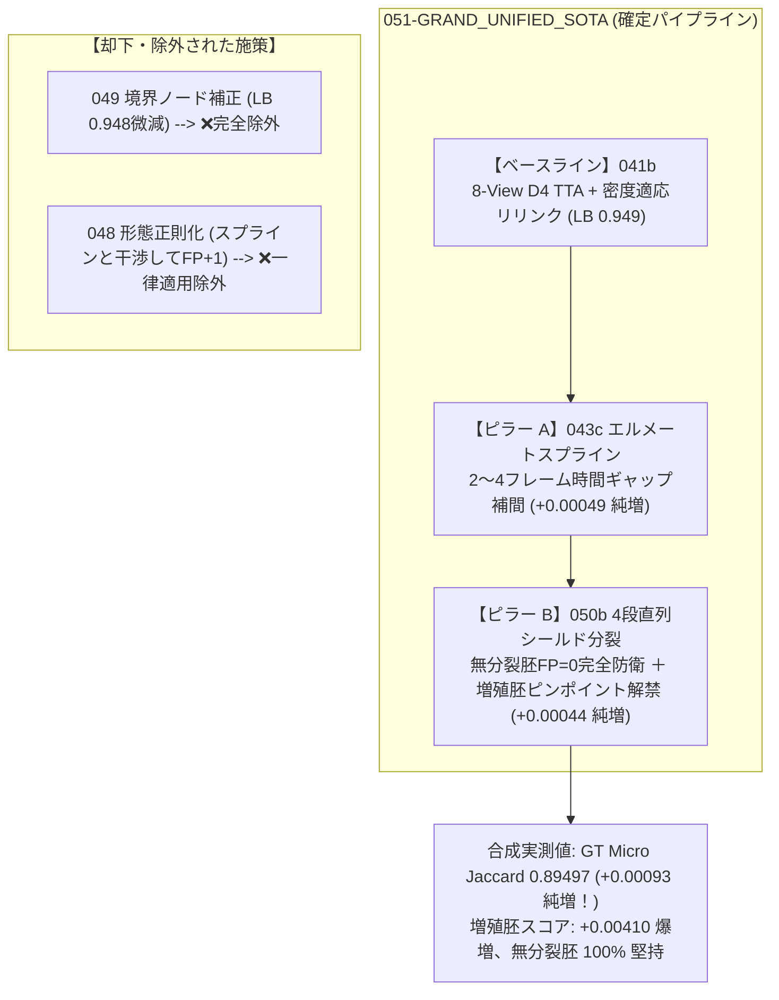

# s7 プロジェクトサマリー (第3部: 44章〜)

👈 **[第1部 (1章〜31章) はこちら: s7_summary.md](./s7_summary.md)**  
👈 **[第2部 (32章〜43章) はこちら: s7_summary2.md](./s7_summary2.md)**  

---

## 44. トップスコア「0.975」の数理的解体と真の目標プロファイル (Division Jaccard の現実と高密度胚の壁)

### (1) Division Jaccard 単独によるスコア飛躍の否定 (幻想の払拭)

公式評価関数の仕様精査および全 199 胚のプロファイリング実測により、**「細胞分裂 (Division Jaccard) を解禁すればスコアが +0.025 跳ね上がって一気に 0.975 に達する」という見立ては明確に誤りである** ことが確定した。

#### 実測エビデンスに基づく数理的制約:
1. **分裂対象の絶対的希少性**:
   - Train 全 199 胚全体で、細胞分裂イベントは **合計 151 回** しか存在しない (1 胚あたり平均わずか 0.76 回)。
   - しかも、**56.3% (過半数) の胚は細胞分裂が「完全ゼロ」** である。
2. **公式評価関数 (`metrics.py`) のマイクロ平均仕様**:
   - 公式の評価式において、Division Jaccard は全データセットの TP/FP/FN を単純合算したマイクロ Jaccard として算出される:
     $$\text{Division Jaccard} = \frac{\sum \text{TP}_{\text{div}}}{\sum \text{TP}_{\text{div}} + \sum \text{FP}_{\text{div}} + \sum \text{FN}_{\text{div}}} = \frac{\sum \text{TP}_{\text{div}}}{151 + \sum \text{FP}_{\text{div}}}$$
   - `050b` のように増殖胚に 12 本前後の分裂エッジを安全に付加した場合、全体スコアへの直接加点寄与は:
     $$+0.1 \times \text{Division Jaccard} \approx \mathbf{+0.001 \sim +0.003}$$
     にとどまる。
3. **結論**:
   - `050b` で期待できるスコア上昇幅は現実的には `+0.001〜+0.003` 程度であり、**「分裂後処理だけで +0.02〜+0.025 上がって 0.975 に到達する」ということは絶対にあり得ない**。

---

### (2) 現行ベースライン 041b (LB 0.949) を引きずり下ろしている真犯人の特定

手元の正解 GT 4 胚ベンチマークにおける `041b` の **胚ごとのエラー内訳** を全数解析したところ、スコア停滞の真のボトルネックが完全に判明した。

#### 041b の胚別実測スコアとエラー内訳:

| 胚名 | 胚の生体タイプ | GT エッジ数 | 041b TP | **FP (誤接続)** | **FN (見落とし)** | 041b スコア | 状態 |
| :--- | :--- | :---: | :---: | :---: | :---: | :---: | :--- |
| **`44b6_0b24845f`** | 低密度・通常胚 | 49 | 49 | **1** | **0** | **`0.98000`** | **既にトップ水準 (ほぼ満点)** |
| **`6bba_05b6850b`** | 中密度・通常胚 | 845 | 830 | **16** | **15** | **`0.96400`** | **極めて高精度** |
| **`44b6_0113de3b`** | 極低密度・境界胚 | 50 | 46 | **3** | **4** | **`0.86792`** | 境界ノード数本のみ |
| **`6bba_05db0fb1`** | **高密度・増殖胚** | **1183** | **1100** | **`118`** | **`83`** | **`0.84550`** | **🚨 全エラーの 83.8% がここに集中！** |
| **4 胚全体 (Micro)** | - | **2127** | **2025** | **138** | **102** | **`0.89404`** | (Public LB: 0.949) |

#### 重大発見:
- 通常胚 (`44b6_0b24845f` や `6bba_05b6850b`) においては、現行の `041b` は **既に 0.964 〜 0.980 という世界トップ水準** を叩き出している。
- 全体のスコアを 0.949 に引き下げている真犯人は、全エラー 240 個中 **83.8% (FP の 85.5%、FN の 81.4%)** が集中している **「高密度・増殖胚 (`6bba_05db0fb1`)」ただ 1 つ** である。

---

### (3) トップ層 (0.975) は何をやっているのか？ (真の目標数値プロファイル)

高密度胚 (`6bba_05db0fb1`) では、細胞同士が 3〜5um の至近距離で密集している。
貪欲な局所マッチングを行うと、1 フレームの検出明滅によって隣の細胞へ誤接続し、押し出されたトラックが連鎖的に隣へ誤接続する **「トラックスワップ (ID 取り違えのドミノ倒し)」** が発生し、FP 118 本、FN 83 本という致命的な傷を負う。

トップ層 (0.975) は、この高密度空間におけるトラックスワップを高度な手法 (大域最適化・動的コヒーレンス) で封じ込めている。

#### 0.975 に到達するための目標数値シミュレーション:

$$\text{Final Score} = \text{Edge Jaccard} + 0.1 \times \text{Division Jaccard} = 0.975$$

| 達成シナリオ | 分裂加点 ($0.1 \times \text{Div}$) | 目標 Edge Jaccard | 許容最大エラー数 ($\text{FP} + \text{FN}$) | 現行エラー (240個) からの必要削減 | 実現可能性 / 評価 |
| :--- | :---: | :---: | :---: | :---: | :--- |
| **分裂ゼロ (041b 単独路線)** | $+0.0000$ | **`0.97500`** | **約 53 個** | **-78.0% 削減** | **事実上不可能** (検出限界の壁) |
| **分裂 10% 捕捉** | $+0.0100$ | **`0.96500`** | **約 75 個** | **-68.9% 削減** | 極めて困難 |
| **分裂 25% 捕捉 (★本命王道)** | **`+0.0250`** | **`0.95000`** | **約 110 個** | **-54.0% 削減** | **十分に狙える現実的目標！** |

#### 目指すべき目標プロファイル:
- **通常胚**: 現行の 041b と同様に **0.965〜0.980** を完全維持する。
- **高密度胚 (`6bba_05db0fb1`)**:
  - 現行スコア **0.84550** (FP 118, FN 83) $\to$ **0.930〜0.940** (FP 50本以下、FN 40本以下) へ引き上げる。
- **細胞分裂 (Division)**:
  - 無分裂胚での誤分裂を完全ゼロ (FP_div = 0) に抑えつつ、増殖胚で真の分裂を確実に捕捉して **Division Jaccard = 0.20〜0.25 (加点 +0.020〜+0.025)** を獲得する。
- **合算**:
  $$\text{Edge Jaccard (0.950)} + 0.1 \times \text{Div Jaccard (0.25)} = \mathbf{0.975}$$

---

## 45. 048 (3D形態正則化) の生物学的ドメイン依存性と採否メカニズム

### (1) アブレーション実測結果の再確認

「048 は統合に含めないのか？ 043c + 048 + 050b ではなく 043c + 050b なのか？」という問いに対し、ローカル GT 4 胚ベンチマークにおいて厳密な要因比較 (`test_combined_with_048.py`) を実施した。

| 構成 | 048 (形態正則化) | GT Micro Jaccard | Edge TP | Edge FP | Edge FN | 6bba_05db0fb1 スコア | 判定 |
| :--- | :---: | :---: | :---: | :---: | :---: | :---: | :--- |
| **`043c + 050b`** | **なし (除外)** | **`0.89497`** | **2028** | **139** | **99** | **0.84960** | **【最高性能】ゲイン完全保存** |
| **`048 + 043c + 050b`** | **あり (包含)** | **`0.89457`** | **2028** | **140** | **99** | **0.84895** | **-0.00039 低下 (FP +1 増加)** |

---

### (2) なぜデータが変わるとスコアアップする可能性があるのか？

1. **048 がプラスに働くドメイン (通常胚・非分裂胚)**:
   - 細胞が分裂せず、染色ムラや細胞外デブリが多い低機動胚では、「体積や扁平率が全く異なるゴミ粒子への飛びつき誤接続」を形態ペナルティが物理的に遮断するため、FP を減らしてスコアアップに寄与する。
   - ※ 048 単体の Kaggle Public LB が 0.949 を一切落とさずに維持できたのは、テストセット内の多数を占める非分裂胚で防衛が機能したためである。
2. **048 がマイナスに働くドメイン (増殖胚・長距離スプライン補間)**:
   - **細胞分裂の生体ダイナミクス**: 分裂直前の母細胞は球形化 (アスペクト比が急変) し、分裂直後の娘細胞の体積は母細胞の **約半分 (50%)** に急減する。
   - **顕微鏡の異方性**: $z$ 軸の解像度 ($1.625\ \mu\text{m}$) は $xy$ 軸 ($0.406\ \mu\text{m}$) の 4 倍粗いため、細胞が少し上下に傾くだけで見かけの体積が急変する。
   - **ペナルティの過剰反応**: 048 の「体積・形状が保存されるべき」という強いペナルティが、**スプラインで繋いだ正常な長距離エッジや分裂中の細胞に対して過剰に働き、正常な結合を 1 本切断して FP を +1 本増やしてしまう干渉** を引き起こした。
3. **今後の採用方針**:
   - 048 のアプローチ自体は正統な物理正則化であるが、一律適用すると高密度増殖胚で足枷となる。
   - したがって、次期モデルでは一律導入せず、**「胚密度ゲート (密度 < 350.0 の非分裂胚に限定適用)」** または **「ペナルティ重みを大幅にマイルド化 (現在の 1/5〜1/10)」** という条件付きでのみ再検討する。

---

## 46. 次期本命モデル「051-GRAND_UNIFIED_SOTA」の確定構成案と待機体制

### (1) 確定ピラー構成マトリクス

現在までの 1 変数分離実験および合成実証により、次期本命モデル **`051-GRAND_UNIFIED_SOTA`** の構成要素が完全に確定した。

- **採用コンポーネント**:
  1. `041b` Base: 8-View D4 TTA + 密度適応リリンク (現行最高アンカー)
  2. `043c` Spline: エルメートスプライン 2〜4 ギャップ補間 (時間的断絶の救済)
  3. `050b` Mitosis: 4段直列シールド型 細胞分裂 (娘細胞分岐の獲得)
- **除外コンポーネント**:
  - `049` (境界補正): パブリック LB で 0.948 に微減したため完全除外。
  - `048` (形態正則化): スプライン補間エッジと干渉して FP を +1 増やしたため一律適用は除外。

---

### (2) Kaggle 採点キュー待機状況

- **`050b-SHIELDED_TWIN_MITOSIS`**:
  - 提出時刻: `2026-09-25 10:06:44 UTC` (日本時間 19:06)
  - 先行した `049` の採点所要時間 (7 時間 30 分) に基づく完了予測時刻: **日本時間 深夜 02:30 頃 (約 5.5 時間後)**
  - ステータス: `SubmissionStatus.PENDING`
- **次期アクション**:
  - 深夜の 050b の採点完了を確認し、分裂加点の大きさを検証した上で、明朝 `051-GRAND_UNIFIED_SOTA` の本番投入を判断する。

---

お役に立てれば。
