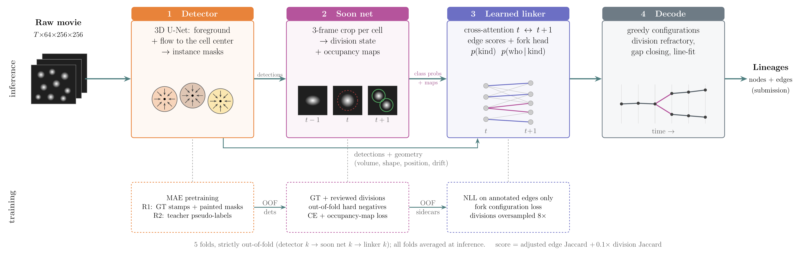
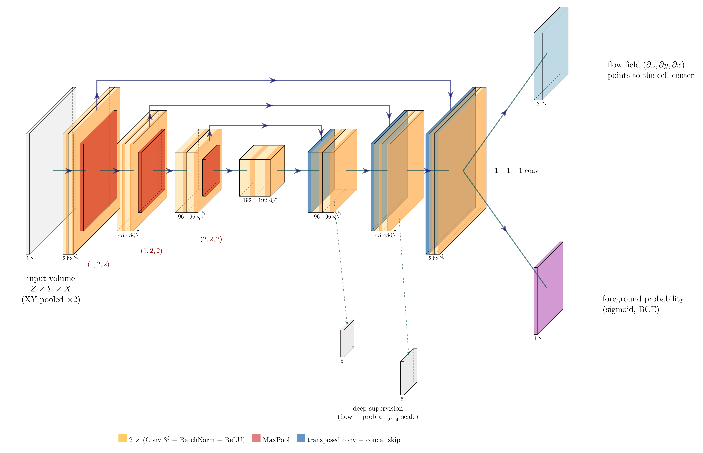
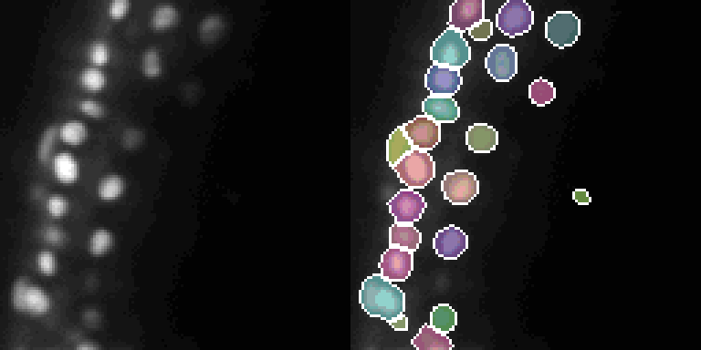

# 振り返って

- 1st Place Solution
  https://www.kaggle.com/competitions/biohub-cell-tracking-during-development/writeups/1st-place-solution
- 2nd Place Solution
  https://www.kaggle.com/competitions/biohub-cell-tracking-during-development/writeups/2nd-place-solution
- 3rd Place Solution
  https://www.kaggle.com/competitions/biohub-cell-tracking-during-development/writeups/3rd-place-solution
- 4th Place Solution
  https://www.kaggle.com/competitions/biohub-cell-tracking-during-development/writeups/4th-place-solution
- 5th Place Solution
  https://www.kaggle.com/competitions/biohub-cell-tracking-during-development/writeups/5th-place-3d-u-net-transformer-linker-multi-s
- 6th Place Solution
  https://www.kaggle.com/competitions/biohub-cell-tracking-during-development/writeups/6th-place-solution-six-model-detect-and-link-ense
- 7th Place Solution
  https://www.kaggle.com/competitions/biohub-cell-tracking-during-development/writeups/7th-place-solution

---
## 前提情報
  1. 元データ(入力)の3D画像サイズ
  **1フレームのサイズ**: 104μm x 104μm x 104μm
  **1フレームあたりのボクセル数**
      - **形状(Z×Y×X)**: 64×256×256 ボクセル
      - **Z(奥行き・スライス数)**: 64
      - **Y(縦)**: 256
      - **X(横)**: 256
      - **時間軸T**: 1動画あたり100フレーム
<br/>
  2. ZYXのスケール (物理ボクセルサイズ)
    顕微鏡の物理的な空間解像度(Voxel Spacing)は以下の通り。
    **Z軸のスケール**: 1.625μm / ボクセル
    **Y軸のスケール**: 0.40625μm / ボクセル
    **X軸のスケール**: 0.40625μm / ボクセル
<br/>
  3. 解像度の比率: 4倍
    $$
    \frac{\text{Zのスケール}}{\text{XYのスケール}} = \frac{1.625\,\mu\text{m}}{0.40625\,\mu\text{m}} = 4.0
    $$

---


# 1st Place Solution: Tracking-by-detection with a per-cell visual tracker
**1位解法: 細胞単位のビジュアルトラッカーを備えた検出ベース追跡法**  
**Author: Sergio Alvarez**

---

### ■ 導入と背景 (Introduction & Motivation)

**[EN]** Thanks to BioHub and Kaggle for hosting such an amazing competition.  
**[JA]** このような素晴らしいコンペティションを開催してくださったBioHubとKaggleに感謝します。

**[EN]** When I started participating in Kaggle competitions 2 years ago I could have never imagined coming this far.  
**[JA]** 2年前にKaggleのコンペに参加し始めた頃は、ここまで来られるとは夢にも思っていませんでした。

**[EN]** Really proud of this first solo gold and 1st place.  
**[JA]** 初めてのソロ金メダル、そして1位を獲得できたことを心から誇りに思います。

---

**[EN]** When reading the solution, bear in mind that it was not designed from scratch.  
**[JA]** この解法を読む際は、これが最初からゼロベースで設計されたものではないということを心に留めておいてください。

**[EN]** It grew as ideas came up and were added along the way, and they didn't come in a straight line, I tried a lot of stuff.  
**[JA]** それはアイデアが浮かぶたびに途中で追加されながら成長していったものであり、一直線に進んだわけではなく、私は非常に多くの試行錯誤を行いました。

**[EN]** So there are some parts that could perhaps be simplified and made more elegant without losing score, maybe even improving it.  
**[JA]** そのため、スコアを落とすことなく、あるいは改善すらさせながら、もっと単純化してエレガントにできる部分もあるかもしれません。

---

**[EN]** I entered the competition just 4h after it was launched.  
**[JA]** 私はコンペ開始からわずか4時間後に参加しました。

**[EN]** I didn't know much about tracking in general, much less cell tracking.  
**[JA]** 一般的なトラッキングについてあまりよく知らず、細胞トラッキングについてはなおさら知りませんでした。

**[EN]** But I wanted to try for a solo gold, so I was very invested in learning the subject.  
**[JA]** しかしソロ金メダルに挑戦したかったので、このテーマを学ぶことに全力を注ぎました。

---

**[EN]** At the beginning of the competition, while I was trying to get more acquainted with the task, I was very intrigued that, contrary to other fields of computer vision, cell tracking was not following the trend of 'let's just scale things up', as a matter of fact, it mostly uses "hand-made" features like geometry, intensity, velocity and so on, and these features are blind, they never look at the cell itself.  
**[JA]** コンペの序盤、タスクに慣れようとしていたとき、コンピュータビジョンの他の分野とは異なり、細胞トラッキングが「とにかくモデルを大規模化(スケールアップ)しよう」というトレンドに従っていないことに強い興味を惹かれました。実際、この分野では幾何学的特徴、輝度、速度といった「手作業の特徴量(hand-made features)」が主流であり、それらの特徴量は盲目的で、細胞そのものを直接見ていませんでした。

**[EN]** This was one of the things that stayed in my mind throughout the competition, and one of the things my ideas wandered around.  
**[JA]** これはコンペ期間中ずっと私の頭の中に残り続けたことの1つであり、私のアイデアが巡る原点となったことの1つでした。

---

**[EN]** The second main driver, which helped me with ideas (not so much with improving the scores), was a quote from an ultrack presentation that I watched on [YouTube](https://www.youtube.com/watch?v=98dahngkNOI), where Jordão Bragantini (one of the hosts) [1] says "tracking is hard, because segmentation is hard. If segmentation was solved, tracking would be much easier...".  
**[JA]** アイデアを得るのに役立った(スコア向上にはあまり役立ちませんでしたが)2つ目の主な原動力は、[YouTube](https://www.youtube.com/watch?v=98dahngkNOI)で見たultrackのプレゼンテーションの中で、主催者の1人であるJordão Bragantini氏[1]が語った「セグメンテーションが難しいからこそトラッキングは難しい。もしセグメンテーションが解決されれば、トラッキングはずっと容易になるだろう……」という言葉でした。

**[EN]** Because of this, in the first half of the competition I tried mainly to improve the detection part, with little to no progress.  
**[JA]** この言葉があったため、コンペの前半では主に検出(detection)パートの改善を試みましたが、進捗はほとんど、あるいは全くありませんでした。

**[EN]** This month and a half of attacking the segmentation part led me to try the desperate measure of manually annotating cells.  
**[JA]** セグメンテーションの改善に挑み続けたこの1か月半の末、私は手動で細胞をアノテーションするという必死の手段を試みるに至りました。

**[EN]** I'm used to doing this kind of manual work from my undergraduate research and my master's, but man, annotating 3D cells is very hard.  
**[JA]** 学部時代の研究や修士課程でこうした手作業には慣れていましたが、いやはや、3D細胞のアノテーションは途方もなく大変でした。

**[EN]** I spent a lot of time on it and only managed to annotate about 1,800 cells, less than 2% of what was already provided, so it was too much effort for almost nothing in the detection part.  
**[JA]** 膨大な時間を費やしたにもかかわらず、アノテーションできたのは約1,800個の細胞に過ぎず、これはすでに提供されていたデータの2%未満だったため、検出パートにおいては多大な労力に対してほぼ何の成果も得られませんでした。

---

**[EN]** Still, I don't regret doing it, because spending dozens of hours looking at cells gave me a lot of ideas for moving away from the hand-made features that are so dominant.  
**[JA]** それでも、この作業を行ったことを後悔はしていません。何十時間も細胞を見つめ続けたことで、支配的だった手作業の特徴量から脱却するためのアイデアを数多く得られたからです。

**[EN]** Yes, tracking is hard, cells are extremely similar to each other, they constantly change and, worse, they DIVIDE.  
**[JA]** 確かにトラッキングは難しく、細胞同士は極めて似通っており、絶えず変化し、さらに悪いことに「分裂(DIVIDE)」します。

**[EN]** But that doesn't stop me, a human who had never tracked cells before, from looking at 3 frames and saying with confidence, this is cell X in frame t-1, this is cell X in t, and here are its daughter cells in t+1.  
**[JA]** しかし、細胞を一度もトラッキングしたことがなかった人間である私でさえ、連続する3フレームを見れば「これはフレームt-1の細胞Xであり、これがフレームtの細胞Xであり、そしてこれがフレームt+1におけるその娘細胞たちだ」と自信を持って言えるのです。

**[EN]** So a machine should be able to learn this somehow.  
**[JA]** であるならば、機械も何らかの方法でこれを学習できるはずです。

---

**[EN]** Here's the 1st place solution for Biohub - Cell Tracking During Development.  
**[JA]** ここに、「Biohub - Cell Tracking During Development」の1位解法を提示します。

---

# Overview of the approach
# アプローチの概要

**[EN]** My solution follows the tracking-by-detection paradigm and has 3 main stages plus decoding.  
**[JA]** 私の解法は「検出ベース追跡(tracking-by-detection)」のパラダイムに従っており、3つのメインステージとデコード処理で構成されています。

**[EN]** The first stage, the detection part, is a vanilla U-Net with a Cellpose-style head [2], which predicts a foreground probability and a flow field pointing to each cell's center.  
**[JA]** 第1ステージである検出パートは、Cellposeスタイルの出力ヘッド[2]を備えた標準的なU-Netであり、前景確率と、各細胞の中心を指し示すベクトル場(flow field)を予測します。

**[EN]** The model was pretrained with MAE [3], finetuned with manual annotations + 4.305 µm stamps on GT nodes, and then retrained on pseudo labels generated by that first model.  
**[JA]** このモデルはMAE[3]で事前学習され、手動アノテーション ＋ 正解ノードを中心とした4.305µmの球状スタンプでファインチューニングされ、その後、その最初のモデルによって生成された擬似ラベル(pseudo labels)を用いて再学習されました。

---

**[EN]** The second stage is the fun part of the approach, here I'll call it Soon Net.  
**[JA]** 第2ステージはこのアプローチの中で最も面白い部分であり、ここでは「Soon Net」と呼ぶことにします。

**[EN]** It looks at 3 frames cropped around each cell and tries to predict its division state (interphase, soon to divide, just divided), where it was and where it went.  
**[JA]** これは各細胞の周囲から切り取られた3つのフレームを見つめ、その分裂状態(間期、もうすぐ分裂、分裂直後)と、その細胞が以前どこにいて、どこへ向かったのかを予測しようとします。

**[EN]** The architecture is a very small CNN encoder (236K parameters) + transformer (508K parameters) .  
**[JA]** アーキテクチャは、非常に小型のCNNエンコーダ(パラメータ数236K) ＋ Transformer(パラメータ数508K)です。

---

**[EN]** The third stage is a learned linker, also a transformer, with some LightGlue [4] inspirations.  
**[JA]** 第3ステージは学習型リンカー(learned linker)であり、こちらもLightGlue[4]に着想を得たTransformerです。

**[EN]** It scores the edges between frames t and t+1 and decides divisions, using the detector's geometry and the Soon Net's outputs.  
**[JA]** これは検出器の幾何学的情報とSoon Netの出力を用いて、フレームtとt+1の間のエッジをスコアリングし、分裂を決定します。

---

**[EN]** Finally, a greedy decode turns the linker scores into lineages.  
**[JA]** 最後に、貪欲デコード(greedy decode)がリンカーのスコアを細胞系列(lineage)へと変換します。

**[EN]** The overview can also be seen in the image below.  
**[JA]** 全体像は下の画像でも確認できます。



> ### [図: Overview of the pipeline(パイプライン概要) の和訳]
> #### **Inference**: 推論
>   - **Raw movie**: $T \times 64 \times 256 \times 256$ (生データ動画: 時間=$T$, Z=64, Y=256, X=256)
>   - **1 Detector**: 検出フェーズ
>     - **3D U-Net: foreground + flow to the cell center → instance masks**: 3D U-Net (前景 ＋ 細胞中心へのフロー → インスタンスマスク)
>     - **detections(instance masks)**: 検出結果(instance masks)
>     - foregroundで前景の予測を実施、flow to the cell center(細胞中心へのフローベクトル)で「細胞の中心点はどの方向(dx, dy, dz)にあるか」を示すベクトル(矢印)を予測
>   - **2 Soon net**: Soon netと命名した独自の学習フェーズ
>     - **3-frame crop per cell → division state + occupancy maps**: 細胞ごとの3フレーム切り出し($t-1, t, t+1$) → 分裂状態 ＋ 占有マップ
>     - **class probs + maps**: クラス確率 ＋ 占有マップ
>   - **3 Learned linker**: 学習リンカー フェーズ
>     - input: **detections + geometry (volume, shape, position, drift)**: 検出結果 ＋ 幾何学的特徴(体積, 形状, 位置, ドリフト)
>     - input: **class probs + maps**: クラス確率 ＋ 占有マップ
>     - **cross-attention $t ⇔ t+1$ edge scores ＋**: 相互参照(時刻 $t ⇔ t+1$)のエッジスコア ＋
>     - **fork head $p(\text{kind}) \quad p(\text{who} \mid \text{kind})$**:  分岐ヘッド(分岐を予測するモデルの出力部分)の種別確率および条件(種別確率)付き確率
>   - **4 Decode**:
>     - **greedy configurations**: 貪欲構成
>     - **division refractory, gap closing, line-fit**: 分裂不応期、欠損補填、直線フィッティング
>     - **time →**: 時間軸
>     ※ division refractory(分裂不応期) ... 刺激に対して反応しなくなる「不応性の時期」という意味。細胞分裂直後は当分は分裂しないはずという考えから。
>     ※ gap closing(ギャップを埋める) ... 一時的に検出できなかった細胞を、前後のフレームの情報からつなぎ直す処理。
>     ※ line-fit(直線近似) ... 細胞の位置の時間変化に直線を当てはめ、移動軌跡や位置の整合性を評価する処理。
>   - **Output**:
>     - **Lineages (nodes + edges) (submission)**: 追跡線譜(ノード ＋ エッジ) → 提出データ(submission.csv)
> #### **Training**: 学習
>   - **1 Detector**: 検出フェーズ
>     - **MAE pretraining**: MAE(Masked Autoencoder:大量の画像を使って、画像の一部を隠し、隠された部分を復元する学習をさせる)の事前学習
>       ○ なぜ「pretraining（事前学習）」なのか？
>         通常、学習には大量の画像と正解ラベルを用意する必要が準備するには限界がある。そこで、まず MAE で画像の特徴を学習しておき、その後に本来のタスクを学習させる手法をとる。MAE の事前学習では、元画像そのものから復元のための教師信号を作れるため、人手で作ったラベルが不要(自己教師あり学習(Self-supervised Learning))になる。
>        - **MAE pretraining と通常の学習の違い**
> ```text
>          | 比較      | MAE pretraining      | 通常の教師あり学習           |
>          |------     |----------------      |-------------------         |
>          | 教師信号   | 画像の元データから作る | 人手などで用意した正解ラベル |
>          | 学習の目的 | 画像の特徴を学ぶ       | 特定のタスクを解く          |
>          | 例        | 隠した画像を復元する   | 細胞を検出・分類する         |
>          | 位置づけ   | 本番学習の前段階      | 本番タスクの学習など         |
> 
>          ※MAEで学習したモデルはそのまま細胞追跡はできず、通常、その後に検出や追跡のための学習(Fine tuning)が必要。
> ```
>   - 
>     - 
>       - **Kaggle の細胞追跡コンペで考えると**
>       例えば、細胞追跡コンペで MAE pretraining を使うなら、次のような構成を想定できる。
>         - 事前学習：ラベルのない顕微鏡画像を大量に使い、細胞の形状や画像の特徴を学ぶ。
>         - タスク学習：正解データを使い、細胞の位置・分裂状態・追跡関係などを学ぶ。
>         - 推論：未知の画像から細胞を検出し、追跡する。
>       ※ただし、事前学習に使う画像が本番データと大きく異なると効果は限定的となる。顕微鏡画像に適した事前学習ができるかどうかがポイント。
>     - **R1: GT stamps + painted masks**: ラウンド1(正解スタンプ ＋ ペイント済みマスク)
>         → 正解スタンプとペイント済みマスクを入力に学習するフェーズと思われ。ペイント済みマスクはまだしも、正解スタンプが何者かが不明。
>     - **R2: teacher pseudo-labels**: ラウンド2(教師モデルによる疑似ラベル)
>         → 正教師モデルが生成した疑似ラベルを利用して学習するフェーズと思われ。なぜ疑似ラベルを使用するかは不明(量を増やす目的の可能性あり)。
>     - **OOF dets**(Out Of Fold detections): 交差検証(CV)で、自分自身を学習に使っていないfoldで生成した検出結果
>   - **2 Soon net**: Soon netと命名した独自の学習フェーズ
>     - **GT + reviewed divisions**: 正解 ＋ 確認済み分裂データ
>     - **out-of-fold hard negatives**: OOFの難易度の高い陰性例
>     - **CE + occupancy-map loss**: クロスエントロピー ＋ 占有マップ損失
>       ※ ・ エントロピー：結果の予測しにくさ、不確実性。
>       ※ ・ クロスエントロピー：正解に対して、モデルがどれくらい適切な確率を割り当てたかを評価する量。
>       ※ ・ 損失関数としての役割：クロスエントロピーを小さくすることで、モデルの予測を改善する。
>     - **OOF sidecars**: OOFでの補助データ
>   - **3 Learned linker**: 学習リンカー フェーズ
>     - **NLL on annotated edges only**: アノテーション済みエッジのみでの負の対数尤度損失
>       ※NLL ...Negative Log-Likelihood(負の対数尤度：ふのたいすうゆうど) の略。説明は下記参照。
>     - **fork configuration loss**: 分岐構成損失。説明は下記参照。
>     - **divisions oversampled $8\times$**: 分裂データの8倍オーバーサンプリング
>     - **Cross-Validation & Metric (交差検証と評価指標)**:
>   - **5 folds, strictly out-of-fold (detector $k → soon net $k → linker $k$); all folds averaged at inference**: 厳密なアウトオブフォールドによる5分割交差検証 (検出器 $k → Soon net $k → リンカー $k$)。推論時は全フォールドを平均化
>       ※ strictly ... 厳密に
>   - **score = adjusted edge Jaccard + $0.1 \times$ division Jaccard**: 評価スコア = 調整済みエッジJaccard係数 ＋ $0.1 \times$ 分裂Jaccard係数
>
> ---
> ◆機械学習での「損失（Loss / 損失関数）」は、一言で言うと「モデルがどれくらい間違っているか（ヘマをしているか）を表す点数（ペナルティ）」のこと。
> 「モデルのパラメータ（重み）を理想的な状態へ自動で調整・修正するための『基準・目印』となる数字」のイメージ。
>   - ① 負の対数尤度損失（NLL Loss / Cross-Entropy Loss）... 「正解の選択肢にどれだけ自信を持っているか」を測るペナルティ。例：「本当は接続する（エッジがある）」という正解に対して、モデルが「接続する確率10%」と予測したら、激しく怒られる（Lossが跳ね上がる）。「接続する確率99%」ならLossはほぼゼロ。
>   - ② 占有マップ損失（Occupancy-Map Loss）... 「あるエリア（ボクセル）の中に、細胞が『何個詰まっているか（占有しているか）』の予測間違い」に対するペナルティ。   役割：細胞同士が押し合いへし合いして重なっている領域で、カウントミスや領域の重なりミスを防ぐために特別に設計された損失。
>   - ③ 分岐構成損失（Fork Configuration Loss）... 「細胞の分裂パターン（1つの親細胞から2つの子細胞に分かれる構造）が、生物学的に正しく繋がっているか」に対するペナルティ。   役割：ただ単に点と点を繋ぐだけでなく、「1つの親細胞から3つに分裂する」ような不自然なグラフ（構成）を作ってしまった場合に「その分裂構造はおかしい！」と大きなペナルティを与えて矯正する。
> 
> ◆**instance masks** ... 画像内に存在する個々の細胞（オブジェクト）を1つずつ区別して識別・分離された領域(ラベルマップ)のこと。単なる「領域の検出(セマンティックセグメンテーション:意味マスク)」との違いは下記の通り。
>   1. 「セマンティックマスク:意味マスク」との違い
>     - **セマンティックマスク(背景 vs 前景)**
>     画像内のピクセル（ボクセル）を「背景（0）」か「細胞（1）」の2種類だけに分類します。この場合、細胞どうしが接触・隣接していると、全て1つの大きな塊として繋がってしまいます。
>     - **インスタンスマスク(個体識別)**
>     「細胞A（値1）」「細胞B（値2）」「細胞C（値3）」のように、接触している細胞どうしでも1個1個に固有のID（番号）を割り当てて独立したオブジェクトとして区別した結果(マスク)です。
> 例えば、画像に車が3台写っていた場合は以下のような違いになります。
> ```text
> | タスク                         | 車の扱い                   |
> |  ------------                 |  ------------              |
> | 物体検出                       | 3台の矩形を検出             |
> | セマンティックセグメンテーション | 3台とも「車」という同じクラス |
> | インスタンスセグメンテーション   | 車1・車2・車3を個別に識別    |
> ```
> ◆**occupancy maps** ... 占有マップ
> 例えば、占有マップが二値画像なら、次のようなイメージ。
> ```text
> 入力画像                占有マップ
>   ┌─────────┐           0 0 0 0 0
>   │   ●     │           0 0 1 0 0
>   │  ●●●    │           0 1 1 1 0
>   │    ●    │           0 0 0 1 0
>   └─────────┘           0 0 0 0 0
> ```
> ◆**MAE pretraining** ... MAEでの事前学習
> MAE は Masked Autoencoders（マスク付きオートエンコーダ） の略。大量の画像を使って、画像の一部を隠し、隠された部分を復元しながら符号化する練習をモデルにさせる。MAE自体はEncoder→Decoderを内在するけど、今回は Encoder のみを使う。
> ```text
> | 項目                                           | Input(入力)             | Output(出力)                      |
> |  ---                                           |  ---                   |  ---                              |
> | 1. Encoder(符号化器)                            | 画像                   | 特徴表現                           |
> | 2. Decoder(復号化器)                            | 特徴表現               | 画像                               |
> | 3. Autoencoder(自己符号化器)                    | 画像(または破損した画像) | 入力画像の再構成画像(学習で能力獲得)  | 
> |    ↑ Encoderといいながら 入力画像 → Encoder(符号化) → 特徴表現 → Decoder(復号化) → 再構成画像 のフルスペックを持つ |
> | 4. Masked Autoencoder(マスク付きオートエンコーダ)| 学習時：マスク済み画像   | 学習時：元画像の再構成画像(学習で能力獲得)|
> |    ↑ もフルスペックを持つが、今回はEncoder(符号化器)を取り出し使う                                                |
> ```

---

# Detection(検出)

## Detection Summary(検出の概要)

**[EN]** The detector is a vanilla 3D U-Net with a Cellpose-style head.  
**[JA]** 検出器は、Cellposeスタイルのヘッドを備えた標準的な3D U-Netです。

**[EN]** It has about 3.1M parameters and was trained on crops of size 128×128×64.  
**[JA]** パラメータ数は約3.1Mであり、サイズ128×128×64のクロップ領域で学習されました。

**[EN]** The encoder has 3 downsampling stages (24, 48 and 96 channels) followed by a 192-channel bottleneck, and each block is 2 × (3×3×3 conv + BatchNorm + ReLU).  
**[JA]** エンコーダは3段階のダウンサンプリングステージ(24、48、96チャンネル)とそれに続く192チャンネルのボトルネックを持ち、各ブロックは2組の(3×3×3畳み込み ＋ BatchNorm ＋ ReLU)で構成されています。

**[EN]** Pooling is anisotropic, (1,2,2), (1,2,2), (2,2,2).  
**[JA]** プーリングは異方性(anisotropic)であり、(1,2,2)、(1,2,2)、(2,2,2)となっています。

**[EN]** At the end of the decoder, two 1×1×1 heads predict a foreground probability and a 3-channel flow field pointing to the cell center.  
**[JA]** デコーダの末端で、2つの1×1×1ヘッドが前景確率と、細胞中心を指す3チャンネルのフロー場を予測します。

**[EN]** I also use deep supervision at ½ and ¼ resolution.  
**[JA]** 私はまた、1/2および1/4解像度でのDeep Supervision(深層監視)も使用しています。


**[EN]** To get the instances, like in Cellpose, every voxel with probability > 0.5 follows the flow until it stops at a cell center, and voxels that end up at the same place (within 3 µm) become one instance.  
**[JA]** 個々の細胞インスタンスを取得するために、Cellposeと同様に、確率が0.5を超えるすべてのボクセルが細胞中心で停止するまでフローを追跡し、同じ場所(3µm以内)に到達したボクセル群が1つのインスタンスになります。

**[EN]** Instances smaller than 10 voxels are dropped.  
**[JA]** 10ボクセル未満の微小インスタンスは破棄されます。

**[EN]** The anisotropic pooling is one of the parameters I'm not so sure about.  
**[JA]** 異方性プーリングは、私自身があまり確信を持てていないパラメータの1つです。

**[EN]** I tried it as a way of handling the anisotropy of the data in Z, and the loss curves were a little lower with it, so I kept it.  
**[JA]** Z軸方向におけるデータの異方性に対処する方法として試してみたところ、損失曲線(loss curve)がわずかに低くなったため、そのまま採用しました。

**[EN]** Anyway, it's probably not doing much...  
**[JA]** とはいえ、おそらくそれほど大きな効果は発揮していないでしょう……。

---

**[EN]** The architecture can be seen in the figure below.  
**[JA]** アーキテクチャは下図で確認できます。



> ### [図: 検出器 3D U-Net (Detector, a Cellpose-style 3D U-Net) の和訳]
> - **Input Crop**: 128×128×64 (入力クロップ画像: X=128, Y=128, Z=64ボクセル)
> - **Encoder Stages**:
>   - Stage 1: 24 channels (24チャンネル)
>     - Downsample 1: Pooling (1, 2, 2) (Z軸はそのまま、XY軸を1/2縮小)
>   - Stage 2: 48 channels (48チャンネル)
>     - Downsample 2: Pooling (1, 2, 2) (Z軸はそのまま、XY軸を1/2縮小)
>   - Stage 3: 96 channels (96チャンネル)
>     - Downsample 3: Pooling (2, 2, 2) (Z, XYともに1/2縮小)
> - **Bottleneck**: 192 channels (192チャンネルの最深ボトルネック層)
> - **Decoder Stages & Skip Connections**:
>   - 各ステージでスキップ接続とアップサンプリング
>   - Deep Supervision: 1/4解像度および1/2解像度での補助損失出力
> - **Prediction Heads (1×1×1 Conv)**:
>   - Foreground Probability (1 ch): 前景確率 (0〜1)
>   - Flow Field (3 ch: dz, dy, dx): 最寄りの細胞中心を指す3次元ベクトル場

---

### 補足: 一般的なCNNとU-Netの歴史的なつながりについて

1. 一般的なCNN (画像分類など) の流れ
    一般的なCNN(ResNetやVGGなど)は、「入力 → エンコーダ → ボトルネック → 判定」 の形になる。
    **目的**: 「画像全体に何が写っているか」が分かればいいので、小さく圧縮したまま1つの答えを出力して終了。画像の復元はしない。
```text
  ◆処理フロー イメージ
  [ 入力画像 ]
      ↓
  [ エンコーダ (ダウンサンプリング) ]  ← 畳み込みとプーリングで画像を小さく・抽象化
      ↓
  [ ボトルネック (最も凝縮された特徴) ]
      ↓
  [ 全結合層 (判定) ] ──> 「細胞です (99%)」「背景です (1%)」
```
2. U-Netの進化: 「復元(デコーダ)」を追加した
  「何が写っているか」だけでなく、「画像のどのピクセル(座標)に細胞があるのか」 を正確にセグメンテーションしたいという要求が生まれる。
  そこで、一般的なCNNの後ろに **「復元の流れ」をドッキング**させたのが U-Net 。

```text
  ◆処理フロー イメージ
  [ 入力画像 ]                                                 [ 出力: 細胞の位置マップ ]
      │                                                                   ▲
      ▼                                                                   │
  [ エンコーダ (縮小) ] ────── (スキップ接続で位置を直送) ──────> [ デコーダ (復元) ]
      │                                                                   ▲
      ▼                                                                   │
      └───────────────> [ ボトルネック (最深部) ] ─────────────────────────┘
```
  1. エンコーダ ＋ ボトルネック (CNNの基本):
    画像を小さく圧縮しながら、「ここに細胞があるぞ」という大局的な意味・特徴を掴む。
  2. デコーダ (U-Netで追加された復元):
    圧縮された特徴を、元の画像サイズまで徐々に拡大(アップサンプリング)して復元していく。
  3. スキップ接続 (U-Net最大の発明):
    ただ拡大するだけだと輪郭がぼやけてしまうため、エンコーダ側にあった **「縮小前のクッキリした輪郭・位置情報」を横から直接デコーダに合流**させる。

**まとめ**
- 一般的なCNN: 画像をギュッと圧縮して、答えを1つ出す(縮小のみ)。
- U-Net: CNNで圧縮したあと、元の画像の大きさに復元しながら、ピクセル単位で分割する(縮小 ＋ 復元)。

### 補足: DNN一般論
1. 1チャンネルからどうやって24チャンネルにするのか？
結論から言うと、「異なる特徴を探すフィルター(メガネ)を、一気に24種類使っているから」 。
   - 直感的なイメージ
    入力画像(白黒の顕微鏡画像＝1チャンネル)に対して、24種類の異なる「特徴検出器（3×3×3の小さなサイコロ）」を同時に当てはめ、実行。
    1番目のフィルター: 「縦方向のエッジ（輪郭）」を強く検出する
    2番目のフィルター: 「横方向のエッジ」を強く検出する
    3番目のフィルター: 「斜め方向のエッジ」を強く検出する
    4番目のフィルター: 「細胞の丸いカーブ」を検出する
    5番目のフィルター: 「中心の明るい塊」を検出する
    …
    24番目のフィルター: 「ぼんやりした背景のテクスチャ」を検出する
    それぞれが出力した結果(特徴マップ)を24枚重ねて束にすることで、「1枚の白黒画像」から「24種類の特徴が詰まった24チャンネルの画像」へと変換される。
[ 入力: 1チャンネルの3D画像 ]
        │
        ├─> [ フィルター 1 (輪郭担当) ] ────> 特徴マップ 1
        ├─> [ フィルター 2 (角担当) ]   ────> 特徴マップ 2
        ├─> [ フィルター 3 (丸み担当) ] ────> 特徴マップ 3
        │   ...
        └─> [ フィルター24 (明るさ担当) ] ──> 特徴マップ 24
          → これらを束ねると【 出力: 24チャンネル 】となる。
※Python(PyTorch)のコードでも、下記1行で自動的にこの処理が実行される。
conv = nn.Conv3d(in_channels=1, out_channels=24, kernel_size=3)
output: torch.Tensor(5次元テンソル) = conv(x)

    - torch.Tensor(5次元テンソル)の構成メンバ

      | メンバ | 意味 / 例 | 説明 |
      |---|---|---|
      | `.shape`（または `.size()`） | `torch.Size([1, 24, 64, 128, 128])` | データの形状。5次元 (Batch, Channel, Depth, Height, Width) で表現。 |
      | `.dtype` | `torch.float32` | 格納されている数値の型(通常は単精度浮動小数点)。 |
      | `.device` | `device(type='cuda', index=0)` | データがCPUにあるか、GPU(cuda)にあるかを示す。 |
      | `.grad` | `Tensor` または `None` | 逆伝播（バックプロパゲーション）で計算された「勾配」が格納されている。 |
      | `.grad_fn` | `<ConvolutionBackward0 object>` | 「このテンソルは Conv3d から計算された」という履歴情報（自動微分のための追跡グラフ）。 |
      | `.requires_grad` | `True` または `False` | 勾配計算の対象になっているかどうかのフラグです。 |
      | `.numpy()` | メソッド | NumPy配列（`ndarray`）に変換します（CPUかつ勾配追跡がない場合）。 |

2. なぜ「24 → 48 → 96 → 192」なのか？
  理由: CNNのお約束 と 3D特有の現場事情 による。
  <br/>① 倍々になっていく理由 (CNNの黄金ルール)
    CNNには、「解像度をプーリングで半分に落としたら、チャンネル数は2倍にする」 という世界共通の設計ルールがあります。
    解像度を落とすと、画像の細かな位置情報は減ってしまいます。
    その代わり、チャンネル数を2倍に増やして「より高度で抽象的な特徴（複数の細胞の配置パターンなど）」をたくさん覚えられるようにバランスを取っています。
    だから比率は必ず 1:2:4:8 (倍々) になります。
  <br/>② なぜ32や64ではなく「24」スタートなのか？ (慣習と実用性の理由)
    通常の2Dの画像処理では、コンピュータが2進数で処理しやすいように 32 → 64 → 128 や 64 → 128 → 256 といった 2の累乗（32の倍数） から始めるのが教科書的な慣習です。
    しかし、今回は 3次元(3D)のCNN です。3Dはデータ量が莫大で、通常のサイズ(32や64スタート)で作ると GPUのメモリが一瞬でパンク（Out of Memory） してしまいます。
    **16スタート (16 → 32 → 64)**:
      メモリには余裕があるが、モデルが小さすぎて細胞の特徴を覚えきれない（表現力不足）。
    **32スタート (32 → 64 → 128)**:
    表現力はあるが、3Dでは重すぎてバッチサイズを大きく取れず、学習が遅い・不安定になる。
    24スタート (24 → 48 → 96 → 192):
    **16と32のちょうど中間**！
    メモリ消費をギリギリ抑えつつ、十分な表現力を持たせる絶妙なスイートスポット（妥協点）です。
    <br/>実際、解説文にも 「パラメータ数は約3.1M(わずか310万個)」 と書かれており、3Dモデルとしては極めてコンパクトで扱いやすいサイズに綺麗に収まっています。
  <br/>**まとめ**
     - 1ch → 24ch の方法: 24個の異なる特徴検出フィルターを同時に通して束ねている。
     - 倍々(24→48→96)の理由: 解像度が半分に減る損失を補うための、CNNの世界共通ルール。
     - 24スタートの理由: 3D画像特有のGPUメモリ不足を回避し、軽快に学習させるための現場のチューニング。

## 補足: 「deep supervision: flow + prob at 1/2,1/4 scale」 とは
図の該当箇所(デコーダの途中から下向きに伸びる点線の矢印)のことですが、直感的なイメージと技術的な仕組みをわかりやすく解説します。
一言で言うと、「最終ゴールだけでなく、途中の段階(1/4と1/2の解像度)でも小テストを行って、ネットワークの学習を助ける仕組み」 です。
1. 直感的な例え: 「最終テスト」と「経過テスト」
  - 通常の学習 (Deep Supervision なし):
    最後の右端まで計算が進んだ段階でだけ採点します（最終テスト1発勝負）。
    これだと、ネットワークが深くなるにつれて、最初のほうの層は何を目標に特徴抽出すればいいのか迷子になりやすくなります(勾配消失や学習の遅延)。
  - Deep Supervision(深層監視):
    途中の1/4まで進んだ段階で 「第1回 小テスト」 を実施。
    途中の1/2まで進んだ段階で 「第2回 小テスト」 を実施。
    最後に右端で 「最終テスト（本番）」 を行います。
  こうすることで、途中の層も「自分が今作っている特徴が、最終的な細胞検出にちゃんと役立っているか」を早い段階から意識して学習できるようになります。

2. Deep Supervision(深層監視)でやっていること
  図の下部に伸びている点線矢印を追うと、以下の処理が行われています。
    ```text
    [ デコーダ 1/4解像度の層 (96ch) ]
          │
          └─(点線矢印)─> [ 小さな畳み込み ] ──> 【 1/4サイズの予測マップ 】 (flow + prob)
                                                            │ (正解と比較してLossを計算)
    [ デコーダ 1/2解像度の層 (48ch) ]
          │
          └─(点線矢印)─> [ 小さな畳み込み ] ──> 【 1/2サイズの予測マップ 】 (flow + prob)
                                                            │ (正解と比較してLossを計算)
    ```
    **1/4 scale の段階 (左側の点線)**:
    まだ解像度が元の1/4で粗い状態ですが、そこから無理やり「粗いフロー(flow) 3チャンネル」と「粗い確率(prob) 1チャンネル」を予測させます。
    「ボケボケの画像でもいいから、大まかに細胞の中心がどっちにあるか」をテスト。→ lossを計算
    **1/2 scale の段階 (右側の点線)**:
    解像度が元の半分まで復元された段階で、中くらいの精度のフローと確率を予測。→ lossを計算
    **右端の最終出力 (1 scale)**:
    元の解像度まで完全に復元された、最も精細なフローと確率を出力します。
<br/>
3. 何のためにやるのか？(メリット2つ)
  ① 勾配（学習の信号）がダイレクトに中間層へ届く
  ニューラルネットワークは深くなればなるほど、最後の層から戻ってくる修正指示（勾配）が途中で弱まってしまいます。途中に小テストを挟むことで、中間層に直接「もっとこう修正しなさい」という強い信号が届くため、学習が非常に速く、安定します。
  <br/>② 表現力の向上
  粗いスケール(全体像)と細かいスケール(詳細な輪郭)の両方を意識しながら特徴を組み立てられるため、モデル全体の精度が底上げされます。
<br/>
4. 「本番（推論時）」の扱い
  この途中の出力は、あくまでモデルを賢く育てるための「学習用の補助輪」 です。
  そのため、実際にKaggleのテストデータを推論（予測）するときは、この点線部分は完全に切り離して捨ててしまい、右端の最終出力だけを使います。推論速度を落とさずに、学習時の精度だけを高められる非常にコスパの良いテクニックです。

---

**[EN]** I chose to try a mask output instead of a Gaussian blob, which was the dominant strategy in other competitions like CZII and BYU, because many tracking papers like HOCT [5] use geometric features and Ultrack [6] also needs masks, and a simple Gaussian blob would not be able to provide them.  
**[JA]** CZIIやBYUなどの他のコンペで支配的な戦略だった「ガウス・ブロブ(Gaussian blob)」ではなく「マスク出力」を採用したのは、HOCT[5]などの多くの追跡論文が幾何学的特徴量を使用しており、Ultrack[6]もまたマスクを必要とするためであり、単純なガウス・ブロブではそれらを提供できないからです。



> ### [図: 検出器出力アニメーション (Detector output GIF) の欄外和訳]
> - **Z-stack Slices**: Z軸方向(深さ方向)にスライスを連続表示した様子
> - **Colors**: 検出・分離された個々の細胞インスタンスが固有のカラーで塗り分けられており、密に接触した細胞同士もフロー場によって1個ずつ正確に分離されていることを示しています。

**[EN]** The model was first pretrained with a very "light" MAE (Masked Autoencoder).  
**[JA]** このモデルは、まず非常に「軽量(light)」なMAE(Masked Autoencoder)で事前学習されました。

**[EN]** Normally, MAE masks a big portion of the frame with large blocks.  
**[JA]** 通常のMAEは、フレームの大部分を大きなブロック単位でマスクします。

**[EN]** I opted for a much lighter version, masking 50% of the volume in tiny blocks of 2×4×4 voxels (about 3.25 µm on each side, roughly a third of a nucleus).  
**[JA]** 私ははるかに軽量なバージョンを選択し、2×4×4ボクセル(各辺約3.25µm、細胞核のおよそ3分の1のサイズ)という極めて小さなブロックでボリュームの50%をマスクしました。

**[EN]** Since the cells are very small, it didn't make sense to me to use large blocks, the model would have to completely hallucinate the cells.  
**[JA]** 細胞が非常に小さいため、大きなブロックを使うのは理にかなっておらず、もしそうすればモデルは細胞を完全に捏造(ハルシネーション)しなければならなくなります。

**[EN]** With a light MAE it could learn useful features without having to hallucinate.  
**[JA]** 軽量なMAEを用いることで、捏造することなく有用な特徴を学習することができました。

---

**[EN]** I used 180 movies from the competition (18,000 frames, 15 more held out to check the reconstruction) and 1,500 external frames (150 crops × 10 time points) from the ultrack zebrafish embryo, and trained for 30 epochs.  
**[JA]** 私はコンペの180本の動画(18,000フレーム、さらに再構成を確認するために15本の動画をホールドアウト)と、ultrackのゼブラフィッシュ胚からの外部データ1,500フレーム(150クロップ×10タイムポイント)を使用し、30エポック学習させました。
  - **18,000フレームの使われ方**:
    (コンペデータの)18,000フレームは、MAEだけで終わりではなく、その後のすべての学習(ファインチューニング、疑似ラベル学習、Soon NetのR1/R2など)で徹底的にフル活用されている。
    ```text
    コンペデータ(18,000フレーム)が使われた4つのステージ
    text
    【コンペの180本 (18,000フレーム)】
        ├─① [ MAE 事前学習 ] ──> ラベルなしで生画像だけを使って基礎体力を鍛える
        ├─② [ 検出器のファインチューニング ] ──> 正解ラベルを使って「細胞検出」を教え込む
        └─③ [ 疑似ラベルでの再学習(R1 & R2) ] ──> ①②で作ったモデルで180本全体に予測ラベルを付け直し、再学習
    ```
    **各ステージでの使われ方**
    ① MAE (画像復元による事前学習)
    - 目的: 正解ラベル（アノテーション）は使わず、生の画像だけ を使って「ゼブラフィッシュの画像とはどういうものか」をモデルのエンコーダに叩き込む。
    ※ここで外部データ1,500フレームも一緒に混ぜて学習実施。

    ② 検出器のファインチューニング (Finetuning)
    - 目的: ①で賢くなったエンコーダに、先ほどのCellposeヘッドを取り付け、コンペの正解ラベル(GT) を見せながら「細胞の位置とフローベクトル」を学習させる。

    ③ 疑似ラベルによる再学習 (Pseudo-Labeling)
    - 目的: コンペの正解ラベルは「すべての細胞」に完璧に付いているわけではないため、②で完成したモデルを使って195本の動画全体を予測し、「高精度な擬似正解ラベル」を自動生成 → その擬似ラベルを使って、検出器をもう一度最初から鍛え直す。
    
    **まとめ**
    18,000フレームは「MAEで下地を作り → 検出器で細胞を見つけ → 擬似ラベルを生成して → 再学習する」というように、Detection工程の最初から最後までメインの学習データとしてフル稼働しています。
  「データが限られているからこそ、同じ18,000フレームから自己教師学習、擬似ラベル、再学習などを駆使して、限界まで情報を搾り取って勝つ」というのが、まさに1位の圧倒的なデータ活用力でした。

**[EN]** Honestly, I can't say how much it improved the metrics, or even if it improved them at all.  
**[JA]** 正直なところ、これが評価指標をどれほど向上させたのか、あるいは向上させたのかどうかすら断言はできません。

**[EN]** In earlier experiments, I was working with an out-of-embryo split and saw a small improvement in recall, so I kept using it.  
**[JA]** 初期の実験において胚ごとの分割(out-of-embryo split)で作業していた際、Recall(再現率)にわずかな改善が見られたため、使い続けました。

**[EN]** I just wanted to make sure my detector would be more robust against the embryo variety it may encounter in the private LB.  
**[JA]** 私は単に、プライベートLeaderboardで直面する可能性のある胚の多様性に対して、自分の検出器がより頑健であることを確実にしたかったのです。

**[EN]** And finally, even if it doesn't improve the scores, it helped my models converge much faster, which cannot be a bad thing.  
**[JA]** そして最後に、仮にスコアを改善しなかったとしても、モデルの収束を大幅に早めるのに役立ったので、それが悪い選択であるはずがありません。

**[EN]** This decision was also supported by the literature, the FOCUS-3D paper [7] that @hengck23 shared in the discussions uses MAE pretraining.  
**[JA]** この決定は文献的にも支持されており、ディスカッションで@hengck23氏が共有してくださったFOCUS-3D論文[7]でもMAE事前学習が採用されていました。

---

**[EN]** The code for MAE is from the amazing MIC-DKFZ group and can be found in their [github](https://github.com/MIC-DKFZ/nnssl) [8].  
**[JA]** MAEのコードは素晴らしいMIC-DKFZグループのものであり、彼らの[GitHub](https://github.com/MIC-DKFZ/nnssl)[8]で見つけることができます。

**[EN]** In the figure below we can see the MAE reconstruction, showing that it did in fact learn to reconstruct.  
**[JA]** 下の図ではMAEの再構成結果を見ることができ、実際に再構成を学習できていることが示されています。


> ### [図: MAE再構成 (MAE reconstruction) の和訳]
> - **(a)input**: 入力画像そのもの(=zarrの画像)
> - **(b)masked input**: 入力画像にマスクをかけた画像(全体の50%のボクセルが2×4×4ブロック単位でチェッカー状に黒くマスク・隠蔽された状態)
> - **(c)Reconstruction**: モデルによる再構成画像(マスクされた微小領域が周囲のテクスチャから自然に補完・復元されているの分かる)
> - **(d)composite**: 復元画像(b + c)

---

**[EN]** The first finetune uses my hand-painted masks (~1,800 cells over 583 frames) and 4.305 µm stamps on the 133k annotated GT cells.  
**[JA]** 初回のファインチューニングでは、私が手動でペイントしたマスク(583フレームにわたる約1,800個の細胞)と、133,000個のアノテーション済み正解細胞に対する4.305µmの球状スタンプを使用しています。

**[EN]** Models were trained for 40 epochs, using heavy augmentation and EMA.  
**[JA]** モデルは強力なデータ拡張(heavy augmentation)とEMA(指数移動平均)を用いて40エポック学習されました。
  - **データ拡張とは**:
    データ拡張とは、画像を少し回転させたり反転させたりして「データの水増し」をする処理ですが、「Heavy (強力な)」 とついている場合は、AIを過酷な環境で徹底的にしごくような激しい変形を加えます。
    - **3次元の空間変形**:
      - 3Dの回転(斜めに傾ける)、拡大縮小
      - ぐにゃりと歪ませる弾性変形(Elastic Transform)
      - 3軸(X, Y, Z)のランダムな反転
    - **画質の劣化・ノイズ**:
      - 明るさやコントラストの激しい変化(急に暗くしたり白飛びさせたりする)
      - ガウシアンノイズ(砂嵐のようなノイズ)の付加
      - 画像の一部を四角くくり抜いて黒塗りにする(CoarseDropout)
    - **どう使うのか？** (3D Cellpose特有の注意点)
      ここが重要ですが、入力画像を回転・反転させたら、正解データである「細胞中心へのフローベクトル(dz, dy, dx)」も同じ向きに回転・反転させなければいけません。(例えば、画像を左右反転したら、ベクトルのX方向の向きもマイナスを掛けて反転させる)
      これによって、モデルは「多少ピントがボケていようが、細胞が斜めに歪んでいようが、どんな画像でも正しく細胞を見つけ出すタフさ」を身につけます。
  - **EMA(指数移動平均)**:
    機械学習で使うEMAは、「AIの重み(パラメータ)の移動平均」 を取ること。
    - **仕組み (どう使うのか？)**
      学習中、裏側にもう1台「影のモデル(EMAモデル)」を走らせておきます。
      毎ステップ、AIが学習して重みを更新するたびに、影のモデルに少しずつ重みをブレンドしていきます。
    $$ \text{新しい影の重み} = 0.999 \times \text{(これまでの影の重み)} + 0.001 \times \text{(最新の重み)} $$
    - **学習中:**
      通常のモデルは最新の画像データに向かってジタバタと激しく重みを更新し続けます。
      影のモデルは、直近の数百〜数千ステップの重みを**「じわじわと滑らかに平均化」**して蓄積していきます。
    - **学習終了後 (本番):**
      通常のモデルは捨てて、この「影のモデル(EMAモデル)」を取り出して予測(提出)に使います。
    - メリット
      毎ステップの「たまたま起きた重みのブレやノイズ」が綺麗に打ち消され、「過去の優秀な重みたちの平均値」 になるため、モデルの予測が驚くほど安定し、過学習が防げます(実質的に、無料でアンサンブルしているような効果があります)。

---

**[EN]** After the first finetune, I generated pseudo labels for all 195 movies + the 150 external crops using a 5-fold average + 4x flip TTA.  
**[JA]** 初回のファインチューニング(R1)後、5-foldの平均 ＋ 4倍の反転TTA(Test-Time Augmentation)を用いて、全195本の動画と150個の外部クロップに対して擬似ラベルを生成しました。

**[EN]** After this, I kept only high-confidence detections, generated tracks with the public twoPass tracker and filtered for min length > 3 to help me keep only high-confidence detections.  
**[JA]** その後、高信頼度の検出のみを保持し、公開されているtwoPassトラッカーでトラックを生成した上で、長さ3以上のトラックのみにフィルタリングすることで、高信頼度の検出だけを手元に残すようにしました。

**[EN]** Yes, this leaks into CV, so Round 2 validation scores are optimistic, but since GT was sparse and I could visually see improvements I accepted the trade.  
**[JA]** 確かにこれはCV(交差検証)へのリークを引き起こすため、Round 2の検証スコアは楽観的なものになりますが、正解データが極めてスパースであり、視覚的にも改善が確認できたため、私はそのトレードオフを受け入れました。

---

**[EN]** For the final submission, 5 folds × 4x TTA were used, resulting in 20 forward passes per frame.  
**[JA]** 最終サブミッションでは、5フォールド × 4倍TTAが使用され、1フレームあたり20回のフォワードパス(推論計算)が実行されました。

---

# Soon to Divide / Visual Tracking
# 分裂直前 / ビジュアルトラッキング

**[EN]** In the middle of the competition, when looking at the detections, I noticed that the public baseline (twoPass + kalman) was doing a decent job with the tracks, but it was having a hard time with the divisions.  
**[JA]** コンペの中盤、検出結果を眺めていたとき、公開ベースライン(twoPass ＋ カルマンフィルタ)は通常のトラックについてはそこそこ良好に機能しているものの、分裂(division)の検出には非常に苦戦していることに気づきました。

**[EN]** Divisions in cell tracking are usually resolved by looking at the geometry of the candidate cells (distance, velocity agreement, daughter sizes and so on).  
**[JA]** 細胞追跡における分裂は通常、候補細胞の幾何学的情報(距離、速度の一致度、娘細胞のサイズなど)を精査することによって解決されます。

**[EN]** But this was one of the things that bothered me, these features don't look at the cell, they are blind.  
**[JA]** しかし、これこそが私を悩ませていたことの1つでした。これらの特徴量は細胞そのものを全く見ておらず、盲目的だったのです。

---

**[EN]** In reality, before dividing, a cell changes its appearance in a visible way, so a human can easily tell if it's about to divide.  
**[JA]** 実際には、細胞は分裂する前に目に見える形で外見を変化させるため、人間が見れば「もうすぐ分裂する」かどうかを容易に見分けることができます。

**[EN]** So I tried to train a small model to predict this "soon to divide" state.  
**[JA]** そこで私は、この「もうすぐ分裂する(soon to divide)」状態を予測するための小型モデルを学習させようと試みました。

**[EN]** It was a classification model, looking at crops around the cell in t-1, t and t+1, with 3 classes: interphase, soon-to-divide and just divided.  
**[JA]** それは、t-1、t、t+1における細胞周囲のクロップ画像を観察する分類モデルであり、間期(interphase)、もうすぐ分裂(soon-to-divide)、分裂直後(just divided)の3つのクラスを分類するものでした。

**[EN]** The model learned it and the results were encouraging, so I kept working on it.  
**[JA]** モデルはこれをしっかりと学習し、有望な結果が得られたため、私はこの方向性の開発を続けました。

---

**[EN]** That's when I started attacking the second thing that bothered me about tracking.  
**[JA]** そのとき、私はトラッキングに関して私を悩ませていた2つ目の問題への取り組みを開始しました。

**[EN]** By adding an FPN head, my model no longer only said the state of the cell, it could also say where the cell was and where it went, just by looking at it.  
**[JA]** FPN(Feature Pyramid Network)ヘッドを追加することにより、私のモデルは単に細胞の状態を答えるだけでなく、画像を見るだけで「細胞が以前どこにいて、どこへ移動したのか」まで答えることができるようになりました。

**[EN]** The FPN takes the encoder features of each frame and the transformer tokens, and predicts two occupancy maps for each of the 3 frames, one for continuation and one for division.  
**[JA]** FPNは各フレームのエンコーダ特徴量とTransformerトークンを受け取り、3つのフレームそれぞれに対して「継続(continuation)」と「分裂(division)」という2種類の占有マップ(occupancy maps)を予測します。

---

**[EN]** The targets are small spheres at the positions of the query cell and its relatives.  
**[JA]** 学習ターゲットは、クエリされた細胞およびその血縁細胞の位置に配置された小さな球体です。

**[EN]** For an ordinary cell, its position in t-1, t and t+1 lights up in the continuation maps, so the map for t+1 says "this is where this cell will be in the next frame", which is exactly the question the linker has to answer.  
**[JA]** 通常の細胞の場合、t-1、t、t+1におけるその位置が継続マップ上で点灯(発火)するため、t+1のマップは「この細胞は次のフレームでここに存在する」と伝えてくれます。これこそが、リンカーが答えなければならない問いそのものです。

**[EN]** For a mother, both daughters light up in the division map of t+1, and for a newborn daughter, its mother lights up in the division map of t-1.  
**[JA]** 母細胞の場合、t+1の分裂マップ上で両方の娘細胞が点灯し、生まれたばかりの娘細胞の場合、t-1の分裂マップ上でその母細胞が点灯します。

---

**[EN]** The architecture is shown below.  
**[JA]** アーキテクチャは下図に示されています。

**[EN]** A lot of it comes from Primus [10] by MIC-DKFZ (yup, them again).  
**[JA]** その多くの部分は、MIC-DKFZによるPrimus[10]に由来しています(そうです、またしても彼らです)。

**[EN]** The idea of using a small CNN as a tokenizer before a transformer is something I first learned from them, but their tokenizer is much larger and was overfitting easily, so I simplified it as much as I could and ended up with this small CNN.  
**[JA]** Transformerの前に小型CNNをトークナイザーとして使用するというアイデアは彼らから初めて学んだものですが、彼らのトークナイザーははるかに巨大で過学習を起こしやすかったため、私は可能な限りそれを簡略化し、最終的にこの小型CNNへと行き着きました。

**[EN]** The EVA [11] blocks also come from Primus, and here I have to be honest, I used them just because they did, there was no proper ablation against plain transformer blocks.  
**[JA]** EVA[11]ブロックもPrimusに由来していますが、ここで正直に告白すると、彼らが使っていたからという理由だけで採用したに過ぎず、プレーンなTransformerブロックとの厳密なアブレーション実験(比較検証)は行っていません。


> ### [図: Soon Net アーキテクチャ (Soon Net architecture) の欄外和訳]
> - **Input Crops (3 frames)**: $t-1, t, t+1$ の各時点におけるサイズ 16×64×64 の局所3Dボリューム
> - **Small CNN Tokenizer (236K params)**:
>   - 3D Conv層を重ねて特徴マップを抽出・トークン化
> - **Transformer Backbone (EVA Blocks, 508K params)**:
>   - 時間方向 ($t-1 \leftrightarrow t \leftrightarrow t+1$) のコンテキスト情報を統合
> - **Class Head**:
>   - 3クラス分類 (Interphase: 間期 / Soon to divide: もうすぐ分裂 / Just divided: 分裂直後)
> - **FPN Head & Occupancy Maps**:
>   - 各フレームごとの特徴マップとTransformerトークンを融合してアップサンプリング
>   - **Continuation Maps**: $t-1, t, t+1$ で通常細胞が辿る位置の球体ヒートマップ
>   - **Division Maps**: $t-1$ (母細胞), $t+1$ (2つの娘細胞) の位置の球体ヒートマップ

---

**[EN]** The idea of the occupancy maps is simple, but the training recipe needed a couple of tweaks to make it work.  
**[JA]** 占有マップのアイデア自体はシンプルですが、それをうまく機能させるためには訓練レシピにいくつかの工夫が必要でした。

**[EN]** I couldn't always put the query cell at the center of the crop, because the model would get lazy and predict occupancy for the cell in the center instead of the queried one.  
**[JA]** クエリ対象の細胞を常にクロップの中心に配置するわけにはいきませんでした。なぜなら、モデルが怠惰になり、クエリされた細胞ではなく「中心にある細胞」に対する占有を予測してしまうようになるからです。

**[EN]** So I use a very large FOV jitter (±3 px in z, ±16 px in xy).  
**[JA]** そこで私は、非常に大きな視野ジッター(FOV jitter: Z方向に±3ピクセル、XY方向に±16ピクセルのランダムシフト)を適用しました。

**[EN]** I also use a kind of time-step augmentation for interphase cells, frame t-1 is sometimes actually t-2 or t-3, and t+1 is sometimes t+2 or t+3, so the model learns that cells can move far.  
**[JA]** また、間期の細胞に対しては一種のタイムステップ拡張(time-step augmentation)を使用し、フレームt-1が実際にはt-2やt-3であったり、t+1がt+2やt+3であったりするようにすることで、細胞が遠くまで移動し得ることをモデルに学習させました。

---

**[EN]** The examples below query a cell and move the FOV around it, and as can be seen, the occupancy maps and class probabilities stay consistent.  
**[JA]** 以下の例では、1つの細胞をクエリしながらその周囲でFOV(視野)を動かしていますが、ご覧の通り、占有マップとクラス確率は一貫性を保ち続けています。


> ### [図: Soon Net 出力GIF (Soon Net outputs GIF) の欄外和訳]
> - **Camera Motion (FOV Jitter)**: クロップのカメラ視野を中心から大きく揺らして動かしている様子
> - **Consistency**: カメラ位置が移動しても、追跡対象の細胞に対する占有ヒートマップのピーク座標と、予測されるクラス分類確率(Interphase/Soon-to-divide/Just divided)がブレずに安定して追従していることを示しています。

---

**[EN]** I used early versions of the Soon Net to mine divisions and visually checked a couple hundred of them.  
**[JA]** 私は初期バージョンのSoon Netを使用して分裂イベントをマイニング(発掘)し、それらのうち数百個を目視で確認しました。

**[EN]** In the final version I had 515 divisions to train with, against the 151 in the original GT.  
**[JA]** 最終バージョンでは、オリジナルの正解データにあった151個の分裂に対し、学習用として515個の分裂を用意することができました。

---

**[EN]** The class head uses a cross-entropy over the 3 classes with label smoothing of 0.1.  
**[JA]** クラス分類ヘッドには、ラベル平滑化(label smoothing)0.1を適用した3クラスのクロスエントロピーを使用しています。

**[EN]** The occupancy maps use a BCE with foreground and background weighted equally, plus a Focal-Tversky term on the maps that have spheres.  
**[JA]** 占有マップには、前景と背景を等しく重み付けしたBCE(バイナリクロスエントロピー)に加え、球体が存在するマップに対してFocal-Tversky損失項を付加しています。

**[EN]** Maps of the wrong type, like the division map of an interphase cell, get an extra BCE on their 512 highest voxels to avoid ghost blobs.  
**[JA]** 間期細胞の分裂マップのような「誤ったタイプのマップ」には、ゴースト・ブロブ(虚偽の発火)を防ぐために、上位512個の最高値ボクセルに対して追加のBCEを課しています。

**[EN]** The total loss is the class loss + 2 × the map loss.  
**[JA]** 総損失(Total Loss)は、クラス損失 ＋ 2 × マップ損失です。

---

**[EN]** Training consisted of two rounds.  
**[JA]** 学習は2つのラウンドで構成されました。

**[EN]** Round 1 was trained for 100 epochs, showing about 6650 crops per epoch with a balanced 1:1:1 split (interphase, soon-to-divide, just divided).  
**[JA]** Round 1は100エポック学習され、各エポックでバランスの取れた1:1:1の比率(間期、もうすぐ分裂、分裂直後)で約6,650個のクロップを提示しました。

**[EN]** In round 2 I used round 1 to mine hard interphases, i.e. cells in interphase tracks that round 1 scored as soon-to-divide (p ≥ 0.5) or just divided (p ≥ 0.3), out-of-fold, which gave 2492 hard negatives.  
**[JA]** Round 2では、Round 1モデルを用いて「ハードな間期細胞(hard interphases)」、すなわちRound 1がOut-of-foldで「もうすぐ分裂(p ≥ 0.5)」または「分裂直後(p ≥ 0.3)」と誤判定した間期トラック内の細胞をマイニングし、2,492個のハードネガティブ(判別困難な負例)を得ました。

**[EN]** The second version was again trained for 100 epochs, with 6600 crops per epoch and a 1:1:1:1 split (random interphase, hard interphase, soon-to-divide, just divided).  
**[JA]** 第2バージョンは再び100エポック学習され、エポックあたり6,600クロップ、1:1:1:1の比率(ランダム間期、ハード間期、もうすぐ分裂、分裂直後)で実施されました。

---

**[EN]** By itself, the Soon Net can already track, using a greedy decode on the occupancy fields.  
**[JA]** Soon Netはそれ単体でも、占有フィールドに対して貪欲デコードを行うことで、すでにトラッキングを実行可能です。

**[EN]** I haven't submitted it, but here are the scores in my 5-fold CV, on the original tracks and on my augmented tracks with manual annotations, mined divisions and a couple of corrections where the original tracks were missing a division annotation.  
**[JA]** これ単体での提出はしていませんが、オリジナルのトラック、および手動アノテーション、マイニングされた分裂、元トラックで欠落していた分裂アノテーションの修正を加えた「拡張トラック」における私の5-fold CVスコアを以下に示します。

---

### ■ 表: Soon Net単体での5-fold CV評価結果

| GT | Official score, Round 1 | Official score, Round 2 | adj. edge Jaccard (R1 / R2) | division Jaccard (R1 / R2) | Divisions TP/FP/FN (R1 → R2) |
|---|---|---|---|---|---|
| Original GT | 0.9270 | **0.9288** | 0.8926 / 0.8914 | 0.3439 / 0.3738 | 76/73/72 → 77/58/71 |
| Augmented GT | 0.9459 | **0.9464** | 0.8914 / 0.8903 | 0.5443 / 0.5617 | 313/70/192 → 314/54/191 |

> ### [表: Soon Net単体CV結果の欄外和訳]
> - **GT (Ground Truth)**: 評価対象の正解ラベル集合
>   - Original GT: コンペ公式提供の元ラベル
>   - Augmented GT: 著者が手動修正・マイニング分裂を追加した拡張ラベル
> - **Official score (公式スコア指標)**: Round 1とRound 2モデルの総合評価値
> - **adj. edge Jaccard**: 隣接エッジのJaccard係数 (細胞の時系列リンク精度)
> - **division Jaccard**: 細胞分裂イベントのJaccard係数 (分裂検出の適合率と再現率のバランス)
> - **Divisions TP/FP/FN**: 分裂判定の内訳 (TP=真陽性 / FP=偽陽性 / FN=偽陰性)
>   - R1からR2への改善で、FP(過剰検出)が73個→58個(Original)、70個→54個(Augmented)へと劇的に減少している

---

**[EN]** It's a decent score, but still not enough to be competitive, so we still need a linker to learn how to better use these features.  
**[JA]** これはまずまずのスコアですが、コンペで勝つにはまだ不十分であるため、これらの特徴量をより上手に活用する方法を学習するリンカー(linker)がやはり必要となります。

**[EN]** Note that the Soon Net was the last piece to appear, the early experiments were just detection + learned linker, and this model came much later.  
**[JA]** なお、Soon Netはパイプラインの中で最後に登場したピースであり、初期の実験は「検出 ＋ 学習型リンカー」だけで行われていて、このモデルが登場したのはずっと後だったことに留意してください。

---

# Linker
# リンカー (Learned Linker)

**[EN]** Finally, we have the learned linker.  
**[JA]** 最後に、学習型リンカー(learned linker)についてです。

**[EN]** Its job is to look at two consecutive frames at a time and decide which cell goes where, and which cell divided.  
**[JA]** その仕事は、一度に連続する2フレームを観察し、どの細胞がどこへ移動したか、そしてどの細胞が分裂したかを決定することです。

**[EN]** The main inspiration is LightGlue, which matches keypoints between two images, and matching cells between two frames is kind of the same problem.  
**[JA]** 主な着想源は2枚の画像間でキーポイントをマッチングするLightGlueであり、2つのフレーム間で細胞をマッチングすることは、ある種これと同じ問題です。

---

**[EN]** The linker uses two kinds of features.  
**[JA]** リンカーは2種類の特徴量を使用します。

**[EN]** Node features describe a single cell and go through the transformer.  
**[JA]** ノード特徴量(Node features)は単一の細胞を表現し、Transformerへと入力されます。

**[EN]** Pair features describe a candidate link between two cells and are only used later, in the MLP heads.  
**[JA]** ペア特徴量(Pair features)は2つの細胞間の候補リンクを表現し、後段のMLPヘッドにおいてのみ使用されます。

---

**[EN]** Starting with the node features, each detection becomes a token built from 42 hand-made features.  
**[JA]** ノード特徴量から説明すると、各検出は42個の手作業特徴量から構築された1つのトークンになります。

**[EN]** The first 39 go through a linear layer, and the 3 distances to the edge of the field of view go through their own small linear layer that is added to the same token (this is the "FoV embedding" in the figure).  
**[JA]** 最初の39個の特徴量は1つの線形層を通過し、視野の境界までの3つの距離は独自の小さな線形層を通過して同一のトークンに加算されます(これが図中の「FoV embedding」です)。

**[EN]** Yes, after all my talk about hand-made features, the linker still uses them.  
**[JA]** ええ、手作業の特徴量についてあれこれ語っておきながら、リンカーは依然としてそれらを使っています。

**[EN]** I looked down on them at the beginning of the competition, but I can't argue with the results, they work hehe.  
**[JA]** コンペの最初期にはそれらを見下していましたが、結果には逆らえません、実際に効くのですから(笑)。

**[EN]** But there is one difference with the occupancy ones.  
**[JA]** しかし、占有マップに関する特徴量には決定的な違いがあります。

**[EN]** They are also kind of hand-made, I'm the one deciding to read the parent's heatmap at the child's center, but they are not blind, the heatmap comes from a model that looked at the 3 frames.  
**[JA]** それらも「子の中心における親のヒートマップ値を読み取る」と決定したのは私自身であるという意味では一種の手作業ですが、盲目的ではなく、ヒートマップ自体は3つのフレームを直接観察したモデルから生み出されたものです。

**[EN]** So if the Soon Net gets better, with more data or a bigger model, these features get better too, and I think this is the part that could be scaled.  
**[JA]** したがって、より多くのデータや大規模なモデルによってSoon Netが賢くなれば、これらの特徴量も向上するため、スケールアップが可能なのはこの部分だと考えています。

---

### ■ 表: ノード特徴量 (Node Features: 42次元)

| Dims | Feature |
|---|---|
| 1 | log volume of the mask |
| 1 | mean foreground probability over the mask |
| 24 | position z, y, x (sinusoidal, 4 frequencies × sin/cos) |
| 13 | mask geometry in µm (semi-axes, axis ratios, fill ratios, main axis direction, bounding box size) |
| 3 | distance to the edge of the field of view in z, y, x  |

> ### [表: ノード特徴量の欄外和訳]
> - **Dims 1 (log volume of the mask)**: マスクの体積(ボクセル数)の対数値
> - **Dims 1 (mean foreground probability over the mask)**: マスク領域内における前景予測確率の平均値
> - **Dims 24 (position z, y, x)**: 3次元座標(Z, Y, X)に対する4周波数の正弦・余弦(sin/cos)位置埋め込み ($3 	ext{軸} 	imes 4 	ext{周波数} 	imes 2 = 24$次元)
> - **Dims 13 (mask geometry in µm)**: µm単位の実スケールにおけるマスク幾何特徴量
>   - semi-axes: 楕円体近似した際の半軸の長さ
>   - axis ratios: 長軸・短軸の比率
>   - fill ratios: バウンディングボックスに対する実体積の充填率
>   - main axis direction: 主軸の方向ベクトル
>   - bounding box size: 外接直方体のサイズ
> - **Dims 3 (distance to the edge of the field of view in z, y, x)**: 顕微鏡の視野端(FoV境界)までのZ, Y, X各方向の距離 (端付近では見切れによる誤認が起きやすいため重要な手掛かり)

---

**[EN]** The tokens of both frames go through 4 cross-attention blocks, where each cell only looks at nearby cells in the other frame, every cell within 30 µm plus its 16 nearest ones, so even cells in sparse regions always have candidates.  
**[JA]** 両フレームのトークンは4層のクロスアテンション(Cross-Attention)ブロックを通過します。ここでは、各細胞は他方フレームの近傍細胞のみを注視し、30µm以内にあるすべての細胞に加えて直近16個の最近傍細胞が含まれるため、細胞密度の疎な領域にある細胞でも常に候補を持つことができます。

---

**[EN]** Then come the pair features, computed for every candidate link (parent at t, child at t+1).  
**[JA]** 続いて、すべての候補リンク(フレームtの親、フレームt+1の子)に対して計算されるペア特徴量が現れます。

**[EN]** Most of them are simple differences between the two cells.  
**[JA]** それらの大部分は、2つの細胞間の単純な差分です。

**[EN]** The occupancy ones come from the Soon Net maps (the heatmaps shown in the Soon Net figure).  
**[JA]** 占有に関連するものは、Soon Netのマップ(Soon Netの図に示されているヒートマップ)に由来します。

**[EN]** For a candidate link, we ask the parent "where do you think you'll be at t+1?" and read its heatmap at the child's center, then ask the child "where were you at t-1?" and read its heatmap at the parent's center.  
**[JA]** 候補リンクについて、親に対して「t+1でどこにいると思うか？」と問いかけて子の中心座標における親のヒートマップ値を読み取り、次に子に対して「t-1でどこにいたか？」と問いかけて親の中心座標における子のヒートマップ値を読み取ります。

**[EN]** If both answers are high, it's probably the right link.  
**[JA]** もし両方の答えが高い値を示していれば、それはおそらく正しいリンクです。

---

### ■ 表: ペア特徴量 (Pair Features: 23次元)

| Dims | Pair feature |
|---|---|
| 3 | displacement z, y, x |
| 1 | log volume ratio |
| 5 | drift residual after removing the local tissue motion (coarse to fine) |
| 5 | shape change (main axis agreement, axis lengths, elongation) |
| 4 | intensity change |
| 1 | parent's t+1 heatmap, read at the child |
| 1 | child's t-1 heatmap, read at the parent |
| 1 | same value compared with the best other candidate |
| 1 | distance from the child to the peak of the parent's heatmap |
| 2 | flags when the other cell is outside the crop |

> ### [表: ペア特徴量の欄外和訳]
> - **Dims 3 (displacement z, y, x)**: 親から子への空間変位ベクトル ($\Delta z, \Delta y, \Delta x$)
> - **Dims 1 (log volume ratio)**: 体積比の対数値 $\log(	ext{vol}_{	ext{child}} / 	ext{vol}_{	ext{parent}})$
> - **Dims 5 (drift residual after removing the local tissue motion)**: 周囲の組織全体の変位(平均流動)を大まかなスケールから詳細なスケール(coarse to fine)で差し引いた後の「局所相対ドリフト残差」
> - **Dims 5 (shape change)**: 形状の変化量
>   - main axis agreement: 主軸方向の一致度(内積)
>   - axis lengths: 各軸の長さの変化
>   - elongation: 細長さ(扁平度)の変化
> - **Dims 4 (intensity change)**: 蛍光輝度の統計量変化
> - **Dims 1 (parent's t+1 heatmap, read at the child)**: 親のSoon Netが予測した $t+1$ 占有ヒートマップを、子の中心座標でサンプリングした値
> - **Dims 1 (child's t-1 heatmap, read at the parent)**: 子のSoon Netが予測した $t-1$ 占有ヒートマップを、親の中心座標でサンプリングした値
> - **Dims 1 (same value compared with the best other candidate)**: 競合する他の最良候補細胞と比較した際のマージン差
> - **Dims 1 (distance from the child to the peak of the parent's heatmap)**: 親のヒートマップの最高峰(ピーク位置)から子までのユークリッド距離
> - **Dims 2 (flags when the other cell is outside the crop)**: クロップサイズ(16×64×64)の外側に相手細胞がはみ出しているかどうかを示すバイナリフラグ

---

**[EN]** The linker has two heads, a pair head and a fork head.  
**[JA]** リンカーには2つのヘッドが存在します。「ペアヘッド(pair head)」と「フォークヘッド(fork head: 分岐ヘッド)」です。

**[EN]** The pair head scores every candidate link, using the two cell embeddings plus the pair features.  
**[JA]** ペアヘッドは、2つの細胞の埋め込み表現にペア特徴量を加えたものを使用して、すべての候補リンクをスコアリングします。

---

**[EN]** The fork head makes the final decision for each parent, no child, one child, or two children.  
**[JA]** フォークヘッドは各親細胞に対して、「子なし」「子1つ(継続)」「子2つ(分裂)」の最終決定を下します。

**[EN]** The pair scores pick the 16 best candidate children, and every option is scored, no child (1), a single child (16) or a pair of children (16×15/2 = 120), which gives 137 options per parent.  
**[JA]** ペアスコアによって最良の候補となる16個の子細胞が選ばれ、「子なし(1通り)」「単一の子(16通り)」「子のペア(16×15/2 ＝ 120通り)」という、親1つあたり合計137通りの選択肢すべてがスコアリングされます。

---

**[EN]** The decision is split in two steps.  
**[JA]** この決定は2つのステップに分割されています。

**[EN]** First, a "kind" step decides if the parent divides at all.  
**[JA]** まず「種類(kind)」ステップが、その親細胞がそもそも分裂するかどうかを決定します。

**[EN]** Then, a "who" step picks the children.  
**[JA]** 次に「誰(who)」ステップが、どの子細胞たちを選ぶかを決定します。

**[EN]** I split it because these are two different questions.  
**[JA]** 私がこれを分割したのは、これらが本質的に2つの異なる問いだからです。

**[EN]** "Is this cell dividing?" depends mostly on the cell itself, what the Soon Net says about it, but also on whether there is a good pair of daughters in the next frame, so the kind step also looks at how good the best candidate pairs are.  
**[JA]** 「この細胞は分裂するか？」という問いは、主として細胞自身やSoon Netが下す判定に依存しますが、次フレームに適切な娘細胞のペアが存在するかどうかにも依存するため、「kind」ステップは最良の候補ペアがどれほど優れているかも参照します。

**[EN]** "Which cells are the daughters?" is about choosing between the candidates.  
**[JA]** 「どの細胞が娘細胞なのか？」という問いは、候補の中から選別することに関わります。

**[EN]** Here the who step uses the Soon Net division maps (the mother points at both daughters and both point back at the mother), the pair scores, intensity, and some geometry, like the distance between the sisters, if their volumes add up to the mother, and if the split happens along the mother's main axis.  
**[JA]** ここで「who」ステップは、Soon Netの分裂マップ(母細胞が両方の娘を指し、両娘が母細胞を指し返す)、ペアスコア、輝度、そして姉妹細胞間の距離、それらの体積の合計が母細胞と一致するかどうか、分裂が母細胞の主軸に沿って起きているかといった幾何学的情報を使用します。

**[EN]** When everything was in a single softmax, the 120 pair options drowned the rare division decision and the model produced too many false divisions.  
**[JA]** すべてを単一のソフトマックス関数に組み込んでいたときは、120通りものペアの選択肢が稀少な分裂決定をかき消してしまい、モデルはあまりにも多くの偽陽性分裂(false divisions)を生成してしまいました。

**[EN]** With the split, the division decision gets its own small head, and the final probability is just p(kind) × p(who | kind).  
**[JA]** 分割を導入したことで、分裂決定は独自の小さなヘッドを獲得し、最終的な確率は単純に $p(	ext{kind}) 	imes p(	ext{who} \mid 	ext{kind})$ となりました。

---

**[EN]** It's kind of complex to follow everything that is going on, so the figure below tries to illustrate it better.  
**[JA]** 起きていることのすべてを追うのは少々複雑なため、下図でより分かりやすく図示することを試みています。


> ### [図: 学習型リンカー アーキテクチャ (Learned linker architecture) の欄外和訳]
> - **Input Node Tokens**:
>   - Frame $t$ nodes & Frame $t+1$ nodes (各細胞の42次元幾何・FoV特徴量)
> - **Cross-Attention Blocks (4 layers)**:
>   - フレーム $t$ と $t+1$ のトークン間で相互アテンション (30µm以内 ＋ 16最近傍)
> - **Pair Features (23 dims)**:
>   - 各ペアの変位、組織ドリフト残差、Soon Netヒートマップ読み取り値を結合
> - **Pair Head (MLP)**:
>   - すべての候補ペアに対してエッジスコアを出力
>   - Dual-softmax NLL損失で学習
> - **Fork Head (Decision Split)**:
>   - **Kind step**: $p(	ext{kind})$ を算出 (親細胞が分裂するか否かの2値/3値判定)
>   - **Who step**: $p(	ext{who} \mid 	ext{kind})$ を算出 (姉妹ペア120通りの中から最適な娘細胞を選定)
>   - 全137通りの選択肢:「子なし(1)」「単一の子(16)」「子のペア(120)」
> - **Loss Formulation**:
>   - $\mathcal{L}_{	ext{pair}}$ (ペアNLL) ＋ $\mathcal{L}_{	ext{parent}}$ (親側の137択NLL) ＋ $\mathcal{L}_{	ext{child}}$ (子側の親選定NLL)

---

**[EN]** The linker has 3 losses with equal weights.  
**[JA]** リンカーには、等しい重みを持つ3つの損失関数(Loss)があります。

**[EN]** The pair head uses a dual-softmax NLL, like LightGlue.  
**[JA]** ペアヘッドは、LightGlueと同様のDual-softmax NLL(負の対数尤度)を使用します。

**[EN]** The fork head uses an NLL over the 137 options of each parent, which trains the kind and who steps together.  
**[JA]** フォークヘッドは各親の137個の選択肢にわたるNLLを使用し、これにより「kind」ステップと「who」ステップが同時に学習されます。

**[EN]** The third loss goes the other way, it is also an NLL, where each child has to pick its right parent, or no parent, among all the options that claim it.  
**[JA]** 3つ目の損失は逆方向に向かうものであり、これも同様にNLLであり、自身を主張するすべての選択肢の中から、各子細胞が正しい親を選ぶか、あるいは「親なし」を選択しなければなりません。

---

**[EN]** Training was done for 10 epochs on the augmented GT, with divisions oversampled 8 times.  
**[JA]** 学習は拡張正解データに対して10エポック行われ、分裂イベントは8倍にオーバーサンプリングされました。

**[EN]** I also use the time-step augmentation, so there is a 25% chance of seeing a (t, t+2) pair.  
**[JA]** 私はここでもタイムステップ拡張を使用しており、25%の確率で(t, t+2)のペアが出現するようになっています。

---

**[EN]** At inference, the 5 fold linkers are averaged, and the links come from a greedy decode, no threshold on the edge scores.  
**[JA]** 推論時には5フォールドのリンカーが平均化され、エッジスコアに対する固定閾値を用いない貪欲デコード(greedy decode)によってリンクが決定されます。

**[EN]** For every parent and every option, the decode computes how much better it is than "no child", log p(option) − log p(no child), and keeps only the ones above 0.  
**[JA]** すべての親とすべての選択肢について、デコード処理はそれが「子なし」よりもどれだけ優れているか($\log p(	ext{option}) - \log p(	ext{no child})$)を計算し、0を上回るものだけを残します。

**[EN]** These are sorted and accepted from the best down, where each parent takes at most one option and each child can only have one parent.  
**[JA]** これらはソートされ、スコアの最も良いものから順に承認されていきます。その際、各親は最大1つの選択肢しか取れず、各子は親を1つしか持てません。

**[EN]** Children left without a parent start new tracks.  
**[JA]** 親を持たずに残された子細胞は、新たなトラックを開始します。

---

# Post Processing
# 後処理 (Post Processing)

**[EN]** I tried to keep the post-processing as simple as possible.  
**[JA]** 私は後処理を可能な限りシンプルに保つよう努めました。

**[EN]** There is a line-fit smoothing that was shared in the public notebooks, just adjusted to not smooth divisions into their mothers, a division refractory rule that does not allow a newborn daughter to divide again in the next frame (conflicts are resolved from the most confident division down, otherwise a weak early fork could block the real division one frame later), a 1-frame gap closing, and a pruning of tracks shorter than 3 frames.  
**[JA]** 公開ノートブックで共有されていた線形フィッティング平滑化(分裂を母細胞へと平滑化してしまわないよう調整済み)、生まれたばかりの娘細胞が次のフレームですぐに再分裂することを禁止する分裂不応期ルール(信頼度の高い分裂から優先して競合を解決します。さもないと早い段階の弱い分岐が1フレーム後の真の分裂をブロックしてしまうためです)、1フレームのギャップ補完(gap closing)、そして3フレーム未満の短いトラックの枝刈り(pruning)を採用しました。

---

**[EN]** The final 5-fold CV of the full pipeline (detector + Soon Net + linker, greedy decode) is shown below.  
**[JA]** フルパイプライン(検出器 ＋ Soon Net ＋ リンカー、貪欲デコード)の最終的な5-fold CVを以下に示します。

---

### ■ 表: フルパイプラインの最終5-fold CV結果

| GT | Soon Net alone | Full pipeline | adj. edge Jaccard (alone / full) | division Jaccard (alone / full) | Divisions TP/FP/FN (full) |
|---|---|---|---|---|---|
| Original GT | 0.9288 | **0.9575** | 0.8914 / 0.9089 | 0.3738 / 0.4857 | 102/62/46 |
| Augmented GT | 0.9464 | **0.9856** | 0.8903 / 0.9090 | 0.5617 / 0.7654 | 434/62/71 |

> ### [表: フルパイプラインCV結果の欄外和訳]
> - **Soon Net alone**: リンカーを使わず、Soon Netの占有マップだけで追跡した場合のスコア
> - **Full pipeline**: 検出 ＋ Soon Net ＋ 学習型リンカー ＋ 貪欲デコードを統合した最終システム
>   - Original GT上で 0.9288 → **0.9575** へと大幅上昇
>   - Augmented GT上で 0.9464 → **0.9856** へと極めて高い一致率を達成
> - **adj. edge Jaccard (alone / full)**: 通常エッジ追跡のJaccard (単体: 0.8914 → フル: 0.9089)
> - **division Jaccard (alone / full)**: 分裂検出のJaccard (単体: 0.3738 → フル: 0.4857、Augmentedでは 0.5617 → **0.7654** へ急増)
> - **Divisions TP/FP/FN (full)**:
>   - Original GT: TP=102個, FP=62個, FN=46個
>   - Augmented GT: TP=434個, FP=62個, FN=71個 (マイニングされた分裂の大多数を正確に捉えている)

---

**[EN]** The final score is 0.976 on the public LB and 0.977 on the private LB.  
**[JA]** 最終スコアは、パブリックLBで0.976、プライベートLBで0.977でした。

---

## Code
## コード

**[EN]** To be released  
**[JA]** 近日公開予定

---

## Sources
## 参考文献

- **[1]** Jordão Bragantini, *ultrack: large-scale versatile cell tracking in Python*, SciPy 2024. https://www.youtube.com/watch?v=98dahngkNOI  
  (Jordão Bragantini, 『ultrack: Pythonにおける大規模・多用途細胞追跡』, SciPy 2024)
- **[2]** Stringer et al., *Cellpose: a generalist algorithm for cellular segmentation*, Nature Methods (2021). https://github.com/MouseLand/cellpose  
  (Stringerら, 『Cellpose: 細胞セグメンテーションのための汎用アルゴリズム』, Nature Methods 2021)
- **[3]** He et al., *Masked Autoencoders Are Scalable Vision Learners*, CVPR (2022). https://arxiv.org/abs/2111.06377  
  (Heら, 『Masked Autoencoderはスケール可能なビジョン学習器である』, CVPR 2022)
- **[4]** Lindenberger, Sarlin, Pollefeys, *LightGlue: Local Feature Matching at Light Speed*, ICCV (2023). https://arxiv.org/abs/2306.13643  
  (Lindenberger, Sarlin, Pollefeys, 『LightGlue: 光速の局所特徴量マッチング』, ICCV 2023)
- **[5]** Bragantini, Theodoro, Royer, *Higher-Order Cell Tracking Transformer*, arXiv:2607.11754 (2026). https://arxiv.org/abs/2607.11754  
  (Bragantini, Theodoro, Royer, 『高次細胞追跡Transformer』, arXiv 2026)
- **[6]** Bragantini, Theodoro, Zhao et al., *Ultrack: pushing the limits of cell tracking across biological scales*, Nature Methods 22, 2423–2436 (2025). https://doi.org/10.1038/s41592-025-02778-0  
  (Bragantini, Theodoro, Zhaoら, 『Ultrack: 生物学的スケールを超えて細胞追跡の限界を押し広げる』, Nature Methods 2025)
- **[7]** Zhang, Mu, Liu et al., *FOCUS-3D: Robust, generalizable volumetric cell segmentation for three-dimensional fluorescence microscopy*, bioRxiv (2026). Shared by @hengck23 in the competition discussions.  
  (Zhang, Mu, Liuら, 『FOCUS-3D: 3次元蛍光顕微鏡のための頑健で汎用的な立体細胞セグメンテーション』, bioRxiv 2026. コンペのディスカッションで@hengck23氏が共有)
- **[8]** MIC-DKFZ, *nnssl*, self-supervised learning framework (MAE code used here). https://github.com/MIC-DKFZ/nnssl  
  (MIC-DKFZ, 『nnssl』, 自己教師あり学習フレームワーク: ここで使用されたMAEコードのリポジトリ)
- **[9]** tomoon33, *RSNA Intracranial Aneurysm Detection, 1st place solution*, Kaggle (2025). https://www.kaggle.com/competitions/rsna-intracranial-aneurysm-detection/writeups/1st-place-solution  
  (tomoon33, 『RSNA 頭蓋内動脈瘤検出コンペ 1位解法』, Kaggle 2025)
- **[10]** Wald, Roy, Isensee et al., *Primus: Enforcing Attention Usage for 3D Medical Image Segmentation* (2025). https://arxiv.org/abs/2503.01835  
  (Wald, Roy, Isenseeら, 『Primus: 3D医用画像セグメンテーションのためのアテンション利用の強制』, 2025)
- **[11]** Fang et al., *EVA-02: A Visual Representation for Neon Genesis* (2023). https://arxiv.org/abs/2303.11331  
  (Fangら, 『EVA-02: 新世代のための視覚表現』, 2023)
