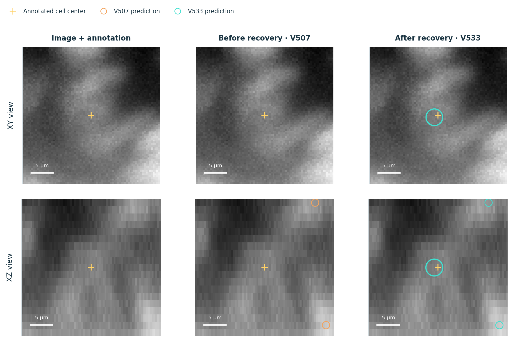
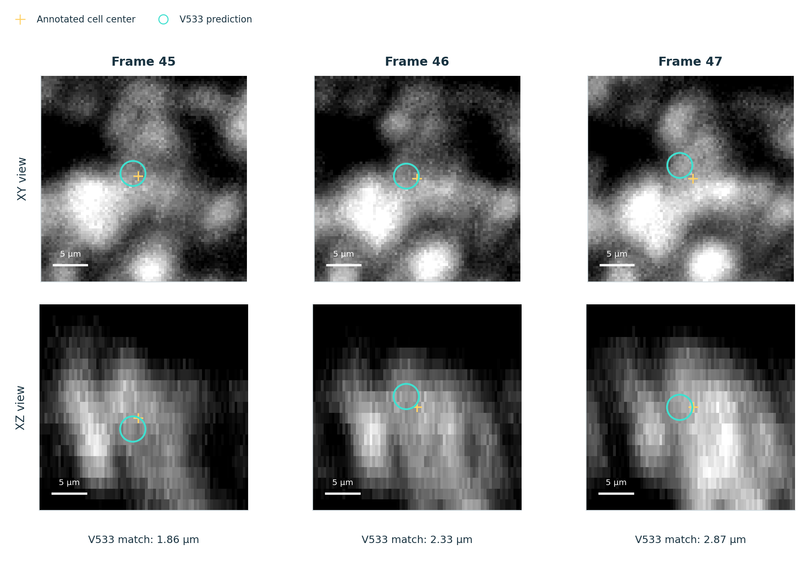
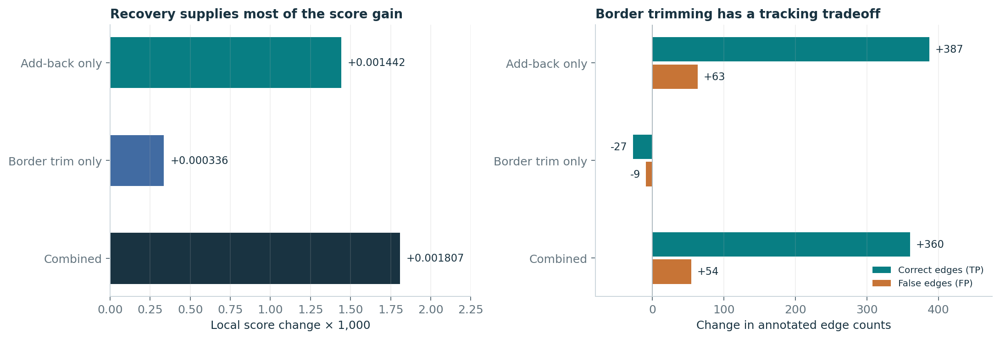

# 2nd Place Solution From Microscopy to Lineage Graphs

First, I would like to thank the organizers and hosts for creating an opportunity to compete and, more importantly, to learn.  
まず、競い合い、そして何より深く学ぶ機会を提供してくださった主催者と運営の皆様に感謝申し上げます。

This field is still new to me, and to borrow from the great and mighty Ted Lasso, you could fill two internets with what I still have to learn.  
この分野は私にとってまだ日が浅く、あの偉大なるテッド・ラッソ(海外ドラマのキャラクター)のセリフを借りるなら、「これから学ばなければならないことでインターネットが2つ分埋まってしまう」ほどです。

That was part of the appeal.  
しかし、それこそがこの挑戦の醍醐味でもありました。

I enjoyed exploring unfamiliar approaches, reading related research, and gradually building a small pipeline into a more capable system.  
馴染みのないアプローチを試し、関連論文を読み込み、シンプルなパイプラインを段階的により強力なシステムへと育て上げていくプロセスを大いに楽しみました。

Working through what helped and what did not was a large part of that learning.  
何が有効で何が無効だったのかを一つひとつ検証していく作業こそが、最大の学びとなりました。

I hope this writeup is useful to others tackling similar problems, whether through the methods that worked or the experiments that fell short.  
うまくいった手法はもちろん、期待通りの結果が出なかった実験も含め、このレポートが同様の課題に取り組む方々のお役に立てば幸いです。

Above all, I hope it passes on some of the curiosity and enjoyment I found in this challenge.  
何よりも、私がこのコンペで感じた知的好奇心と楽しさが少しでも伝われば嬉しく思います。

---

### 1. Overview (概要)

My final solution, V533, finished 2nd on the private leaderboard, with 0.970 private and 0.968 public.  
私の最終解法である「V533」は、Private 0.970、Public 0.968を記録し、Private Leaderboardで2位を獲得しました。

It combines temporal 3D detection with graph-based tracking to follow cells and identify divisions in 3D microscopy movies.  
本手法は、時系列3D検出とグラフベースのトラッキングを組み合わせ、3D顕微鏡動画像における細胞追跡と細胞分裂の同定を行います。

The detectors propose cell centers and estimate motion from neighboring frames.  
検出器が細胞の中心座標を提案し、前後フレームから細胞の移動量を推定します。

A tracker then selects candidates, links them through time, and evaluates divisions.  
続いてトラッカーが候補を選別し、時間軸に沿って結合(リンク)した上で、細胞分裂の判定を行います。

Synthetic faint-cell examples were included in detector training, while auxiliary detector models supplied alternative tracks.  
検出器の学習には合成した微弱(暗い)細胞サンプルを導入し、補助的な検出器モデル群によって代替の軌跡(トラック)候補を補う設計としました。

The central idea was to preserve weak detection evidence until it could be judged as part of a track.  
本解法の核心は、「微弱な検出シグナルであっても即座に捨てず、時系列トラックの文脈で判断できる段階まで保持し続ける」という点にあります。

A faint point may be unconvincing in one frame but useful when it persists along a plausible path.  
単一フレームでは確信が持てない暗い輝点でも、時間軸上で妥当なパスを描いて持続していれば、極めて有用な情報になります。

The final recovery stage revisited unused detections and checked the original images, restoring supported paths without another detector pass.  
最終的な復元(リカバリー)段階では、過去の判定で使われなかった検出候補を再走査し、元画像と照合することで、検出器を再実行することなく確証のあるパスを復元しました。

The V numbers are internal experiment labels.  
「V〜」という番号は実験管理用の内部ラベルです。

V454 denotes the core pipeline with one-frame gap repair; V507 adds position refinement and removal of selected false division links; V533 adds missed-track recovery and narrow x/y border cleanup.  
V454は1フレーム欠損(ギャップ)修復を備えた基本パイプライン、V507は座標の微調整と高確信度な誤分裂リンクの除去を追加した版、そしてV533は見逃しトラックの復元と画像境界(x/y)近傍のクリーンアップを追加した最終版です。

These versions share the same detectors and core tracker.  
これらのバージョンは、共通の検出器とコアトラッカーをベースにしています。

The detector components are V21, V24, V38, V39, and an earlier bank named Stage-6 strong.  
検出器アンサンブルの構成要素は、V21、V24、V38、V39、および初期に作成した「Stage-6 strong」と呼ばれるモデル群(バンク)です。

---

### 2. Data and validation (データと検証)

The training set contains 199 movies from two embryos, with sparse annotations of cells and temporal links.  
学習データは2個体の胚から取得された199本の動画で構成されており、細胞座標および時間リンクのアノテーションは非常に疎(限定的)です。

I grouped movies by image measurements, including brightness and contrast, using standardized features and K-means clustering.  
輝度やコントラストなどの画像統計量を標準化し、K-meansクラスタリングを行うことで、動画を撮像条件ごとにグループ化しました。

The resulting local labels, acq_00 and acq_01, describe image conditions for whole movies.  
これにより得られた内部ラベル「acq_00」と「acq_01」は、各動画全体の撮像環境の質を表しています。

They were derived without cell annotations or embryo identity; both embryos appear in both groups.  
これらは細胞ラベルや個体IDを用いずに画像情報のみから導出されたものであり、どちらのグループにも両方の胚が含まれています。

In acq_01, elevated background often makes weak cell peaks less distinct.  
acq_01では背景ノイズ(バックグラウンド輝度)が高く、シグナルの弱い細胞のピークが埋もれて不鮮明になりがちです。

At inference, the saved grouping rule assigns each movie from its image measurements, allowing some corrections to be restricted to the conditions where they helped.  
推論時にもこの分類ルールを適用して動画ごとに条件を判定し、「効果が実証された特定の条件下(acq_01)にのみ限定して補正処理を適用する」ことを可能にしました。

Validation used five folds at the movie level, balanced by annotated edge count within each embryo.  
ローカル検証(CV)には、各胚におけるアノテーション済みエッジ数が均等になるよう配慮した、動画単位の5-fold CVを採用しました。

Both embryos occur in training and validation; this was not an embryo-held-out split.  
学習と検証の双方に両方の胚が含まれており、胚単位で完全に隔離した分割(embryo-held-out split)ではありません。

The hidden test set uses embryos absent from training, making embryo transfer a possible source of disagreement between CV and leaderboard results.  
評価用の非公開テストセットには学習に含まれていない未知の胚が使用されているため、胚の個体差への適応(embryo transfer)が、CVとリーダーボードのスコア乖離の要因になり得ます。

The competition score combines a cell-count-adjusted edge Jaccard with 0.1 × division Jaccard.  
コンペの評価指標は、予測細胞数によるペナルティ補正付きのエッジJaccardと、0.1倍の重みを持つ分裂Jaccardの合算値です。

Because the count adjustment can reward removing cells even when correct tracks are lost, I also inspected raw edge and division counts.  
この細胞数補正の仕様上、正しいトラックを失ってでも細胞数を減らした方がスコアが上がってしまう逆転現象が起こり得るため、補正前の純粋なエッジ数や分裂数も併せて詳細に監視しました。

Cell-level analysis used the scorer's one-to-one matching within 7 μm.  
細胞単位のエラー分析には、評価スクリプトと同様に「3次元距離7 μm以内の1対1マッチング」を用いました。

---

### 3. Detection with temporal context (時系列文脈を取り入れた検出)

Each frame is intensity-normalized and downsampled by averaging 1 × 4 × 4 voxel blocks in Z × Y × X order.  
各フレームの輝度を正規化した後、Z × Y × Xの順で1 × 4 × 4ボクセルのブロックを平均プーリングしてダウンサンプリングを行いました。

This reduces X and Y by four while retaining all 64 depth planes:  
これにより、全64枚のZスライス(深さ方向)を維持したまま、X軸およびY軸の解像度を1/4に圧縮しています。

**Table 1. Image dimensions and voxel spacing before and after downsampling.**  
**表1. ダウンサンプリング前後の画像サイズおよびボクセル間隔**

| 項目 (Quantity, Z × Y × X) | 元画像 (Source image) | 検出器入力 (Detector input) |
| :--- | :--- | :--- |
| ボリューム形状 | 64 × 256 × 256 | 64 × 64 × 64 |
| ボクセル間隔 | 1.625 × 0.40625 × 0.40625 μm | 1.625 × 1.625 × 1.625 μm |

The detector processes the complete downsampled volume at isotropic spacing.  
検出器は、等方的な解像度(1.625 μm等間隔)に揃えられたボリューム全体を入力として一括処理します。

Predicted position offsets refine cell centers within the coarse grid before coordinates are mapped back to the source image.  
粗いグリッド上で予測された微小オフセットを用いて細胞中心座標をサブボクセル精度で補正した後、元の高解像度座標系へと逆変換します。

Original-resolution images remain available for later checks.  
元の高解像度画像は、後段の検証ステップ用として保持されます。

The primary detector is a residual 3D U-Net receiving t−1, t, and t+1, giving an input shape of 3 × 64 × 64 × 64.  
メインの検出器には、前後を含む3フレーム(t−1, t, t+1)を入力とする3D Residual U-Netを採用しており、入力テンソルの形状は3 × 64 × 64 × 64です。

It predicts a center heatmap, sub-voxel offsets, backward motion with uncertainty, and image descriptors for linking.  
このモデルは、中心ヒートマップ、サブボクセルオフセット、不確実性付きの後退運動ベクトル(前フレームへの移動量)、およびトラッキング照合用の画像特徴記述子を出力します。

V24 also uses three-frame context; V38 and V39 use five frames.  
V24も同様に3フレームを入力とし、V38とV39は5フレームの時系列文脈を入力としています。

---

#### 3.1. Sparse supervision and synthetic faint cells (疎な教師ラベルと微弱細胞の疑似生成)

Training distinguishes annotated cells, background identified from image evidence, and unknown regions.  
学習時には、正解ラベルのある細胞、画像特徴から特定した確実な背景、そして未知領域の3つを明確に区別して扱いました。

Unknown regions are excluded from the heatmap loss, so missing annotations do not automatically become negative examples.  
アノテーションがない未知領域はヒートマップ損失の計算から除外することで、ラベルの付け忘れが誤って負例(背景)として学習されるのを防いでいます。

Cell and background losses are normalized separately.  
細胞領域と背景領域の損失は個別に正規化されます。

Position and motion losses use available annotated targets.  
座標オフセットおよび運動ベクトルの損失計算には、ラベルが存在するターゲットのみを使用します。

Supervision masks are created before brightness augmentation, preventing artificially darkened, unannotated cells from becoming background targets.  
輝度オーグメンテーションを適用する前に教師マスクを確定させることで、データ拡張で人工的に暗くなった未アノテーション細胞が誤って背景ターゲットに分類される事態を防ぎました。

To provide more labeled weak cells, I used synthetic faint-cell augmentation.  
シグナルの弱い細胞のラベル付きデータを増やすため、合成による微弱細胞オーグメンテーション(synthetic faint-cell augmentation)を考案しました。

Short annotated tracks of isolated real cells were extracted from a training movie.  
学習動画から、周囲から孤立した実在細胞の短いアノテーション済みトラックを切り出します。

Their local background was subtracted, then the cell signal was dimmed, blurred along depth, and blended into another region of that same movie.  
切り出した細胞から局所背景を差し引いた後、輝度を下げ、深さ(Z)方向にブラーをかけ、同一動画内の別の領域へとブレンド(埋め込み合成)しました。

Each inserted track lasted 5–15 frames, with positions and links added to the labels.  
挿入された各トラックは5〜15フレーム持続し、その座標とリンク情報を教師ラベルに追加しました。

Keeping donor and host material within a movie also kept them within its training fold.  
ドナー(切り出し元)とホスト(貼り付け先)を同一動画内に限定することで、データが学習Foldの外にリークするのを防いでいます。

The primary V21 bank used two synthetic variants per training sample.  
メインのV21モデル群では、1サンプルあたり2パターンの合成バリエーションを使用しました。

Auxiliary V24 used four, followed by two epochs of fine-tuning on real data only.  
補助用のV24では4パターンを使用し、その後に実データのみで2エポックのファインチューニングを行いました。

Each bank has one model per fold, five in total, and both remain in the final system.  
各バンクは5-foldに対応する計5モデルで構成され、両方のバンクが最終パイプラインに組み込まれています。

Augmentation was used during training; the later faint-track recovery stage reuses their inference outputs.  
このデータ拡張は学習時に活用され、後段の微弱トラック復元ステージではその推論結果を再利用しています。

In an early experiment, replacing the detector bank with the synthetic-trained models raised the public score from 0.943 to 0.952.  
初期の実験において、検出器群をこの合成データ学習モデルに置き換えたところ、Publicスコアが0.943から0.952へと大きく向上しました。

The corresponding local CV study showed higher raw edge Jaccard and annotated-cell recall, but lower division quality and a combined score decrease of 0.001147.  
ただしローカルCVでは、生のエッジJaccardや細胞再現率は上がったものの、分裂判定の質が低下したため、総合CV値としては0.001147の微減となりました。

The stronger V24 recipe later produced the opposite CV/leaderboard pattern, as discussed in Section 7.  
より強力な学習レシピを用いたV24では、第7節で後述するように、CVとリーダーボードの相関がこれとは逆の挙動を示すことになります。

---

#### 3.2. Combining predictions (予測の統合とアンサンブル)

During final inference, primary heatmaps are averaged across the five V21 fold models and the original and 180-degree XY-rotated views.  
最終推論時、メインのヒートマップは5つのV21フォールドモデル、および元画像と180度XY回転画像の予測結果を平均化して算出します。

Position offsets, motion, and image descriptors come from the original orientation.  
座標オフセット、運動ベクトル、および画像特徴記述子には、元の向き(無回転)の予測値を使用します。

Original-view peaks missing from the averaged result are added back into spare candidate slots when they lie more than 3 μm from every averaged peak; nearby additions are also suppressed.  
平均化によって消えてしまった元向きのピークであっても、平均化後の全ピークから3 μm以上離れている場合は予備スロットに候補として再追加しました(近傍の重複候補は除外)。

This preserves candidates that averaging might otherwise remove, without a separate temporal-support test at this stage.  
これにより、単純な平均化で消去されてしまう可能性のある有用な候補を、この初期段階では余計な時系列判定を挟むことなく救出・保持できます。

V24 and Stage-6 strong each combine five fold models.  
V24およびStage-6 strongも、それぞれ5つのフォールドモデルをアンサンブルしています。

V38 and V39 each use one model per movie, selected by a fixed routing rule from their five fold checkpoints.  
V38とV39は、各動画の条件に応じて5つのフォールドチェックポイントから固定ルールで1モデルずつ割り振って使用します。

Each auxiliary bank produces its own candidates and tracks.  
それぞれの補助バンクが、独自の候補点とトラックを個別に生成します。

Stage-6 strong contributes missing paths and, together with V24, agreement on candidate links; the auxiliary graphs also provide evidence for division decisions.  
Stage-6 strongは欠落したパスの補完に貢献し、V24とともにリンク候補の合意(信頼性裏付け)に寄与します。また、これら補助グラフは分裂判定の有力な根拠としても機能します。

---

### 4. From candidates to tracks and divisions (候補からトラックと分裂の構築へ)

Tracking proceeds through candidate selection, temporal linking, division scoring, and graph repair:  
トラッキング処理は、「候補の選別」「時間リンクの形成」「分裂スコアリング」「グラフ修復」の4段階で進みます。

Select cells.  
1. 細胞候補の選別:

A learned count estimator sets the approximate number to keep per frame.  
学習済みの細胞数推定器が、フレームごとに残すべき大まかな細胞数を設定します。

Two LightGBM specialists estimate dimness and cell likelihood, using bounded ranking adjustments to add spatially distinct candidates to the primary pool for temporal support while retaining the original pool.  
「暗さ(dimness)」と「細胞らしさ」を個別に評価する2つの特化型LightGBMモデルを用い、元の候補群を維持しつつ、空間的に孤立した候補を順位補正によってメインプールへと追加し、時間軸での追跡候補を確保します。

The tracker then weighs detector confidence and possible links to earlier and later cells, suppressing nearby duplicates.  
トラッカーは検出器の確信度と前後フレームへの接続可能性を天秤にかけ、近接する重複ノードを抑止しながら候補を決定します。

A dim point on a consistent path can therefore compete with a brighter isolated point.  
これにより、「一貫した経路上にある暗い点」が、「孤立した明るいノイズ点」に競り勝つことが可能になります。

Follow movement.  
2. 動きの追跡:

Predicted backward motion suggests predecessors in the previous frame.  
予測された後退運動ベクトルに基づいて、前フレームにおける親候補(先行細胞)を絞り込みます。

Learned link scorers compare distance, motion, detection evidence, and track context.  
学習済みリンクスコアラーが、距離、運動量、検出スコア、トラックの連続性を総合的に比較・評価します。

Competing links are resolved so ordinary continuations have at most one predecessor and successor.  
競合するリンクを解消し、通常の移動では先行ノード・後続ノードがそれぞれ最大1つ(1対1)になるよう整理します。

Evaluate divisions.  
3. 分裂の評価:

A separate scorer examines a parent and two potential daughters using geometry, appearance, and temporal context, including competition with existing track assignments.  
独立した分裂スコアラーが、幾何的配置、細胞外観、時系列文脈、および既存トラックとの競合状態を考慮しながら、1つの親細胞と2つの娘細胞の組み合わせを厳密に検証します。

Combine and repair.  
4. 統合とグラフ修復:

Auxiliary tracks provide supported missing paths and agreement on links or divisions.  
補助トラック群から、信頼性の高い欠落パスを補完し、リンクや分裂の確からしさを裏付けます。

Image and motion checks help replace poor candidates and bridge one-frame gaps.  
画像特徴と動きの整合性チェックにより、質の低い候補を差し替え、1フレームの欠損(途切れ)を補間します。

Unreliable fragments and endings are filtered in a fixed order.  
信頼性の低い微小なトラック断片や不安定な末端を、あらかじめ決めた順序に従ってフィルタリング(剪定)します。

V507 then refines positions and removes at most one high-confidence false division link per movie, preserving the predicted cell count.  
続くV507では、予測細胞数を維持したまま座標を微調整し、動画あたり最大1箇所の「高確信度な誤分裂リンク」を安全に削除します。

V533 adds a final opportunity to recover cells that were detected but discarded during these earlier decisions.  
そしてV533において、これら初期の判定段階で検出されながらも切り捨てられてしまった細胞を復元する最終ステップが加わります。

---

### 5. Recovering faint tracks without another detector pass (検出器を再実行しない微弱トラックの復元)

The detector proposes more centers than the tracker keeps.  
検出器は、トラッカーが最終的に採用するよりも多くの中心候補を出力しています。

A weak cell can therefore be absent from the graph while its position remains in the saved output.  
そのため、シグナルの弱い細胞は、保存された推論結果の中に座標が存在しているにもかかわらず、系譜グラフからは欠落しているケースが生じます。

V533 searches these unused candidates for persistent paths and checks them against the original images.  
V533はこれらの「未使用候補」の中から時間的に持続するパスを探索し、元画像と直接照合します。

This final search is restricted to acq_01, where validation supported its use.  
なお、この最終探索は、ローカル検証で明確に有効性が確認された「acq_01」の動画群にのみ限定して実行されます。

Find unused candidates.  
ステップ1. 未使用候補の抽出:

Revisit reasonably high-ranked detections more than 4.5 μm from an existing prediction in the same frame.  
同一フレーム内の確定済み細胞から4.5 μm以上離れている、一定以上の順位スコアを持つ検出候補を再収集します。

Thin nearby candidates to avoid duplicates.  
重複を防ぐため、互いに近接する候補を間引きます。

Build a persistent path.  
ステップ2. 持続パスの構築:

Link candidates in consecutive frames, allowing up to 5 μm of movement per step.  
連続するフレーム間で候補同士をリンクさせます(1フレームあたりの移動量は最大5 μmまで許容)。

Require at least nine consecutive detections, one per frame.  
1フレームに1点ずつ、最低でも9フレーム以上連続して途切れないパスであることを必須条件とします。

Check the image evidence.  
ステップ3. 元画像による確証チェック:

Compare a small central region with its surrounding background in the original images.  
元画像において、候補中心の微小領域とその周囲の背景輝度を比較します。

Require the path's median center-minus-background contrast to exceed 0.1 on the normalized intensity scale.  
パス全体を通じて、「中心輝度 − 背景輝度」のコントラスト中央値が正規化スケール上で0.1を超えていることを要求します。

Resolve attachments.  
ステップ4. 既存グラフへの接続解決:

Require proximity within 8 μm of an existing cell in at least one frame.  
少なくとも1つのフレームにおいて、既存の確定細胞から8 μm以内にあることを条件とします。

Where possible, propose an attachment to a track end or start in the adjacent frame, within 5 μm.  
可能であれば、前後フレームにおいて5 μm以内にある既存トラックの始端または終端への接続を提案します。

Qualifying paths are processed longest first.  
条件を満たしたパスは、長さの長いものから優先して処理されます。

A path is discarded if its proposed attachment would give an existing cell an extra parent or continuation.  
もし接続によって既存細胞に余分な親や後続ノードが生じる(分岐ルールに違反する)場合は、そのパスを破棄します。

A qualifying path with no proposed attachment can remain a separate track.  
既存トラックへの接続箇所が見つからない場合でも、条件を完全にクリアしていれば独立した新規トラックとして残します。

Recovery is limited to candidates already present in the detector output.  
この復元処理は、検出器の出力プールにすでに存在していた候補のみを対象とします。

No detector is rerun, no annotations are read, and no new model is fitted at inference.  
推論時に検出器を再実行したり、正解ラベルを参照したり、新たなモデルを学習・調整したりすることは一切ありません。

The thresholds were selected using validation results.  
採用された各閾値は、すべて事前のローカル検証に基づいて厳密に決定されました。

A separate cleanup removes predictions within 1.5 source-image pixels, about 0.61 μm, of the x/y bounding box of each frame's nonzero image region, together with their incident links.  
これとは別に、各フレームの有効画像領域(非ゼロ領域)の境界から1.5ピクセル(約0.61 μm)以内にある予測点とそれに付随するリンクをすべて削除するクリーンアップを行いました。

This runs in all movies.  
この境界クリーンアップはすべての動画で実行されます。

Its contribution is evaluated separately below.  
その個別の効果については、次節のアブレーションで詳しく検証しています。

---

#### 5.1. Real recovery examples (実際の復元事例)

The examples below were selected from eight movies with improved edge recovery to illustrate successful cases.  
以下の例は、エッジ復元の効果をわかりやすく示すため、改善が見られた8本の動画から抽出した成功事例です。

They show training-movie crops with saved validation predictions.  
これらは、学習動画のクロップ画像に保存された検証予測をオーバーレイ表示したものです。

Yellow crosses mark annotated centers, orange circles show V507 centers, and blue circles show V533 centers.  
黄色の十字は正解アノテーション、オレンジの円はV507の予測中心、青の円はV533の予測中心を示しています。

Figure 1. Movie 44b6_5f15d135, frame 73.  
図1. 動画 44b6_5f15d135、フレーム 73。

The same crop is repeated across columns.  
左右の列で同一のクロップ画像を表示しています。

V507's nearest prediction is 11.17 μm from the annotation, beyond the 7 μm matching radius.  
V507の最近傍予測は正解から11.17 μm離れており、マッチング許容範囲(半径7 μm)を超えてしまっています。

V533 adds a prediction 0.91 μm away using a candidate still available in the detector output.  
一方、V533は検出器出力に残っていた候補を利用して、正解からわずか0.91 μmの位置に予測点を追加することに成功しています。

Distances are measured in 3D.  
なお、距離はすべて3次元空間上で計測されています。

Figure 2. Movie 6bba_57b7cc1e, frames 45–47.  
図2. 動画 6bba_57b7cc1e、フレーム 45〜47。

V533 predictions lie 1.86, 2.33, and 2.87 μm from the annotations; both connecting links exist in the saved graph.  
V533の予測は正解からそれぞれ1.86、2.33、2.87 μmの位置にあり、それらを結ぶ2本のエッジリンクも保存グラフ内に正しく構築されています。

V507 has no prediction within 7 μm of these annotations.  
V507では、これら3つの正解から7 μm以内に予測点が1つも存在していませんでした。

Three frames from a longer recovered chain are shown.  
ここでは、復元された長いトラック連鎖のうちの3フレームを抜粋して表示しています。

Frame numbering starts at zero.  
フレーム番号は0始まり(0-indexed)です。

XY panels project three Z planes around the annotation; XZ panels project five Y rows.  
XY面パネルは正解中心の周囲3枚のZスライスを投影したもので、XZ面パネルは5行分のYデータを投影したものです。

Each figure uses a shared linear grayscale range, physical proportions, and 5 μm scale bars, without denoising or retouching.  
各図はノイズ除去やレタッチを行わず、共通の線形グレースケール、実寸アスペクト比、および5 μmのスケールバーで表示されています。

The target and recovered prediction appear in both views even if the prediction falls just outside the thin image slab.  
正解と復元された予測点は、投影スラブの厚みからわずかに外れている場合でも、両方の視野にプロットされています。

---

### 6. Results and ablations (実験結果とアブレーション)

V533 was my highest-scoring private submission.  
V533は、私が提出したモデルの中でPrivateスコアが最も高かったソリューションです。

The comparison below reports CV results from saved predictions for the same 199 movies.  
以下の表は、同一の199本の動画について保存された予測値から算出したCV結果の比較です。

**Table 2. Validation results for successive pipeline versions.**  
**表2. パイプラインのバージョン別検証結果**

| パイプライン (Pipeline) | CVスコア | 生のエッジJaccard (Raw edge Jaccard) | 分裂Jaccard (Division Jaccard) |
| :--- | :--- | :--- | :--- |
| **V454** (ギャップ補正付きコア) | 0.950602 | 0.909682 | 0.468421 |
| **V507** (座標・分裂補正追加) | 0.951217 | 0.910053 | 0.470899 |
| **V533** (微弱トラック復元＋境界トリム) | **0.953024** | **0.912380** | **0.470899** |

All three versions had a displayed public score of 0.968.  
なお、これら3つのバージョンは、Public Leaderboard上ではすべて同値の「0.968」と表示されていました。

Compared with V507, V533 gained 0.001807 CV, with 360 more correct edges, 54 more false edges, and 360 fewer missed edges.  
V507との比較において、V533はCVを0.001807向上させ、正しいエッジが360個増加、誤エッジが54個増加、そして見逃しエッジが360個減少しました。

Division counts were unchanged.  
分裂の検出数には変動がありませんでした。

Raw edge Jaccard also improved, so the gain was not solely due to the cell-count adjustment.  
補正前の生のエッジJaccardも明確に改善していることから、このスコア上昇が単なる「細胞数ペナルティの調整の恩恵」によるものではないことが裏付けられます。

The ablation separates faint-track recovery, labeled “add-back” below, from border trimming and their combination.  
アブレーション分析では、以下で「add-back(再追加)」と表記されている「微弱トラック復元」と、「境界トリミング」、およびその併用効果を分解して検証しています。

Figure 3. Changes relative to V507.  
図3. V507を基準とした変化量。

Recovery supplies most of the score gain, while adding false links as well as correct ones.  
スコア向上の大部分は復元処理(add-back)によってもたらされていますが、正解リンクが増える一方で誤ったリンクも同時に増加しています。

Border trimming alone removes 27 correct edges and nine false edges: its higher combined score comes with a tracking tradeoff.  
境界トリミング単体では、正解エッジを27個失う代わりに誤エッジを9個削除しており、総合スコアが向上する裏でトラッキング本来の精度とのトレードオフが生じています。

The combined V533 pipeline improved every fold, embryo, and acquisition-group breakdown.  
統合されたV533パイプラインは、すべてのFold、胚、および撮像グループの内訳において一貫した改善を示しました。

Evaluating recovery one movie at a time, 20 of the 80 acq_01 movies contributed gains to the overall score and 60 contributed losses.  
復元処理の効果を動画単位で1本ずつ検証したところ、acq_01の80本中、スコアが向上したのは20本にとどまり、60本では逆にスコアが低下していました。

The gains outweighed the losses, with five movies supplying 57% of the positive contributions.  
しかし改善幅が悪化幅を大きく上回っており、その改善分の実に57%がわずか5本の動画によってもたらされていました。

Selecting recovery settings on four folds and applying them to the fifth reduced the estimated recovery-only gain from 0.001442 to 0.001048.  
復元処理のパラメータを4つのFoldでチューニングして残る1つのFoldに適用するOut-of-fold検証を行うと、復元単体による推定改善幅は0.001442から0.001048へと縮小しました。

---

### 7. What did not work as reliably (期待通りに機能しなかった試み)

Several plausible improvements failed when evaluated as complete tracking pipelines.  
一見有望に思えた数々の改善策も、トラッキングパイプライン全体として評価すると失敗に終わりました。

Each comparison here uses that experiment's own reference pipeline.  
ここでの比較は、それぞれの実験時に使用していたベースラインパイプラインとの相対比較です。

Stronger synthetic training as a primary replacement.  
1. 合成データ学習を強化したモデルへの全面置き換え:

V24 improved CV by 0.001306, but public score fell from 0.957 to 0.950.  
V24モデルはCVを0.001306向上させたものの、Publicスコアは0.957から0.950へと大幅に下落しました。

It was later retained as an auxiliary source of tracks.  
そのためメインモデルとしての採用は見送り、後にトラック候補を補う「補助ソース」として活用するにとどめました。

This allowed its alternative candidates to contribute without replacing the primary detector outright.  
これにより、メインの検出器を全面的に差し替えるリスクを避けつつ、V24が生成する代替候補の恩恵のみを取り入れることができました。

More aggressive division repair.  
2. より積極的な細胞分裂の修復:

Models pretrained on external microscopy data could propose alternative parents and daughters.  
外部顕微鏡データで事前学習したモデルを用いることで、別の親細胞・娘細胞の組み合わせ候補を提示させることができました。

An uncapped repair variant recovered three true divisions but added nine false ones relative to V507, reducing CV by 0.000671.  
しかし修復数に上限(キャップ)を設けない設定では、真の分裂を3つ救出した一方で誤った分裂を9つも追加してしまい、CVを0.000671悪化させました。

Generating plausible alternatives was easier than selecting safe corrections.  
「それらしい候補を生成すること」は容易でしたが、「副作用のない安全な修正だけを選別すること」は極めて困難でした。

A late detector replacement with the existing tracker.  
3. 開発終盤における検出器の刷新:

In a comparison of otherwise matched pipelines across 199 movies, the replacement reduced CV by 0.004901, with 72 fewer correct edges and 362 more false edges.  
他の条件をすべて揃えた199動画での比較において、検出器を差し替えたところCVが0.004901も低下し、正解エッジが72個減少した一方で誤エッジが362個も激増しました。

Positions, motion, confidence, and image descriptors change together, so downstream models may need recalibration.  
座標、動き、確信度、画像特徴量が同時に変化するため、後段のトラッカーモデル群全体を再調整(リキャリブレーション)しなければ整合性が取れなくなるためと考えられます。

This comparison used a fresh replay, separate from the table above.  
この検証は、先ほどの表とは別のクリーンな再実験環境で実施されました。

Extra pruning of track endings.  
4. トラック末端の追加剪定(プルーニング):

CV rose by 0.000351, but 136 correct edges were lost for only 14 false edges removed; public score fell from 0.968 to 0.967.  
CV値自体は0.000351上昇したものの、わずか14個の誤エッジを削るために136個もの正しいエッジが犠牲となり、Publicスコアは0.968から0.967へ低下しました。

The retained border trim makes the same kind of tradeoff on a smaller scale, losing 27 correct edges rather than 136.  
最終版に残した画像境界トリミングもこれと同質のトレードオフですが、正解エッジの損失を136個ではなく27個というごく小規模に抑えています。

Its private effect was not measured separately.  
なお、この境界トリミング単体のPrivateへの影響は個別には計測していません。

These experiments made complete graph evaluation essential.  
これらの実験を通じて、局所的な指標ではなく「グラフ全体としての総合評価」が不可欠であることが痛感されました。

More sensitive detection, more proposed repairs, or a higher aggregate score did not by themselves establish better tracking.  
検出感度を高めること、修復提案を増やすこと、あるいは単一の集計スコアを上げること自体は、必ずしも真に優れたトラッキング性能を意味するわけではありません。

---

### 8. Remaining weaknesses (残された課題と弱点)

#### 8.1. The second daughter can be assigned to another track (2番目の娘細胞が別トラックに奪われる問題)

V533 recovered 89 of 151 annotated divisions (58.9%), with 62 missed events and 38 scored false divisions.  
V533はアノテーションされた151件の分裂のうち89件(58.9%)を捉えましたが、62件の見逃しと38件の誤検出(False Division)が残りました。

The final recovery stage left these counts unchanged from V507.  
最終的な微弱トラック復元ステージでも、この分裂検出数自体はV507から変わりませんでした。

An earlier V507 audit found that 30 of its 62 missed divisions had one correctly linked daughter while the second belonged to another predicted track.  
V507の詳細調査によると、見逃した62件の分裂のうち30件において、「一方の娘細胞は正しく接続されているが、もう一方の娘細胞が近傍の別トラックに奪われてしまっている」ことが判明しました。

In a separate 36-conflict audit, daughters averaged 2.33 μm from their assigned predecessor, compared with 10.0 μm from the true parent.  
競合が発生した36件をさらに調査したところ、誤って奪った娘細胞と誤リンク先の前細胞との平均距離は2.33 μmであったのに対し、本来の真の親細胞との距離は平均10.0 μmでした。

A closer neighbor can win a local linking decision even when the more distant parent is correct.  
たとえ遠くにある親細胞が正解であったとしても、局所的なリンク判定アルゴリズムでは、より至近距離にある無関係な隣接細胞が判定に勝ってしまうのです。

These historical categories were not individually reclassified on V533.  
V533の開発過程において、これら過去のエラー分類に対する個別の再判定までは手が回りませんでした。

I would next compare the parent, both daughters, and the displaced neighboring track jointly over several frames, retaining the option to leave the graph unchanged.  
もし次に対策を打つなら、「グラフをあえて変更しない」という選択肢を担保した上で、親細胞、2つの娘細胞、および追いやられた隣接トラックを複数フレームにわたって同時に大局比較するアプローチを取るでしょう。

The failed repairs suggest that simply expanding distances or permitting more edits is insufficient.  
修復に失敗した実験結果からも明らかなように、単に許容探索距離を広げたり編集の自由度を増やしたりするだけでは、この問題は解決できません。

---

#### 8.2. Faint and crowded regions remain difficult (暗い領域・過密領域における難しさ)

Acq_01 still contributes disproportionately to the errors.  
依然としてエラーの大半は「acq_01(悪条件グループ)」に集中しています。

In the final V533 validation records:  
最終的なV533の検証データは以下の通りです。

**Table 3. Remaining errors by acquisition group in V533 validation.**  
**表3. V533検証における撮像グループ別の残存エラー内訳**

| 評価項目 (Measure) | acq_00 (良好) | acq_01 (難関・暗所) |
| :--- | :--- | :--- |
| 正解細胞のマッチ率 (Annotated cells matched) | 98.49% | **94.27%** |
| 復元できた分裂の割合 (Annotated divisions recovered) | 69.2% | **34.1%** |
| 全エッジエラーに占める割合 (Share of scored edge errors) | 36.9% | **63.1%** |

These percentages pool counts across movies within each group.  
これらの割合は、各グループに属する動画の数値を合算して算出したものです。

Acq_01 accounts for 63.1% of edge errors despite only 32.6% of edge-scoring weight.  
acq_01は評価全体のエッジ重みとしては32.6%に過ぎないにもかかわらず、発生した全エッジエラーの63.1%を占めています。

The examples below show annotations still unmatched after recovery.  
以下の図4は、復元処理を経てもなお検出できなかったアノテーションの具体例です。

Figure 4.  
図4。

A: weak contrast in movie 6bba_ebff6e76, frame 30.  
A: 動画 6bba_ebff6e76、フレーム 30 における低コントラストの例。

B: closely packed bright structures in 44b6_a2bb48bb, frame 90.  
B: 動画 44b6_a2bb48bb、フレーム 90 における明るい構造が過密に密集している例。

Yellow crosses are annotations; blue circles are V533 centers within each view's image slab.  
黄色の十字は正解アノテーション、青の円は各投影スラブ内におけるV533の予測中心です。

Nearest predictions are 9.23 and 13.52 μm away in 3D, beyond the 7 μm matching radius.  
最寄りの予測点までの3次元距離はそれぞれ9.23 μmおよび13.52 μmであり、7 μmのマッチング許容半径を大きく超えてしまっています。

Projection thickness and 5 μm scale bars follow the earlier examples.  
投影スラブの厚みおよび5 μmのスケールバーの設定は前の図と同様です。

Each example uses its own linear grayscale range, shared between XY and XZ, so brightness is not numerically comparable between columns.  
各例はXY面とXZ面で共通の線形グレースケールを採用していますが、列間(AとB)での輝度値は数値的に直接比較できるものではありません。

These selected crops illustrate difficult conditions without proving the cause of each miss.  
これらの画像は検出が困難な条件を視覚的に例示したものであり、失注の直接的な単一原因を証明するものではありません。

---

### 9. What I would carry forward (今後の糧となる知見)

Four choices define this solution: training on synthetic faint tracks, preserving weak original-view candidates, using auxiliary models through supported tracks, and checking recovered paths against the original images without another detector pass.  
本解法の成功を決定づけたのは、次の4つの設計判断でした。
1. 合成データによる微弱細胞トラックの学習
2. 原画像向き(Original-view)の微弱な検出候補の保持
3. 信頼性の高いトラックを介した補助モデル群の活用
4. 検出器を再実行せず、元画像との直接照合によって復元パスを検証する仕組み

The most useful lesson was to keep detection evidence available long enough to judge it through time.  
最も有益だった教訓は、「時間軸の文脈で真偽を判定できるようになるまで、検出された痕跡データを長く手元に残しておくこと」の重要性です。

A weak point can become convincing as part of a coherent trajectory.  
単体では頼りない点であっても、時系列で整合した軌跡の一部となれば、確固たる確信に変わります。

Equally, every added path or repaired division can damage a correct track, so gains need to be examined through the underlying cells, links, and divisions as well as the final score.  
同様に、安易にパスを追加したり分裂を修復したりすると、かえって既存の正しいトラックを壊してしまうリスクがあります。だからこそ、スコアの表面的な数字だけでなく、背後にある細胞数、リンク、分裂の個々の内訳を細かく見極めながら改善を進めることが極めて重要でした。

---

### 特に注目すべき改善・解釈のポイント

1. **メトリックのハックに対する注意 ("reward removing cells")**:
   - `count adjustment can reward removing cells even when correct tracks are lost` の箇所は、このコンペ特有の「細胞数の誤差ペナルティが強すぎるため、予測細胞数を無理やり減らすとJaccardが下がっても総合スコアが見かけ上上がってしまう」という現象を指摘しています。「未調整の生(raw)のJaccard」を追う姿勢が2位入賞の大きな勝因となっています。
2. **データのリーク防止 ("Keeping donor and host material within a movie...")**:
   - 切り抜いた細胞(ドナー)を同じ動画の別の場所(ホスト)に貼り付けることで、学習Foldと検証Foldの間でのデータ漏洩(リーク)を完全に防ぐという、機械学習コンペとして非常に綺麗な設計が説明されています。
3. **少数サンプルによるスコア牽引 ("five movies supplying 57% of the positive contributions")**:
   - 80本中20本しか改善していないのに全体スコアが大きく上がった理由として、**「改善したごく少数の動画(5本)で劇的にスコアが跳ね上がり、悪化した60本の小さなマイナスを大きくカバーした」**という極端な分布の分析がなされています。
