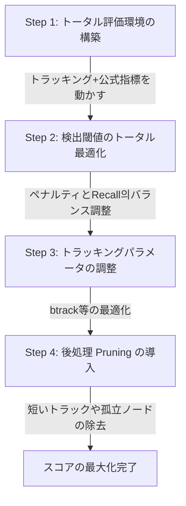

# Biohub細胞トラッキング スコアアップ実装計画 (s1_06)

本ドキュメントは、スコアアップに向けた細胞検出およびトラッキング評価の現状分析と、今後の改善ステップをまとめた実装計画書です。

## 1. 現状の整理と課題

### 現状
1. **細胞検出から着手**: 細胞検出とトラッキングを一度に実施すると改善策が迷走するため、まず細胞検出を先行して作成・検証した。
2. **大量のFP（False Positive）の検出**: フレーム0において、GT（Ground Truth）に比べて大量 of FPが検出された（FP: 276、TP: 4、FN: 1）。
3. **検出データの妥当性**: 大量のFPを図で確認すると、ほとんど細胞として検出するに値するデータ（画像上に実際に細胞として見えているもの）がFPに分類されている。

### 疑問
* GTのTP（True Positive）の条件は何か？
* 次はFPを減らす方向（検出器の閾値を厳しくする等）に行くべきか？
* それとも、トラッキングに進んでトータルで検証を進めるべきか？

---

## 2. 調査と分析結果

### ① GT의 TP条件と「大量のFP」の理由
* **GTのスパース（Sparse）性**: 
  本コンペのGTアノテーションは**一部の細胞のみ（追跡対象の細胞系譜のみ）**にしか付与されていません（スパースアノテーション）。
* **検出単体でのFP判定**: 
  検出単体の評価では、物理空間での距離が最大 7 µm 以下のGTノードと1対1マッチングできたものをTPとし、それ以外はすべてFPと判定されます。したがって、「アノテーションされていない本物の細胞」を正しく検出しても、すべてFPと判定されてしまうため、検出単体CVではPrecisionが極端に低く（約0.01）なります。

### ② 公式評価指標（Edge Jaccard）におけるFPの扱い
* **アノテーション外の予測エッジ・ノードは無視される**: 
  GTにマッチしない余分な予測エッジやノードは、基本的にはエッジJaccardの評価計算から除外（無視）され、直接的なFPペナルティにはなりません。
* **総ノード数ペナルティ（Adjusted Jaccard）の存在**: 
  ただし、予測した総ノード数 $T_{pred}$ が、画像全体の推定総細胞数 $T_{true}$（アノテーション外を含む全細胞数）を大きく超えると、以下の式でスコア全体にペナルティがかかります。
  $$J_{adj} = \max\left(0, J \cdot \left(1 - 0.1 \cdot \frac{T_{pred} - T_{true}}{T_{true}}\right)\right)$$
  ※ $T_{true}$ は、GT数（5個）ではなく、画像全体の細胞数（例: 200個）に近い値としてメタデータからロードされます。そのため、実際の細胞数と同程度の検出であればペナルティは軽微です。

---

## 3. 改善策のステップ提案

次のステップとしては、検出器のFP削減を深追いするのではなく、**トラッキングに進んでトータル評価環境を構築し、Adjusted Jaccardを指標に最適化を進めるべき**です。

### 各ステップの詳細

#### **Step 1: トータル評価環境の構築**
* **内容**: コメントアウトされているトラッキング処理（btrack）および公式評価メトリクスを有効化し、ローカルで `Adjusted Edge Jaccard` と `Division Jaccard` が算出できる状態を作ります。
* **確認事項**: メタデータからロードされる $T_{true}$ (`estimated_number_of_nodes`) が実際に何個になっているか確認し、現在の検出数（276個）がペナルティ範囲内か検証します。

#### **Step 2: 検出閾値のトータル最適化**
* **内容**: `Adjusted Edge Jaccard` を指標に、DOG検出器の `threshold` や `sigma` を調整します。GTの細胞を漏らさない感度（Recall 1.0）を維持しつつ、余分なノイズ検出を抑えてペナルティを最小化するバランスを探索します。

#### **Step 3: トラッキングパラメータの調整**
* **内容**: 検出したノードを繋ぐトラッカー（btrack）の探索半径 `max_search_radius` などのパラメータをチューニングし、エッジ接続精度（Edge Jaccard）を向上させます。

#### **Step 4: 後処理（Pruning）の導入**
* **内容**: トラッキング後に発生する「1〜2フレームで消える短い軌跡」や「移動しない孤立したノード」をプログラム的に除去（Pruning）します。これにより、必要な軌跡（GTにマッチするもの）を残したまま $T_{pred}$ を効果的に削り落とし、Adjusted Jaccardのペナルティを完全に回避します。

---

## 4. 実行予定の作業内容

1. **ノートブックのコピー**:
   `s1_05_stardist_btrack_pipeline.ipynb` を `s1_06_stardist_btrack_pipeline.ipynb` にコピーします。
2. **Step 1 の実装と実行**:
   * コメントアウトされているトラッキング評価および統合評価のコードを有効化。
   * データセットロード時に $T_{true}$ (`estimated_number_of_nodes`) の値を確認・出力するログを追加。
   * 最初の1フレームだけでなく、複数フレームまたは全フレームでのトラッキング評価を実行し、トータルスコアを確認。

## 5. 検証計画

### 自動検証
* コピーおよび修正後の `s1_06_stardist_btrack_pipeline.ipynb` がエラーなく最後まで実行でき、`Adjusted Edge Jaccard` および `Combined Score` が出力されることを確認。

### 手動検証
* ログに出力された $T_{true}$ と $T_{pred}$ の比率、およびペナルティ適用後のスコア変化が論理的に正しいかを確認。
